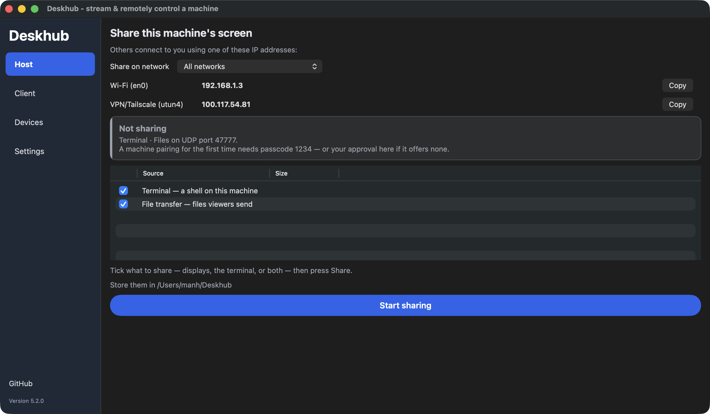
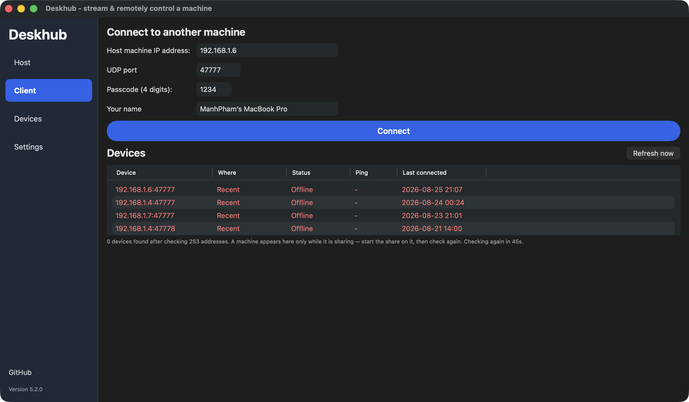
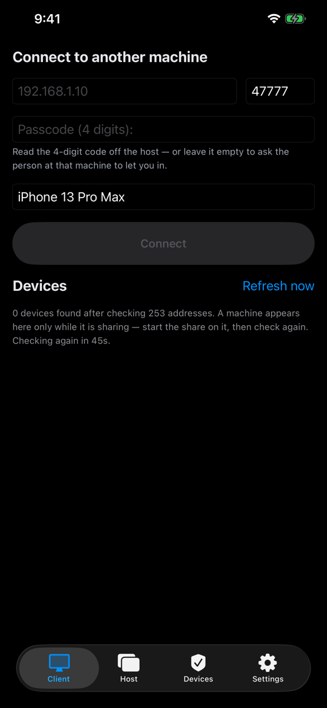
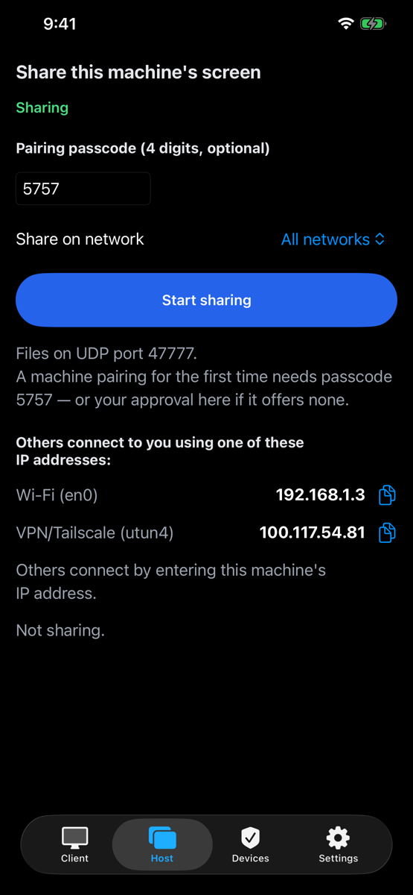
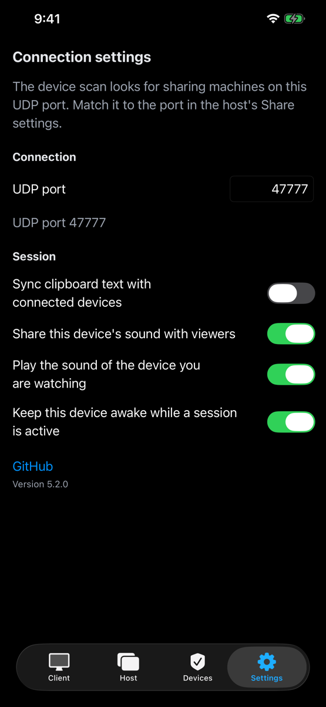
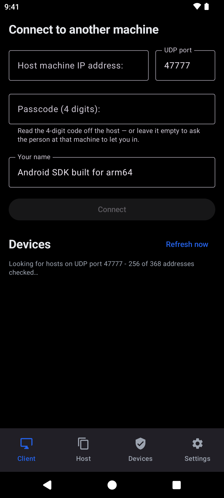
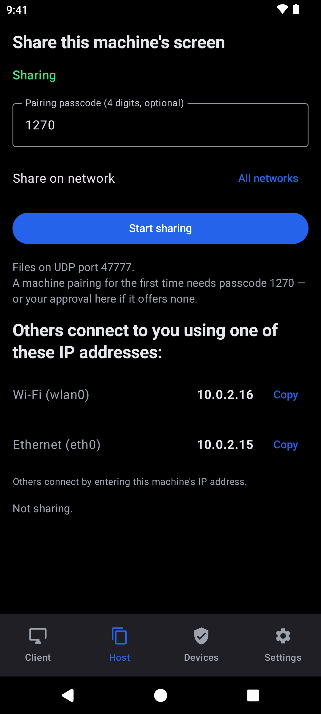
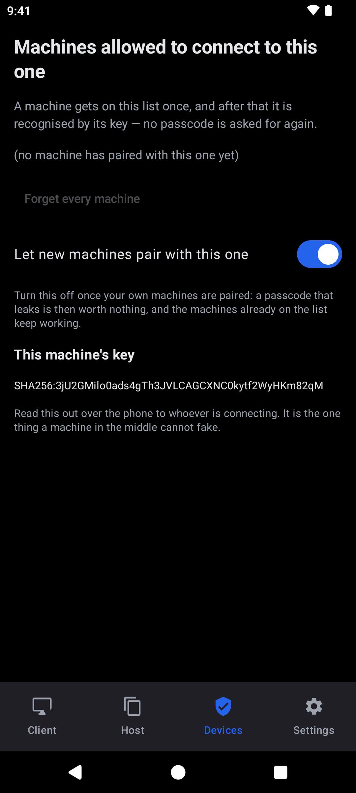
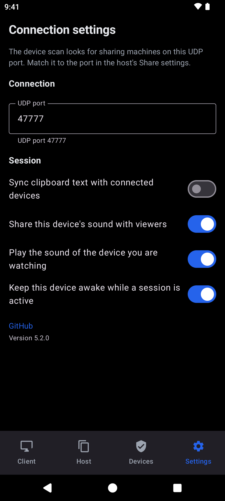

[English](README.md) · [Tiếng Việt](README.vi.md) · [中文](README.zh.md) · **日本語**

# 🖥️ Deskhub

### あなたのマシンを、手持ちのすべての画面へ。

**オープンソース、ネイティブ、クロスプラットフォーム。ローカルと変わらない感触のリモート
デスクトップ — 一般的なリモートデスクトップでは無理な、リモートでゲームが本当に遊べる
速さと素直さ。**

**[インストール](docs/INSTALL.ja.md)** · [ソースからビルド](docs/BUILD.ja.md) ·
[仕様](docs/SPECIFICATION.ja.md) · [アーキテクチャ](docs/ARCHITECTURE.ja.md) ·
[セキュリティ](SECURITY.ja.md)

## 👀 デモ

あとひとつチェックを入れれば共有できる macOS ホスト。何をこのマシンから出すか — 任意のディスプレイ、シェル、あるいは両方 — を選んで <b>Start sharing</b> を押すだけ。

<table>
  <tr>
    <td align="center" width="33%">
      
       <b>クライアント</b> — IP を打つか、スキャンで見つかったマシンをクリックし、開くものを選ぶ：画面、その操作、シェル、あるいはその組み合わせ。
    </td>
    <td align="center" width="33%">
      
       <b>デバイス</b> — これまで入れたすべてのマシンを名前と鍵で一覧し、いつでも取り消せる。自分の端末が揃ったら新規ペアリングは切る。
    </td>
    <td align="center" width="33%">
      
       <b>設定</b> — fps、ビットレート、画質、ポート、パスコード、視聴者に操作を許すか、そして macOS 権限の現在の状態。
    </td>
  </tr>
</table>

  
  
  
  

<b>iPhone</b> — 同じ 4 画面。スキャンしてマシンをタップし、映像をトラックパッド代わりに操作する。あるいは端末自身の画面を、閲覧専用でホストする。

  
  
  
  

<b>Android</b> — Material の装いで同じ 4 画面。Android 10 以降では、ホストは閲覧専用の画面共有。

## 📖 概要

ひとつの **C++20 コア**が Windows から iPhone まですべてで動き、プロトコルの書き直しは
ゼロ。ディスプレイを共有し、もう一方のマシンで IP を打てば、もう操作できている。どの
プラットフォームでも画面は 4 つ — **Host**、**Client**、**Devices**、**Settings** —
なので、Mac で覚えれば Android アプリも同時に覚えたことになる。

| ⚡ 速い | 📦 ファイルひとつ | 🎛️ 単純 |
| ------ | ---------- | --------- |
| キャプチャ→表示 **約 3.5 ms**、60 fps。ゼロコピーの VRAM パイプラインで、ホットパスは CPU に触れない。 | インストーラなし、常駐サービスなし、アカウント不要。Windows アプリ全体が **約 5.1 MB** の exe ひとつ、macOS は **1.9 MB** の dmg。 | ディスプレイを**共有**するか、IP へ**接続**する。それだけ。デスクトップはさらに**シェル**を共有し、視聴者が送る**ファイル**を受け取れる。スマートフォンもホストになれるが閲覧専用 — 入力注入を許すモバイル OS が存在しないため。 |

セッションは **QUIC/TLS** でエンドツーエンドに暗号化され、未知のマシンはホストのパスコードを
知っていると証明するか — **SPAKE2** を使うのでコード自体は決して流れない — ホスト側で承認
されるかでしか入れない。それでも開いたポートの上にある小さな秘密であることに変わりはない。
信頼できるネットワークか VPN を使い、**UDP 47777 は絶対にポート転送しないこと**。完全な
脅威モデルは [`SECURITY.ja.md`](SECURITY.ja.md) にある。

## 💡 なぜ

- 💻 **仕事** — 非力なノート PC やカフェの iPad から、自宅 PC の Claude Code、VS Code、ビルドを動かす。
- 🌐 **なんでも** — どの端末からでも Chrome、Office、PC 専用ソフトを操作する。
- 🎮 **ゲーム** — 60 fps、相対マウス + DirectInput スキャンコード、`F9` でポインタロック。
- 🖥️ **マルチモニタ** — 1 枚でも複数枚でも、各ディスプレイを個別のセッションとして共有。

## 🚦 対応プラットフォーム

| プラットフォーム | ホスト | クライアント | 状態 |
| -------- | :--: | :----: | ------ |
| **Windows** | ✅ | ✅ | リファレンス実装 — LAN + Tailscale（インターネット/NAT）で日常的に使用 |
| **macOS** | ✅ | ✅ | 両方の役割が動作（ScreenCaptureKit + VideoToolbox + CGEvent） |
| **Android** | ✅ | ✅ | クライアント：映像 + 入力（トラックパッド、キーボード）。ホスト：閲覧専用の画面共有（MediaProjection + MediaCodec）、Android 10 以降 — Google Play でテスト中 |
| **iOS** | ✅ | ✅ | クライアント：映像 + 入力（トラックパッド、キーボード）。ホスト：Broadcast Upload Extension による閲覧専用の画面共有（ReplayKit + VideoToolbox）— TestFlight でテスト中 |
| **Linux** | ✅ | ✅ | 両方の役割が動作（PipeWire + VA-API + uinput + GTK3）— Ubuntu、Debian、Mint、Fedora、openSUSE、Arch に deb / rpm / 単体バイナリで。2 台間の LAN で確認済み |

## ✨ 中身

- **端から端までゼロコピー** — VRAM へ直接キャプチャ → NVENC → HW デコード → 描画。ホットパスは CPU に触れない。
- **QUIC 上の専用プロトコル** — 無限 GOP + 要求時 IDR、XOR FEC、適応ビットレート。すべてを暗号化された 1 本の接続に多重化。
- **画面には音がついてくる** — そのマシン自身のオーディオミックスを Opus 64 kbps、1 データグラムにつき 20 ms フレーム 1 つ。パケットを 1 つ落としても失うのは 1 秒の何分の一かで、映像を乱すことはない。マイクは決して使わない。
- **本物の入力** — 相対マウス（Raw Input）と DirectInput ゲーム向けスキャンコード。ホスト自身のマウス・キーボードが常に優先。
- **共有コアはひとつ** — プロトコル、FEC、ビットレート制御は `core/` にあり、すべてのクライアントにコンパイルされる。
- **コマンドラインもある** — `deskhub-cli` は画面を共有し、リモートシェルを開き、スクリプトや SSH 越しにホストを操作する。GUI ツールキットは一切不要。[ビルド](docs/BUILD.ja.md#コマンドラインクライアント)を参照。
- **わざと痛めつけている** — コアはオフラインでユニットテストされ、CI では ASan・UBSan・TSan の下で走り、7 つの libFuzzer ターゲットがワイヤフォーマット、H.264 パース、再組み立て、ターミナルのバイト列、UI テキスト、セッション状態機械を毎晩叩く。見つかったクラッシュはすべて回帰テストになる。

## 📚 ドキュメント

すべての文書は英語で公開し、隣にベトナム語 `*.vi.md`、中国語 `*.zh.md`、日本語 `*.ja.md`
の訳を置いている。正典は英語版。

| 文書 | 内容 |
| --- | --- |
| [インストール](docs/INSTALL.ja.md) ([en](docs/INSTALL.md)) | 5 つのプラットフォームそれぞれに Deskhub を入れる |
| [ビルド](docs/BUILD.ja.md) ([en](docs/BUILD.md)) | ソースからのコンパイル、テスト、パッケージング、リリース |
| [仕様](docs/SPECIFICATION.ja.md) ([en](docs/SPECIFICATION.md)) | Deskhub が何をするか。実装の詳細は含まない |
| [アーキテクチャ](docs/ARCHITECTURE.ja.md) ([en](docs/ARCHITECTURE.md)) | レイヤ、スレッド、ワイヤプロトコル、設計判断 |
| [`SECURITY.ja.md`](SECURITY.ja.md) ([en](SECURITY.md)) | 脅威モデルと脆弱性の報告方法 |
| [`PRIVACY.ja.md`](PRIVACY.ja.md) ([en](PRIVACY.md)) | プライバシーポリシー |
| [`THIRD_PARTY_NOTICES.ja.md`](THIRD_PARTY_NOTICES.ja.md) ([en](THIRD_PARTY_NOTICES.md)) | サードパーティ製コンポーネントとライセンス |

不具合とフィードバック：[issues](https://github.com/manhpham90vn/Deskhub/issues) —
端末のモデル名を添えてください。

## 📄 ライセンス

MIT — [`LICENSE`](LICENSE) を参照。サードパーティ製コンポーネントとその告知（Linux アプリに
静的リンクされた LGPL 版 FFmpeg を含む）は
[`THIRD_PARTY_NOTICES.ja.md`](THIRD_PARTY_NOTICES.ja.md) に一覧がある。
