[English](README.md) · [Tiếng Việt](README.vi.md) · [中文](README.zh.md) · **日本語**

<div align="center">

# 🖥️ Deskhub

### 必要な場所から、自分のパソコンを使える。

**Deskhub を使えば、別の端末から自分のパソコンの画面を見て操作できる。オープンソースで、
5 つのプラットフォームで native に動作し、作業にもゲームにも応えられる操作感を目指している。**

[](https://github.com/manhpham90vn/Deskhub/releases)
[](LICENSE)
[](CMakeLists.txt)
[](#platforms)

[](https://github.com/manhpham90vn/Deskhub/actions/workflows/ci.yml)
[](https://github.com/manhpham90vn/Deskhub/actions/workflows/lint.yml)
[](https://github.com/manhpham90vn/Deskhub/actions/workflows/codeql.yml)
[](https://github.com/manhpham90vn/Deskhub/actions/workflows/nightly.yml)

**[インストール](#install)** · [source から build](docs/BUILD.ja.md) ·
[Spec](docs/SPECIFICATION.ja.md) · [Architecture](docs/ARCHITECTURE.ja.md) ·
[Security](SECURITY.ja.md)

</div>

**目次:**

- [インストール](#install)
- [デモ](#demo)
- [概要](#about)
- [用途](#why)
- [対応プラットフォーム](#platforms)
- [中身](#features)
- [ドキュメント](#docs)
- [ライセンス](#license)

<a id="install"></a>

## 📦 インストール

Windows、macOS、Ubuntu、Debian、Mint では package manager からインストールできる。

```bash
winget install ManhPham.Deskhub                  # Windows · app
winget install ManhPham.DeskhubCLI               # Windows · deskhub-cli
brew install --cask manhpham90vn/tap/deskhub     # macOS · app
brew install manhpham90vn/tap/deskhub-cli        # macOS · deskhub-cli
```

Ubuntu / Debian / Mint では、デスクトップ app と CLI は別パッケージである。
apt repository を一度追加し、必要な方だけ、または両方をインストールする。

```bash
sudo install -d /etc/apt/keyrings
curl -fsSL https://manhpham90vn.github.io/Deskhub/apt/deskhub.gpg | sudo tee /etc/apt/keyrings/deskhub.gpg >/dev/null
echo "deb [arch=amd64 signed-by=/etc/apt/keyrings/deskhub.gpg] https://manhpham90vn.github.io/Deskhub/apt stable main" \
  | sudo tee /etc/apt/sources.list.d/deskhub.list
sudo apt update
sudo apt install deskhub       # デスクトップ app
sudo apt install deskhub-cli   # CLI。単独でもインストール可能
```

デスクトップパッケージはアプリケーションメニューに Deskhub を追加し、`deskhub` を
`/usr/bin` にインストールする。CLI パッケージは `deskhub-cli` を `/usr/bin` に
インストールする。Windows の app インストーラーはスタートメニューとデスクトップに
ショートカットを作成し、別の CLI インストーラーはユーザーの `PATH` にコマンドを
追加する。winget は CLI を portable 版 exe としてインストールし、`PATH` に配置する。
macOS の CLI は Homebrew により `PATH` に配置される。

その他のプラットフォームは [Releases](https://github.com/manhpham90vn/Deskhub/releases) から：

- **Windows 直接ダウンロード** —— app 用 `deskhub-v*-windows-setup.exe` と CLI 用
  `deskhub-cli-v*-windows-setup.exe`。portable 版 exe も利用可能
- **macOS 直接ダウンロード** —— app は `deskhub-v*-macos.dmg`、CLI は `deskhub-cli-v*-macos`
- **repository を使わない Ubuntu / Debian / Mint** —— `deskhub-v*-amd64.deb` と
  `deskhub-cli-v*-amd64.deb`
- **Fedora / openSUSE** —— app と CLI は別の RPM。`deskhub-v*-x86_64.rpm` と
  `deskhub-cli-v*-x86_64.rpm` を必要に応じて `dnf` または `zypper` でインストール
- **Arch、その他の Linux** —— portable 版 `deskhub-v*-linux-x86_64` と
  `deskhub-cli-v*-linux-x86_64` を `chmod +x` して実行
- **Android** —— `deskhub-v*-android.apk`、または [Play の beta](https://play.google.com/apps/testing/com.manhpham.deskhub)
- **iOS** —— [TestFlight](https://testflight.apple.com/join/7qY7wgpd)

プラットフォームごとの詳細と必要な権限：[INSTALL.ja.md](docs/INSTALL.ja.md)。

<a id="demo"></a>

## 👀 デモ

<div align="center">

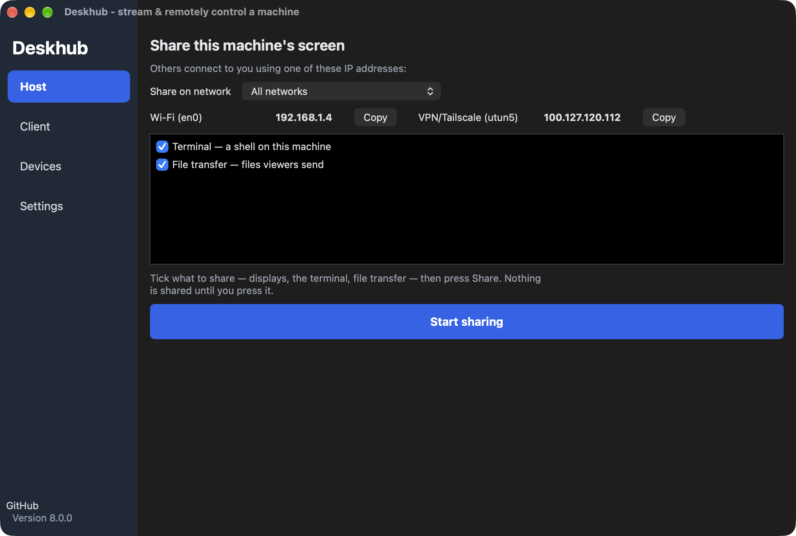

<sub>共有を開始する前の macOS host。このマシンから出すものを選択する —— 任意の display、shell、またはその両方 —— そのうえで <b>Start sharing</b> を押す。</sub>

</div>

<table>
  <tr>
    <td align="center" width="33%">
      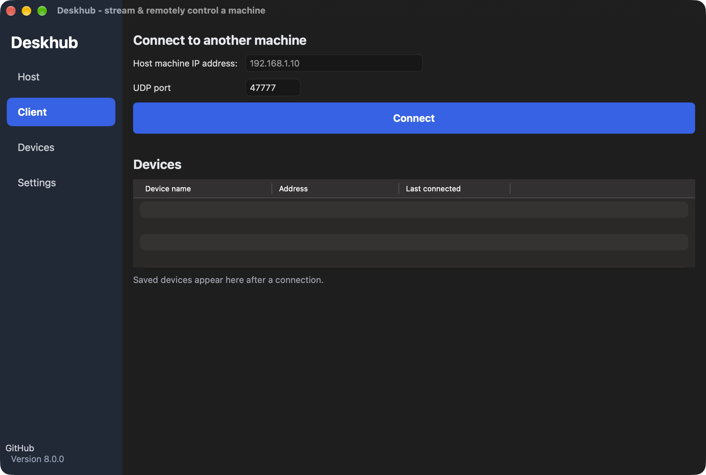
      <br><sub><b>Client</b> —— アドレスを入力するか、host の QR リンクを貼り付けるか、最近使った host または信頼済み host を選択し、開く対象を選ぶ。画面、control 権限、shell、またはその組み合わせ。</sub>
    </td>
    <td align="center" width="33%">
      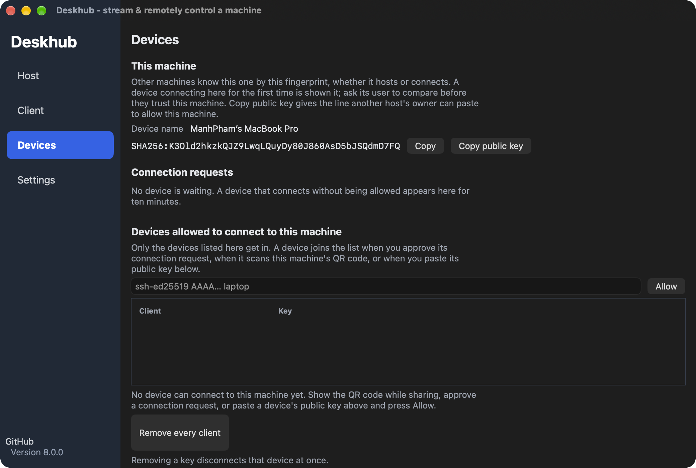
      <br><sub><b>Devices</b> —— host としては、本マシンの key と受け入れるデバイス —— 承認、スキャン、または貼り付けで許可したもの —— を表示し、個別に削除できる。client としては、信頼する host を key で表示する。</sub>
    </td>
    <td align="center" width="33%">
      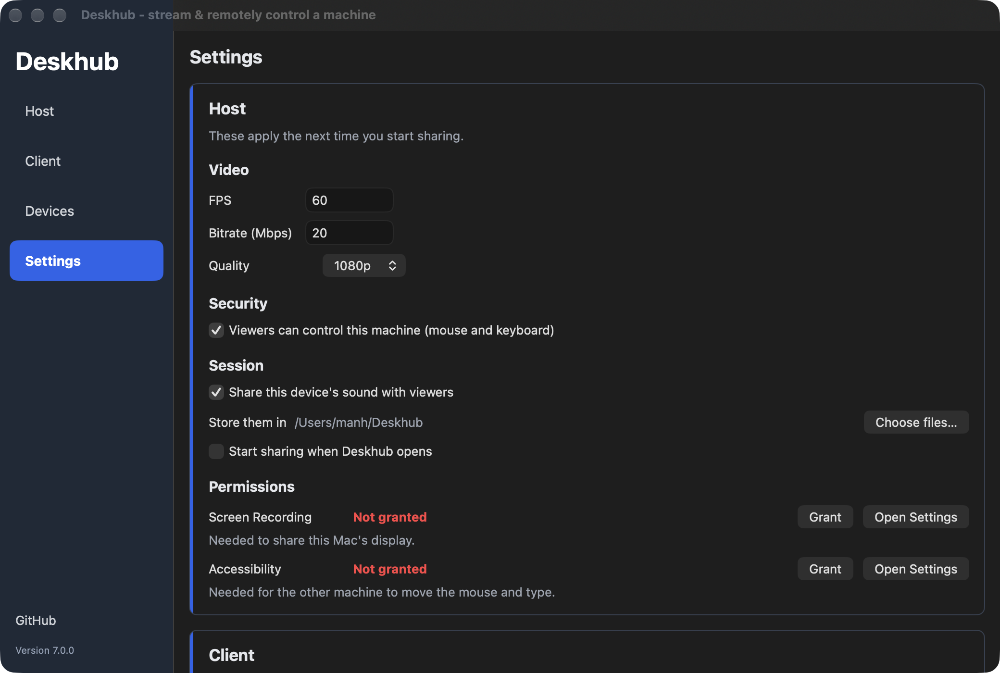
      <br><sub><b>Settings</b> —— デバイス名、fps、bitrate、quality、port、viewer による control の可否、および macOS permission の現在の状態。</sub>
    </td>
  </tr>
</table>

<p align="center">
  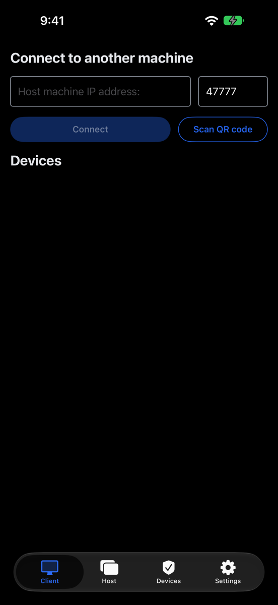
  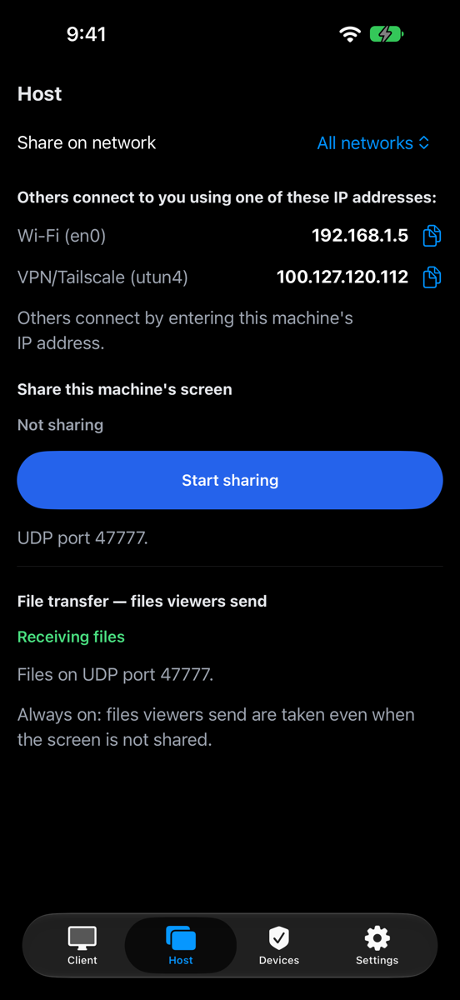
  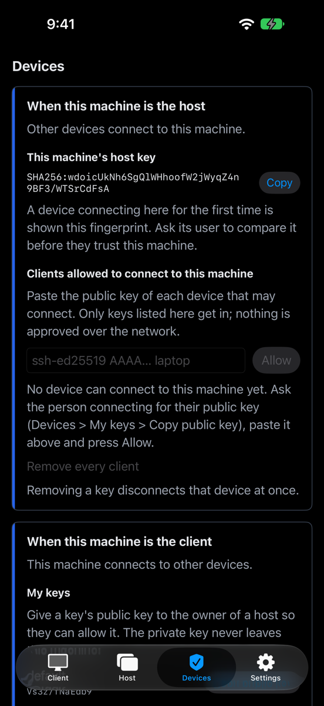
  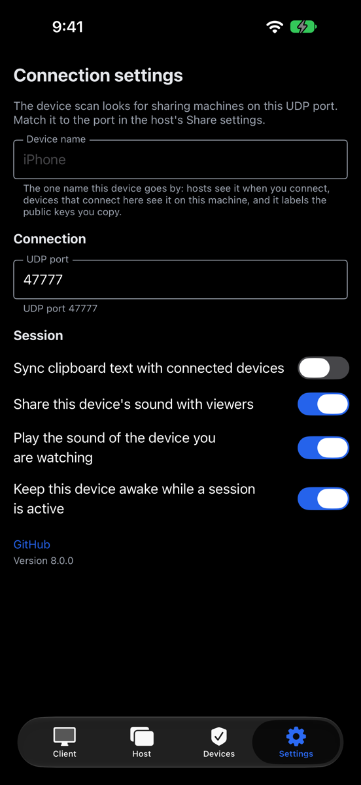
</p>
<p align="center"><sub><b>iPhone</b> —— 同じ 4 ページ。host の QR code をスキャンして connect し、映像を trackpad として操作する。iPhone 自身の画面を host することもできるが、view-only に限られる。</sub></p>

<p align="center">
  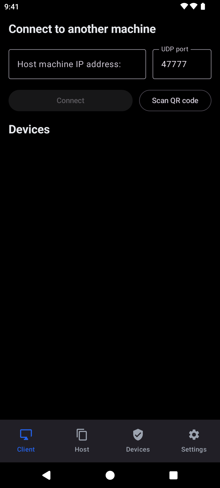
  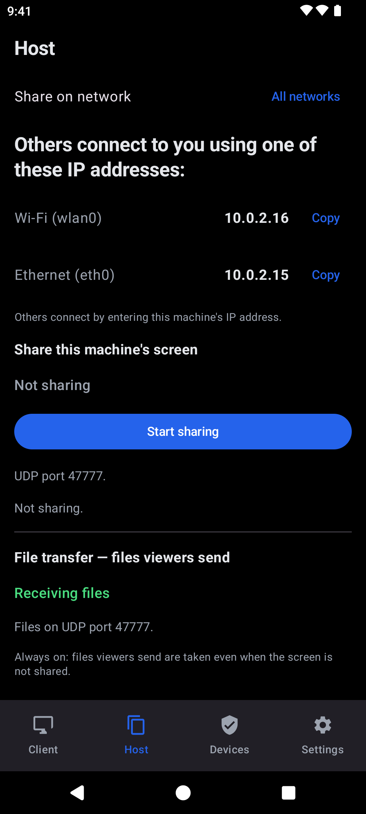
  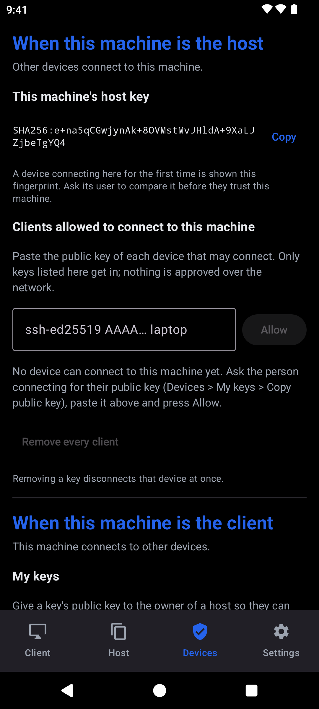
  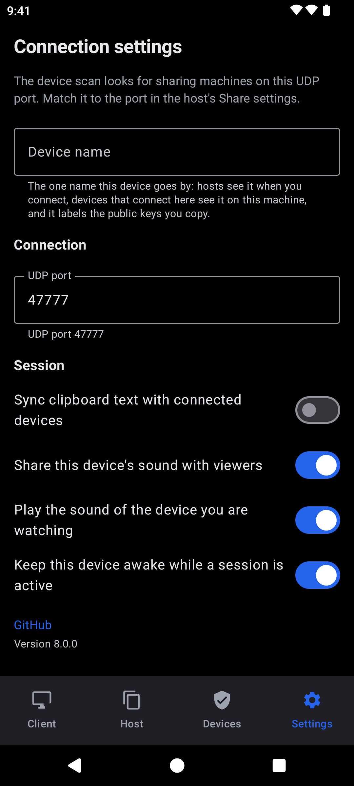
</p>
<p align="center"><sub><b>Android</b> —— 同じ 4 ページを Material Design で構成している。host としては、Android 10+ で view-only の画面共有のみを行う。</sub></p>

<a id="about"></a>

## 📖 概要

一方の端末で共有する display を選び、もう一方で IP アドレスを入力して Connect する。
**Host**、**Client**、**Devices**、**Settings** の 4 ページはどのプラットフォームでも
共通なので、Mac から PC やスマートフォンに移っても操作に迷いにくい。protocol は 5 つの
プラットフォームで共通の **C++20 core** が処理する。

| ⚡ 速い | 📦 簡単インストール | 🎛️ シンプル |
| ------ | ---------- | --------- |
| 既定は 60 fps で、対応するハードウェアでは最大 240 fps で stream できる。video 処理には、利用できる場合に GPU メモリを使う。 | package manager からインストールするか、release をダウンロードできる。アカウントも background service も不要。 | display を **Share** するか、IP アドレスへ **Connect** する。デスクトップでは **shell** も共有でき、スマートフォンを含むすべての host が**ファイル**を受信できる。スマートフォンは view-only で画面を共有する。 |

Session は **QUIC/TLS** 上で end-to-end に encrypt され、アクセスは SSH と同じ仕組みで
行われる。すべてのマシンは key を 1 つ持ち、client が受け入れられるのは、host の所有者が
その key を許可した場合に限られる —— 接続要求を承認する、共有中に **QR code** を見せる、
または public key を貼り付ける、のいずれかによって。client は host の key を pin し、
何かを送る前に必ず照合する。信頼は key に従うため、host はアドレスが変わっても信頼を
保つ。passcode も discovery も、見知らぬマシンを受け入れるスイッチも存在しない。
信頼できる network か VPN を使用し、**UDP 47777 を port-forward しないこと**。完全な
threat model は [`SECURITY.ja.md`](SECURITY.ja.md) を参照。

<a id="why"></a>

## 💡 用途

- 💻 **作業** —— 性能の低いノート PC や iPad から、自宅 PC の Claude Code、VS Code、build を実行する。
- 🌐 **デスクトップアプリ** —— 別の端末から、パソコン上の Chrome、Office などを使う。
- 🎮 **ゲーム** —— 最大 240 fps、relative mouse と DirectInput scancode、`F9` による pointer lock。
- 🖥️ **マルチ display** —— display を 1 つまたは複数共有し、それぞれが独立した session となる。

<a id="platforms"></a>

## 🚦 対応プラットフォーム

| プラットフォーム | Host | Client | 状態 |
| -------- | :--: | :----: | ------ |
| **Windows** | ✅ | ✅ | reference 実装 —— LAN および Tailscale（Internet/NAT）で日常的に使用 |
| **macOS** | ✅ | ✅ | 両方の役割が動作（ScreenCaptureKit + VideoToolbox + CGEvent） |
| **Android** | ✅ | ✅ | Client: video と input（trackpad、keyboard）。Host: view-only の画面共有（MediaProjection + MediaCodec）、Android 10+ —— Google Play でテスト中 |
| **iOS** | ✅ | ✅ | Client: video と input（trackpad、keyboard）。Host: Broadcast Upload Extension による view-only の画面共有（ReplayKit + VideoToolbox）—— TestFlight でテスト中 |
| **Linux** | ✅ | ✅ | 両方の役割が動作（PipeWire + VA-API/NVENC + uinput + GTK3）—— Ubuntu、Debian、Mint、Fedora、openSUSE、Arch に deb / rpm / portable binary で提供。2 台間の LAN で検証済み |

<a id="features"></a>

## ✨ 中身

- **GPU を使う video 処理** —— 対応する環境では capture、encode、decode、render に各プラットフォームのハードウェアを使う。Windows の NVENC 経路では frame を CPU 経由でコピーしない。Linux の host は VA-API で、NVIDIA GPU では NVENC で encode する。
- **QUIC 上の専用 protocol** —— 無限 GOP と必要時の IDR、XOR FEC と失われた packet の再送、adaptive bitrate を、encrypt 済みの connection 1 本に multiplex する。
- **画面に音声が伴う** —— マシン自身の audio mix を Opus 64 kbps で送る。1 datagram につき 20 ms の frame を 1 つ。失われた packet が 1 つなら通常は Opus の in-band FEC で次の packet から復元され、それより長い欠落も 1 秒に満たない音声の損失にとどまり、いずれも映像には影響しない。microphone は capture しない。
- **画面だけではない** —— remote shell、任意の host へのファイル送信、プレーンテキストの clipboard 双方向同期、session 中のスリープ防止。
- **実際の input** —— relative mouse（Raw Input）と、DirectInput ゲーム向けの scancode。host 自身の mouse と keyboard が常に優先される（Linux ではユーザーが `input` グループに入っている場合 —— [Install](docs/INSTALL.ja.md#host-wins) を参照）。
- **共有された core** —— protocol、FEC、bitrate control は `core/` にあり、すべての client にコンパイルされる。
- **command line ツール** —— `deskhub-cli` で画面の共有、remote shell、ファイル送信、key・許可済みデバイス・信頼済み host・settings の管理を、スクリプトや SSH から行える。一覧系のコマンドは `--json` に対応する。Windows と Linux ではリモート画面のウィンドウも開ける。[Build](docs/BUILD.ja.md#command-line-client) を参照。
- **core を継続的にテスト** —— オフラインの unit test に加え、CI で ASan、UBSan、TSan を実行する。9 つの libFuzzer target —— pull request ごとに各 30 秒、毎晩各 15 分 —— が wire format、H.264 の parse、reassembly、terminal の byte stream、UI の文字列、key と招待リンクの parse、QR の encode、session state machine を検査し、見つかった crash は regression test に加える。

<a id="docs"></a>

## 📚 ドキュメント

すべてのドキュメントは英語で公開し、その隣に訳を置いている。ベトナム語 `*.vi.md`、
中国語 `*.zh.md`、日本語 `*.ja.md`。正文は英語版である。

| ドキュメント | 内容 |
| --- | --- |
| [Install](docs/INSTALL.ja.md) ([en](docs/INSTALL.md) · [vi](docs/INSTALL.vi.md) · [zh](docs/INSTALL.zh.md)) | 5 つのプラットフォームそれぞれへの Deskhub の導入 |
| [Build](docs/BUILD.ja.md) ([en](docs/BUILD.md) · [vi](docs/BUILD.vi.md) · [zh](docs/BUILD.zh.md)) | source からのコンパイル、test、パッケージング、release |
| [Specification](docs/SPECIFICATION.ja.md) ([en](docs/SPECIFICATION.md) · [vi](docs/SPECIFICATION.vi.md) · [zh](docs/SPECIFICATION.zh.md)) | Deskhub が何をするか。実装の詳細は扱わない |
| [Architecture](docs/ARCHITECTURE.ja.md) ([en](docs/ARCHITECTURE.md) · [vi](docs/ARCHITECTURE.vi.md) · [zh](docs/ARCHITECTURE.zh.md)) | layer、thread、wire protocol、設計判断 |
| [`SECURITY.ja.md`](SECURITY.ja.md) ([en](SECURITY.md) · [vi](SECURITY.vi.md) · [zh](SECURITY.zh.md)) | Threat model と脆弱性の報告方法 |
| [`PRIVACY.ja.md`](PRIVACY.ja.md) ([en](PRIVACY.md) · [vi](PRIVACY.vi.md) · [zh](PRIVACY.zh.md)) | プライバシーポリシー |
| [`THIRD_PARTY_NOTICES.ja.md`](THIRD_PARTY_NOTICES.ja.md) ([en](THIRD_PARTY_NOTICES.md) · [vi](THIRD_PARTY_NOTICES.vi.md) · [zh](THIRD_PARTY_NOTICES.zh.md)) | サードパーティ製コンポーネントと license |

バグ報告と意見: [issues](https://github.com/manhpham90vn/Deskhub/issues) —— 端末の機種名
を添えてほしい。

<a id="license"></a>

## 📄 ライセンス

MIT —— [`LICENSE`](LICENSE) を参照。サードパーティ製コンポーネントとその表示（Linux
の app と CLI に静的 link されている LGPL ビルドの FFmpeg を含む）は
[`THIRD_PARTY_NOTICES.ja.md`](THIRD_PARTY_NOTICES.ja.md) に一覧がある。
