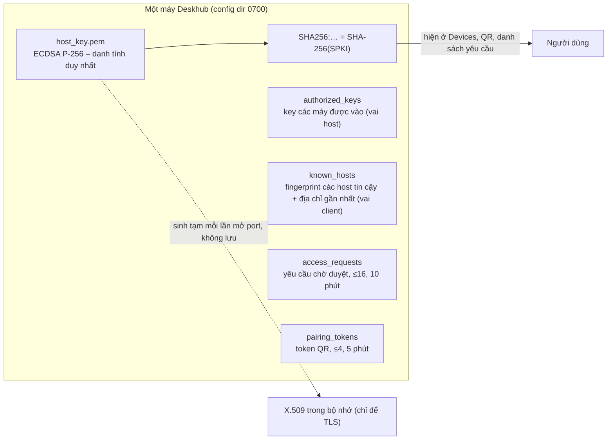
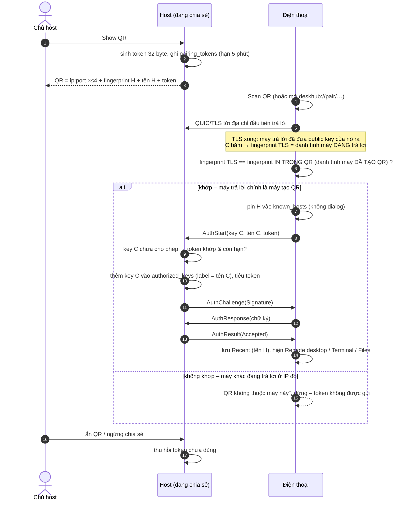
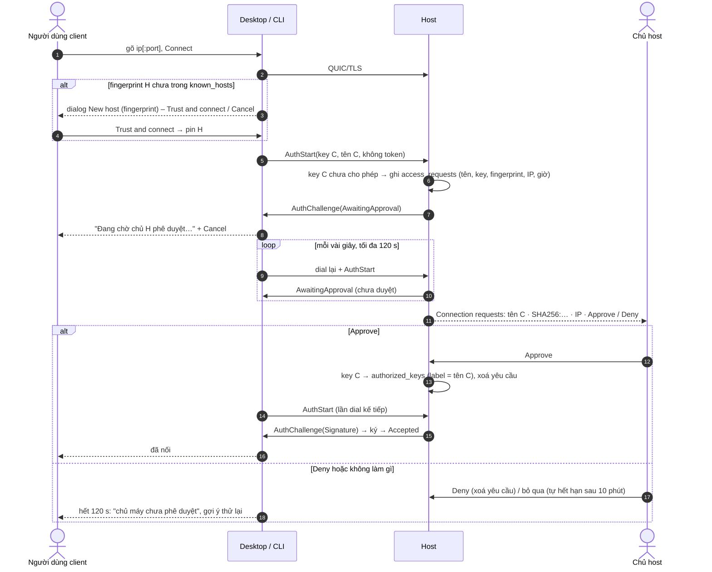
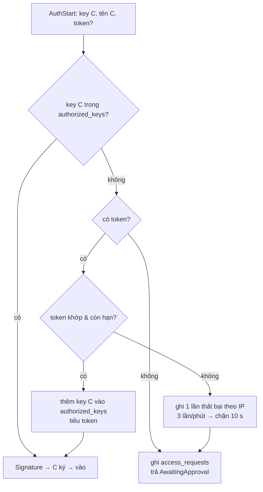
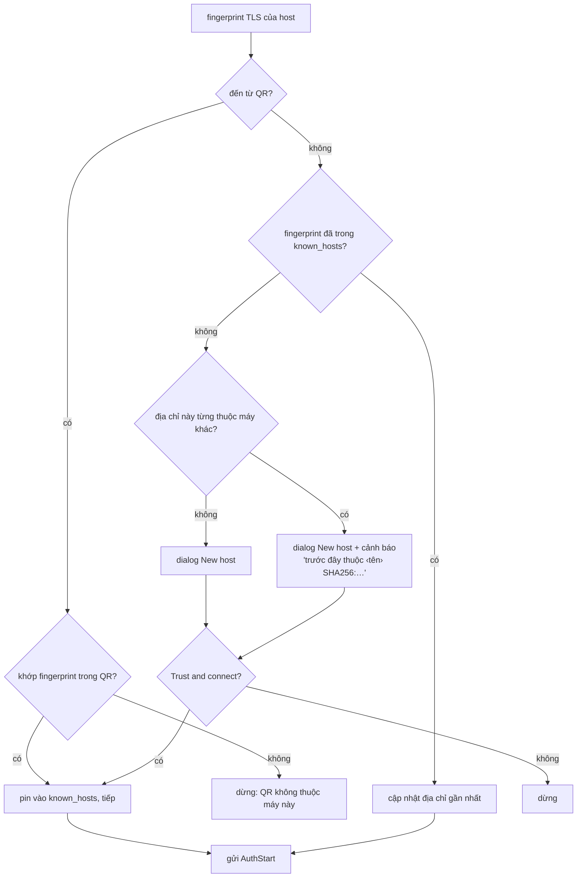
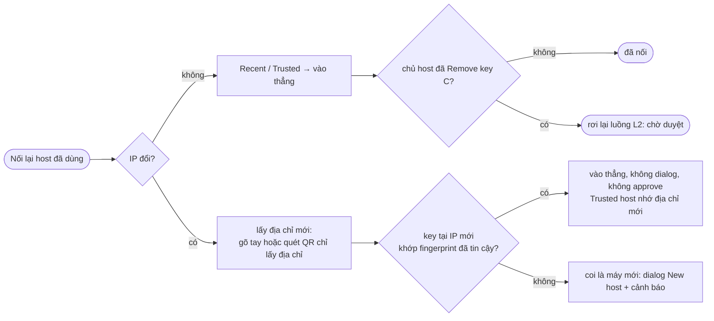
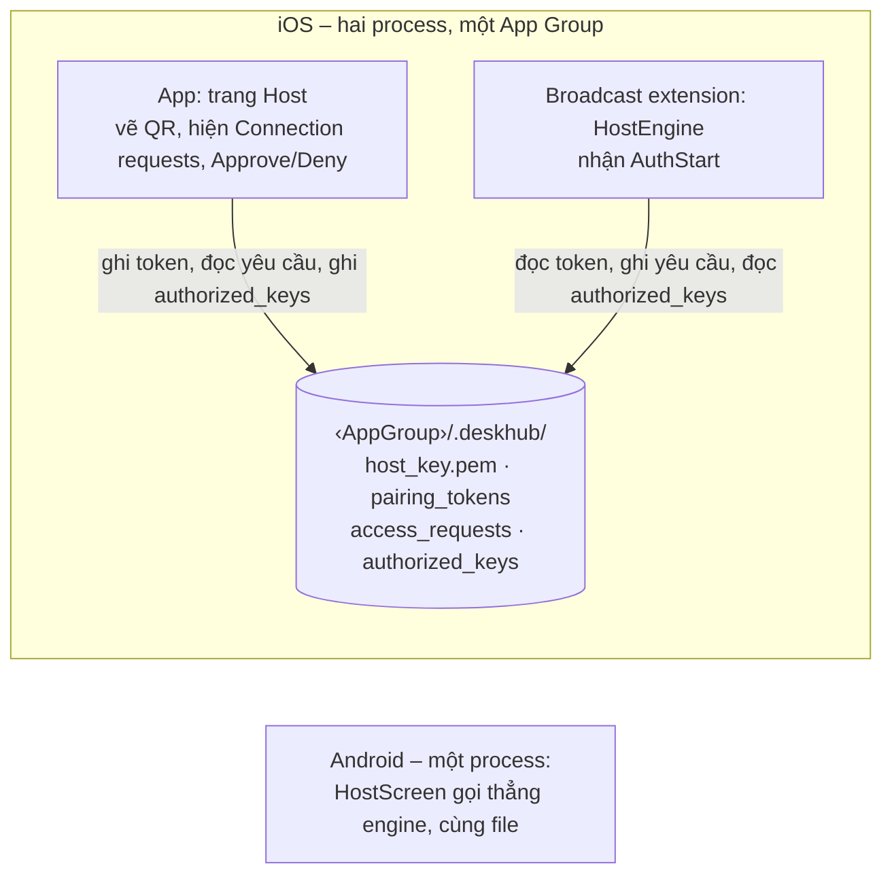

# TODO – Danh tính máy, kết nối bằng QR, phê duyệt tại host

File làm việc để chốt **luồng** trước khi viết code. Sửa trực tiếp vào đây; phần code chỉ bắt đầu khi bốn câu hỏi ở mục 4 đã được trả lời.

## 0. Vì sao

- Hôm nay muốn nối máy A vào host B phải: (1) gõ IP, (2) so fingerprint của B bằng tay,
  (3) copy public key của A gửi cho chủ B, (4) chủ B dán vào *Clients allowed*. Quá nhiều bước.
- v7 đã cố ý bỏ passcode / prompt phê duyệt / LAN scan (ARCHITECTURE §9, SECURITY, SPEC S-2,
  S-10). Việc này **đảo ngược** một phần quyết định đó nên tài liệu bốn ngôn ngữ phải viết lại.
- Tin cậy hiện gắn với `ip:port` (ARCHITECTURE §9 "A host pin belongs to one endpoint") nên
  đổi IP là phải tin cậy lại. Người dùng muốn tin cậy gắn với **danh tính máy**.

## 1. Danh tính máy (nền của mọi luồng)

| Hôm nay | Đề xuất |
| --- | --- |
| Hai khóa: host key ECDSA P-256 (`host_key.pem` + `host_cert.pem`, cert tự ký 10 năm, CN = tên máy) và client key Ed25519 (`client_key.pem`, thêm khóa đặt tên / import OpenSSH) | **Một khóa** ECDSA P-256 cho cả hai vai, vẫn là file `host_key.pem`. Không đổi tên, không migration: máy đã có khóa dùng tiếp, **fingerprint không đổi**; `host_cert.pem` còn sót thì bỏ qua, không đọc nữa; máy chưa có khóa thì sinh mới như hiện nay |
| Cert lưu đĩa, là thứ TLS đưa ra; fingerprint = SHA-256(SPKI) của khóa trong cert | **Không lưu cert.** Mỗi lần mở port sinh cert tạm trong bộ nhớ bọc quanh khóa (TLS bắt buộc phải có X.509; quiche cho phép đưa `SSL*` tự tạo qua `quiche_conn_new_with_tls`; dự phòng: ghi cert tạm 0600 rồi xoá ngay sau khi quiche đọc). Fingerprint vẫn = SHA-256(SPKI) nên không phụ thuộc cert |
| Danh tính = `SHA256:…` của host key; client có fingerprint riêng | **Một** `SHA256:…` cho máy, hiện ở Devices > *This machine*, dùng ở mọi nơi: QR, danh sách yêu cầu, `authorized_keys`, `known_hosts` |
| `known_hosts` pin theo `ip:port` | `known_hosts` pin theo **fingerprint**; mỗi máy tin cậy nhớ tên + địa chỉ **gần nhất** (cập nhật mỗi lần nối được) |
| Khóa đổi tại cùng IP → chặn cứng | Cùng IP nhưng khóa khác = **máy khác**, chưa tin cậy → dialog *New host* như máy mới, kèm dòng cảnh báo "địa chỉ này trước đây thuộc về ‹tên› (SHA256:…)". Không còn khái niệm "host key changed" |




Hệ quả cần chấp nhận:

- Client cũ (v7.0.x) không nối được host mới (auth version 7) và ngược lại → thông báo
  "versions do not match" như S-10.
- Public key phía client đổi (Ed25519 → khóa máy) → host phải cho phép lại **một lần**, giờ
  chỉ là một cú bấm Approve hoặc một lần quét QR.
- **Đã chốt**: bỏ hẳn "My keys" (nhiều khóa đặt tên, import OpenSSH/PKCS#8, S-9). Devices chỉ
  còn *This machine* với fingerprint và *Copy public key* của khóa máy. `client_key*.pem` cũ
  bị bỏ qua. Trusted host không còn trường "client key"; CLI bỏ `key generate/import/delete`,
  `--identity`.

## 2. Các luồng

Ký hiệu: **H** = máy host, **C** = máy client. Mọi bước "tự động" không hiện gì cho người dùng.

### L1. Điện thoại quét QR (lần đầu)

1. H đang chia sẻ, bấm **Show QR** (trang Host, cạnh danh sách địa chỉ). QR chứa: tối đa 4
   `ip:port` của H, fingerprint H, tên H, **token** 32 byte dùng một lần (hạn 5 phút).
2. C bấm **Scan QR** (hoặc mở link `deskhub://pair/…` bằng camera hệ thống).
3. C tự động: dial lần lượt các địa chỉ trong QR → TLS xong, máy trả lời đã đưa public key
   của nó ra → C băm thành fingerprint và so với fingerprint **in trong QR**. Khớp = máy đang
   trả lời chính là máy đã tạo QR (có private key) → **pin H vào `known_hosts`** (không dialog).
   Không khớp = máy khác ở IP đó → báo "QR không thuộc máy này", dừng, token không rời máy.
4. C gửi `AuthStart` (public key C, tên C, token).
5. H: key C chưa có trong `authorized_keys`; token khớp → **thêm key C với label = tên C**,
   tiêu token → yêu cầu C ký như thường → C vào.
6. Trang Client của C chuyển sang trạng thái đã nối (Remote desktop / Terminal / File
   transfer); H lưu vào Recent của C với tên H.
7. H ẩn QR (hoặc ngừng chia sẻ) → token bị thu hồi dù chưa dùng.




### L2. Desktop / CLI nối host lạ (phê duyệt)

1. C gõ `ip[:port]` (hoặc dán link invite), bấm Connect.
2. C dial → TLS → fingerprint H **chưa** trong `known_hosts` → dialog **New host** (hiện tên?
   chưa có – chỉ fingerprint) với *Trust and connect* / *Cancel* (giữ C-2). Đã tin cậy → bỏ qua.
3. C gửi `AuthStart` không token. H: key chưa cho phép → ghi **yêu cầu kết nối** (tên C, key,
   fingerprint C, IP C, giờ) vào `access_requests`, trả `AwaitingApproval`.
4. C hiện "Đang chờ chủ ‹H› phê duyệt máy này…" + **Cancel**; tự dial lại mỗi vài giây
   (backoff hiện có), tối đa **120 s**. CLI in một dòng chờ rồi chờ tương tự.
5. H: mục **Connection requests** (trang Host, mọi nền tảng; CLI in dòng + lệnh) hiện dòng:
   tên C · `SHA256:` 12 ký tự · IP · **Approve** · **Deny**. Yêu cầu tự hết hạn sau 10 phút;
   tối đa 16, trùng key thì cập nhật IP/giờ.
6. Approve → key C vào `authorized_keys` (label = tên C), dòng biến mất. Lần dial kế tiếp của C
   được ký → vào. Deny → dòng biến mất; C hết 120 s báo "chủ máy chưa phê duyệt" (không lộ
   việc bị Deny).
7. Hết 120 s chưa duyệt → C báo lỗi, gợi ý thử lại; yêu cầu vẫn nằm trên H tới 10 phút, nên
   H duyệt muộn thì C chỉ cần Connect lại là vào.




Quyết định phía host khi nhận `AuthStart` (một chỗ duy nhất, `HostAuth::Begin`):



Quyết định phía client sau khi TLS xong (`HostLink::SettleTrust`):



### L3. Lần nối sau (bất kể lần đầu là L1 hay L2)

| Tình huống | Hành vi |
| --- | --- |
| Bấm Recent / Trusted host, IP không đổi | Vào thẳng. Không dialog, không QR, không yêu cầu |
| H **đổi IP** | Gõ IP mới, bấm Connect → **vào thẳng**: fingerprint H đã tin cậy, key C đã cho phép nên không dialog, không approve. Trusted host nhớ IP mới, lần sau lại chỉ cần bấm. (Không có discovery nên IP mới phải do người dùng gõ; quét QR cũng chỉ để lấy địa chỉ, token không bị tiêu.) |
| Chủ H đã **Remove** key C | C rơi lại L2 bước 3 |
| Cùng IP cũ nhưng **khóa khác** (cài lại máy H, hoặc máy khác chiếm IP) | Coi là máy mới: dialog *New host* + cảnh báo "địa chỉ này trước đây thuộc ‹tên› SHA256:…". Máy H cũ vẫn giữ nguyên trong Trusted hosts cho tới khi người dùng Remove |
| C quét lại QR của H đã cho phép | Vào thẳng, token không tiêu |




### L4. Điện thoại là host

- Android: trang Host có **Show QR** và **Connection requests** như desktop (engine cùng process).
- iOS: host chạy trong broadcast extension; app vẫn vẽ QR (đọc khóa máy + địa chỉ + port từ
  config dir chung) và đọc `access_requests` trong App Group; Approve ghi `authorized_keys`
  mà extension đọc lại ở lần C thử tiếp. Token cũng nằm trong file chung vì hai process.




### L5. CLI

```sh
deskhub-cli share --qr                      # in QR (ký tự khối) + link invite
deskhub-cli access requests [--json]        # danh sách chờ
deskhub-cli access approve --fingerprint SHA256:…
deskhub-cli access deny    --fingerprint SHA256:…
deskhub-cli connect 192.168.1.10            # "Waiting for approval…" rồi vào khi được duyệt
deskhub-cli connect 'deskhub://pair/…'      # vào thẳng bằng invite
```
`share` đang chạy in "Connection request from ‹tên› (SHA256:…, IP). Approve: deskhub-cli
access approve --fingerprint SHA256:…" khi có yêu cầu mới (process khác duyệt qua file).

### L6. Những gì **không** đổi

- Không discovery, host không trả gói plaintext (D-1). QR/link là kênh ngoài băng.
- Dán public key bằng tay, `access add --stdin`, `host add` pin trước vẫn dùng được.
- Không passcode, không công tắc "cho máy lạ vào": không ai vào nếu không có token hợp lệ hoặc
  cú bấm Approve.

## 3. Bảo mật (ghi vào SECURITY/ARCHITECTURE §9)

- Token: ngẫu nhiên 32 byte, một lần, 5 phút, so sánh constant-time; token sai tính là thất
  bại theo IP trong `AuthFailureLimiter` hiện có (3 lần/phút → chặn 10 s). C pin fingerprint H
  **trước** khi gửi token nên kẻ đứng giữa không lấy được token.
- Yêu cầu kết nối chỉ chứa thứ C tự khai (tên) + thứ H đo được (key, IP); Approve theo
  fingerprint, không theo thứ tự dòng. Không có mã xác minh (quyết định của người dùng).
- Host không giữ thêm connection chưa xác thực khi chờ duyệt (xử lý như `Denied` hôm nay).
- Tin cậy theo danh tính bỏ "hard block on key change"; thay bằng cảnh báo địa chỉ từng thuộc
  máy khác. Cần ghi rõ trong SECURITY là đổi so với v7.
- `access_requests`, `pairing_tokens`, `host_key.pem` trong config dir 0700/0600. PRIVACY
  lên 2.11 (thêm hai file, quyền camera chỉ khi quét, khung hình không rời máy).

## 4. Câu hỏi mở – đã chốt hết

1. ~~Nhiều khóa client / import OpenSSH (S-9)~~ **Đã chốt: bỏ hẳn.**
2. ~~Tên file khóa~~ **Đã chốt**: giữ `host_key.pem`, không đổi tên, không migration; `host_cert.pem` cũ bị bỏ qua.
3. ~~Dialog *New host* ở L2 bước 2~~ **Đã chốt: giữ.** Approve bảo vệ H, dialog bảo vệ C khỏi
   host giả. Quét QR thì bỏ qua dialog vì QR đã mang fingerprint.
4. ~~Cách vẽ QR~~ **Đã chốt**: encoder tự viết trong `core/` dùng cho cả 5 client + CLI (một
   đường vẽ, test offline). Android quét bằng CameraX + ZXing core; iOS quét bằng AVFoundation.

## 5. Tóm tắt phần code (chỉ để ước lượng, chưa làm)

- **core/**: `Base64.h` (gom hai bản lặp), Wire auth v7 (`AuthStart.pairingToken`,
  `AuthMode::AwaitingApproval`, `AuthResultCode::AwaitingApproval` local-only),
  `PairingInvite` (payload `deskhub://pair/` + base64url record nhị phân ≤ 180 ký tự),
  `PairingTokens`, `AccessRequests`, `TrustStore` đổi khóa tra cứu sang fingerprint + địa chỉ
  gần nhất, `QrCode` encoder, Strings, CLI parser. Test đủ, coverage ≥ 90/80.
- **platform/**: `Identity` thay `HostIdentity`+`ClientIdentity` (một khóa, cert tạm trong bộ
  nhớ, `QuicEndpoint` dùng `quiche_conn_new_with_tls`), `AccessRequestsFile`,
  `PairingTokenFile`, `host/PairingInvite`, `AuthNegotiation` 4 nhánh, `SessionTransport`,
  `HostEngine`, `HostLink` (pin theo fingerprint, vòng chờ duyệt 120 s), `SourceQuery`, FFI
  (`PairingFfi`, `dh_access_*`, `dh_list_sources` + invite/cancel/status).
- **client/**: Host page (Show QR, Connection requests) ×5 + CLI; Client page (Scan QR trên
  Android/iOS, dán link ở mọi nơi, màn chờ duyệt + Cancel); bỏ/thu gọn My keys theo câu hỏi 1.
- **docs ×4**: SPEC (C-1, C-2, C-5, C-12 mới, H-6, H-16 mới, S-2, S-3, S-4, S-8, S-9, S-10,
  D-5, P-4, P-6, §13), ARCHITECTURE (§3, §7, §9), SECURITY, PRIVACY 2.11, INSTALL, README,
  THIRD_PARTY_NOTICES (CameraX, ZXing), `VERSION` 7.1.0 + release notes.
- Thứ tự: core → platform → CLI (thử end-to-end sớm) → Linux → Windows → macOS → iOS →
  Android → docs → `make test-all`, `make lint`, `make lint-tidy`, `make coverage`.

## 6. Tiến độ triển khai

- [x] Tạo `TODO.md` ở gốc repo (file này).
- [x] Chốt 4 câu hỏi mở.
- [x] Người dùng duyệt luồng L1–L6 và ra lệnh triển khai.
- [x] `core/`: Base64 dùng chung, Wire auth v7, `PairingInvite`, `PairingTokens`,
      `AccessRequests`, `TrustStore` theo fingerprint, `HostProfiles` không còn client key,
      QR encoder tự viết, Strings, CLI parser (`share --qr`, `access requests|approve|deny`,
      `connect INVITE`, `--approval-wait`, bỏ `key generate/import/delete`, `--identity`).
      `make test` xanh, coverage 96 % dòng / 87 % nhánh.
- [x] `platform/`: một khóa `host_key.pem` cho cả hai vai, cert TLS sinh trong bộ nhớ,
      `AccessRequestsFile`, `PairingTokenFile`, `BuildPairingInvite`, `HostAuth::Begin` bốn
      nhánh, `SessionTransport` (chặn đoán token theo IP), `HostLink` (pin theo fingerprint,
      chờ duyệt 120 s), `SourceQuery` (invite, cancel, progress), FFI mới (`PairingFfi`,
      `dh_access_*`, `dh_list_sources` mở rộng). `platform_tests` + `integration_tests` xanh.
- [x] CLI: các lệnh mới, in QR ra terminal, in dòng yêu cầu khi đang share;
      `scripts/cli-smoke.sh` chạy cả luồng phê duyệt và luồng invite bằng nhiều config dir.
- [x] Linux GTK: Show QR, Connection requests, Copy public key, dán invite, chờ duyệt + Cancel;
      build sạch, chạy được.
- [x] Windows wx: cùng nội dung (chưa biên dịch được trên máy Linux này).
- [x] macOS/iOS (Swift): Show QR, Connection requests, Copy public key, dán invite, Scan QR
      bằng AVFoundation trên iOS, URL scheme `deskhub://` trên iOS (chưa biên dịch được trên
      Linux; macOS chưa có URL scheme, dán link thay thế).
- [x] Android: Compose + CameraX + ZXing, intent `deskhub://`, `make build-android` xanh,
      detekt 0 lỗi (chưa chạy thử trên thiết bị).
- [x] Tài liệu: SPEC (H-18 cho Connection requests vì H-16 đã dùng; C-12 mới), ARCHITECTURE,
      SECURITY, PRIVACY 2.11, INSTALL, BUILD, README, release notes 7.1.0, `VERSION` 7.1.0,
      fastlane; mirror đủ vi/zh/ja; THIRD_PARTY_NOTICES thêm CameraX + ZXing.
- [x] `make format`, `make lint` (format + dead code + detekt), clang-tidy, coverage
      (96 % dòng / 87 % nhánh) đều xanh.
- [ ] Còn lại ngoài khả năng trên máy này: biên dịch Windows/macOS/iOS, chạy thử quét QR
      trên điện thoại thật, chụp lại ảnh Devices page trong README (còn hiện My keys).
