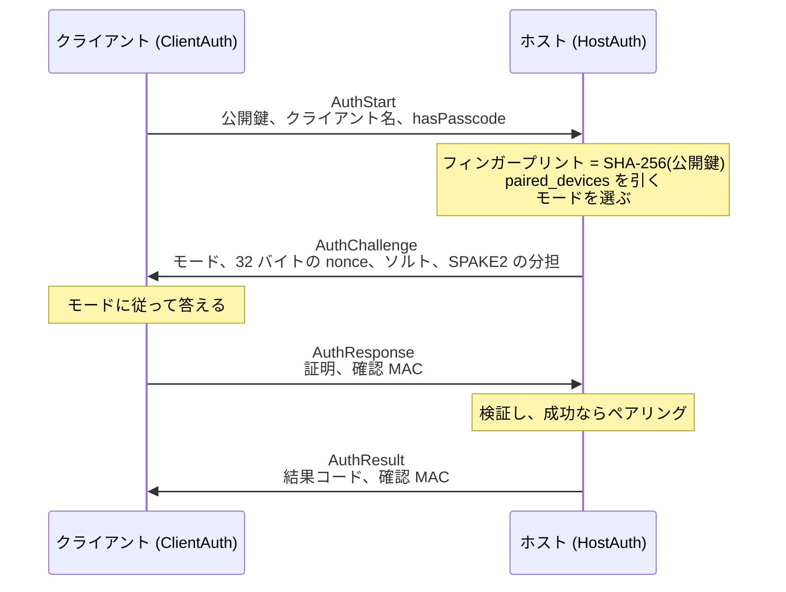
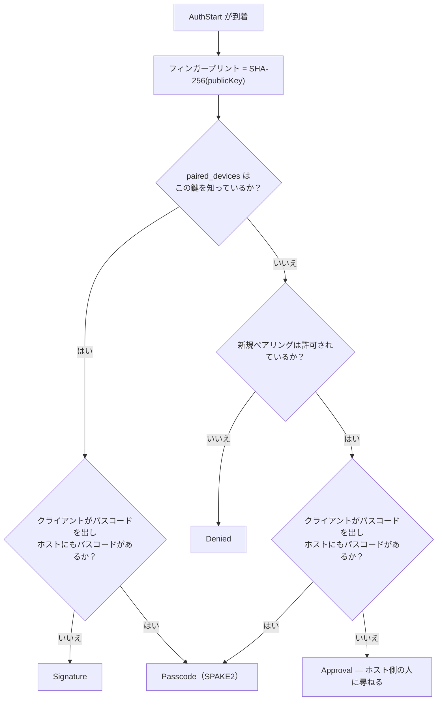
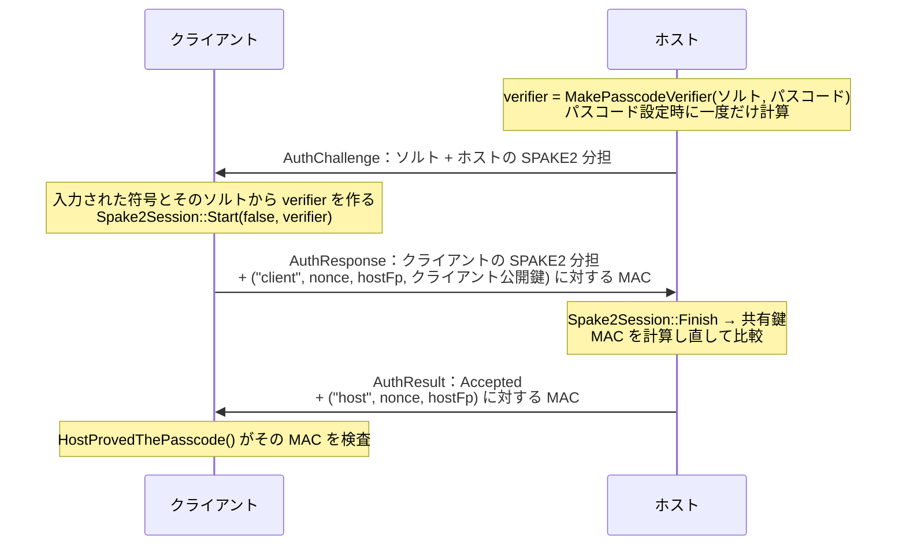
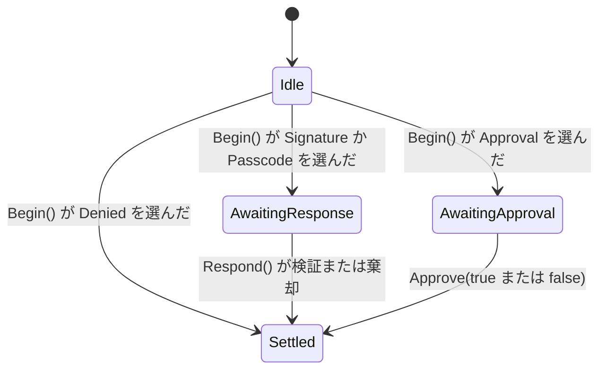

[English](AUTH.md) · [Tiếng Việt](AUTH.vi.md) · [中文](AUTH.zh.md) · **日本語**

# Deskhub — 識別情報、ペアリング、ハンドシェイク

本書は**仕組み**を記述する。各マシンが持つ鍵、接続を受け入れる 4 通のメッセージ、マシン
が自分を証明する 3 つの方法、そしてその後に双方がディスクへ書くものである。

方針の側——どの組み合わせがどの結果になるか——は
[`ARCHITECTURE.ja.md`](ARCHITECTURE.ja.md) の §3 にある。脅威モデルは
[`SECURITY.ja.md`](../SECURITY.ja.md) にあり、本書はそれを繰り返さない。

本書は [`AUTH.md`](AUTH.md) の翻訳である。相違がある場合は英語版が正典となる。

- **状態：** 現在のコードを記述している。
- **読者：** `platform/auth`、`AuthProof`、信頼ストア、ペアリング済み端末一覧を変更する
  すべての人。

---

## 1. 各マシンが持つもの

どのマシンも——ホストでもクライアントでも、5 つのプラットフォームすべてで——初回起動時に
ECDSA P-256 の鍵ペアを 1 組作り、以後ずっと保持する（`LoadOrCreateHostIdentity`）。

| ファイル | 中身 | 持つ側 |
| --- | --- | --- |
| `host_key.pem` | 秘密鍵 | すべてのマシン |
| `host_cert.pem` | その鍵に対する自己署名証明書 | すべてのマシン |
| `known_hosts` | このマシンが信頼するホストのフィンガープリント（`TrustStore`、最大 256） | クライアント |
| `paired_devices` | このマシンが受け入れたクライアントのフィンガープリント（`PairedDevices`、最大 128） | ホスト |
| `auth_salt` | パスコード verifier を導出するソルト | パスコードを設定したホスト |

**フィンガープリント**は SPKI DER の SHA-256 で、`SHA256:` に 43 文字の base64 を続けて
表示する。人が見比べるのはこれで、`ShortFingerprint` は一覧やログ行のために 12 文字へ
詰める。

TLS はその証明書を使うが、TLS だけでは誰も入れない。受け入れはその上のアプリケーション層
ハンドシェイクが決め、`SessionTransport` は認証が決着していない接続からのメッセージを
すべて捨てる。

## 2. 4 通のメッセージ

ホストがフィンガープリントを要求することはない——**公開鍵そのもの**を受け取り、届いたもの
を自分でハッシュする。他人の識別情報をまとうということは、なりすまし側が持っていない鍵で
署名することを意味する。

## 3. モードの選択

`HostAuth::Begin` は 2 つの事実からモードを 1 つ選ぶ。この鍵はすでにペアリング済みか、
そしてクライアントはパスコードを持ってきたか。

入力されたパスコードは、ペアリング済みかどうかに関わらず必ず検査される。パスコードを出す
ことは、既知のマシンを静かな経路から証明の要る経路へ移すということだ。

## 4. 各モードが証明すること

### Signature — ペアリング済みのマシンが静かに入る

クライアントは自分の識別鍵で
`AuthTranscript("client", nonce, hostFingerprint)` に署名する。ホストは今受け取った公開鍵
で検証する。成功すると `TouchPairedDevice` が呼ばれ、最終確認時刻が更新される。

このトランスクリプトは署名を**この接続**（nonce による）と**このホスト**（そのフィンガー
プリントによる）に縛り付ける。よそで捕まえた署名はここでは役に立たない。

### Passcode — SPAKE2、そしてホストも証明する

この形から 4 つの性質が導かれ、その 4 つすべてが狙いである：

- **符号は決して流れない。** 流れるのは SPAKE2 の分担と MAC だけだ。
- **接続 1 本につき 1 回の推測。** 符号が違えば `Finish` が失敗するか MAC が一致せず、
  やり取りはそこで終わる——オフラインで挽くための材料は残らない。
- **双方が証明する。** `"host"` ラベルのトランスクリプトに対するホスト自身の MAC こそ、
  `HostProvedThePasscode` が確かめるものだ。それを作れないホストは符号を知らない。だから
  パスコードを証明したクライアントは、そのホストを**確認を求めずに**記憶する。
- **MAC はクライアントが実際に見たホスト鍵に縛られる。** トランスクリプトが
  `hostFingerprint` を運ぶため、中継は成り立たない。間に立つマシンが自分の鍵でクライアント
  に証明しても、クライアントが受け入れない MAC しか作れない。

成功するとクライアントはペアリングされ（`RememberPairedDevice`）、次の接続からは静かな
Signature 経路が使える。

### Approval — 人が門になる

誰も見たことのないマシンに暗号学的な証明はあり得ないので、ホストは接続を
`AwaitingApproval` に留め、ホスト側にいる人へ名前と短いフィンガープリントを見せて尋ねる
（*このマシンを入れますか？*）。`Approve(true)` はそのマシンをペアリングし、
`Approve(false)` は `Refused` として決着させる。

### Denied

未知のマシンで、新規ペアリングのスイッチが切られている場合。ペアリング済みのマシンは
Signature のままだ——このスイッチが支配するのは新規ペアリングであって、既存のものではない。

## 5. ホスト側の状態

`HostAuth` は相手アドレスごとに 1 つ存在する（`SessionTransport` の `hostAuth_`）ので、
2 台が同時に交渉しても互いを乱すことはない。誤った状態で `Respond` が呼ばれた場合は、
復旧を試みずに `NotPaired` として決着する。

| `AuthResultCode` | いつ |
| --- | --- |
| `Accepted` | 証明が通った、または人が承認した |
| `WrongPasscode` | SPAKE2 の finish が失敗、または確認 MAC が不一致 |
| `NotPaired` | 署名が通らない、またはメッセージが誤った状態で届いた |
| `PairingDisabled` | 未知のマシンで、新規ペアリングが無効 |
| `Refused` | 人が断った |
| `TimedOut` | 承認の問いに誰も答えなかった |
| `Locked` | パスコード経路がロック中 |

パスコードを 3 回間違えるとその経路が 30 秒ロックされる（`AuthThrottle`、
`kMaxPasscodeAttempts` = 3、`kPasscodeLockoutUs` = 30 秒）。承認の経路にスロットルは不要
だ——人そのものがレート制限だからである。

## 6. クライアント側の信頼

`TrustStore` はエンドポイントごとにホスト鍵を固定し、3 つの判定のいずれかを返す：

| `TrustVerdict` | 意味 | 何が起きるか |
| --- | --- | --- |
| `Unknown` | ここへ接続したことがない | ハンドシェイクが決める。パスコードを証明できたなら黙って記憶し、そうでなければ人に尋ねる |
| `Trusted` | フィンガープリント一致 | 接続する |
| `Changed` | **同じエンドポイントで鍵が違う** | 大きな警告の後ろで接続を止める |

`Changed` は知っておく価値のある場合だ。自動で続くものは何もない。良性の説明（ホストを
入れ直した）と敵対的な説明（そのアドレスで別人が応答している）は、ここからは見分けが
つかないからである。

## 7. 受け入れのあと

受け入れは**接続ごとに一度だけ**決着する。トランスポートより上で問い直すものはない。以後
のメッセージはパスコードを運ばず、セッション・ターミナル・ファイル・入力のどの経路も接続
全体を認証済みとして扱う。

ターミナルのセッション表に `SetConnectionAuthenticated` があるのはそのためだ。受け入れ済み
の接続で開かれたシェルは何も証明し直さないが、未認証の経路で開こうとするシェルは自分の
パスコード検査に向き合うことになる。

## 8. 読み進める地図

| 理解したいこと | 読むもの |
| --- | --- |
| モード選択と 2 つの状態機械 | `platform/src/auth/AuthNegotiation.cpp`（212 行） |
| 署名、MAC、SPAKE2、トランスクリプト | `platform/include/deskhubp/system/AuthProof.h` |
| ハンドシェイクを駆動する側 | `platform/src/net/SessionTransport.cpp` の `HandleHostAuth` / `RunClientAuth` |
| 鍵の生成とフィンガープリント | `platform/src/system/HostIdentity*.cpp` |
| 信頼ストアの形式 | `core/src/net/TrustStore.cpp` |
| ペアリング済み端末の形式 | `core/src/net/PairedDevices.cpp` |
| ロックアウト | `core/include/deskhub/session/host/AuthThrottle.h` |

## 9. 既知の隙間

- **ペアリングは鍵単位、アドレスは参考にすぎない。** `paired_devices` はフィンガープリント
  を鍵に持つが、`known_hosts` は*エンドポイント*を鍵に持つ。同じホストでも新しいアドレスで
  来れば再び `Unknown` になり、人はもう一度尋ねられる。
- **忘れる以外の失効手段がない。** マシンは受け入れられているか忘れられているかのどちらか
  で、ペアリングに期限はなく、二度と受け入れない鍵の一覧もない。
- **承認の問いはマシン単位ではなく接続単位。** 一度断られたマシンが「断られた」として記憶
  されることはなく、すぐにもう一度尋ねられる。
