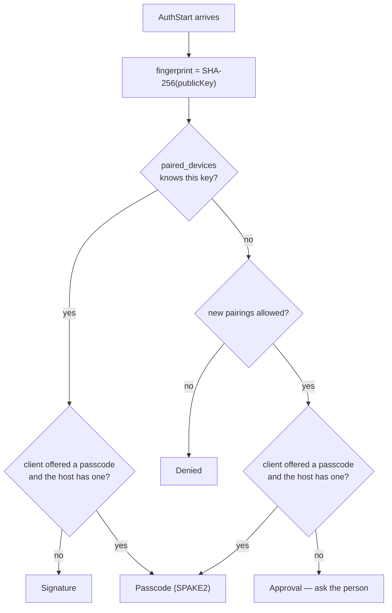
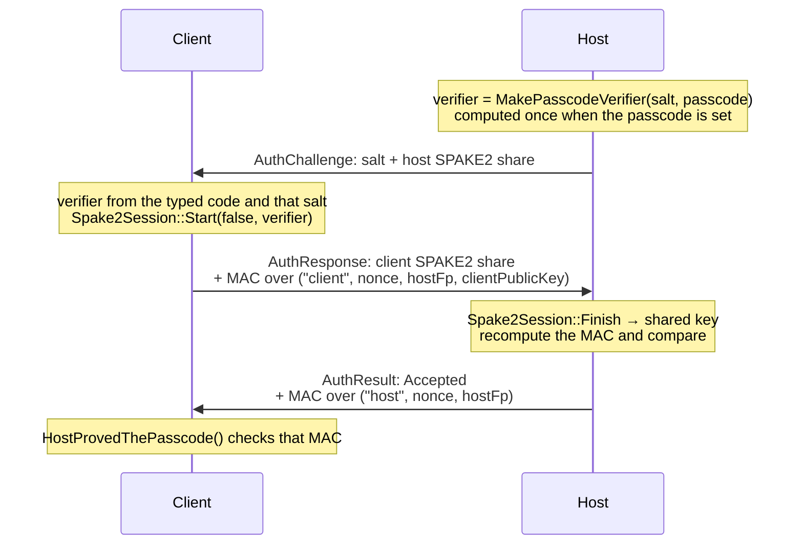
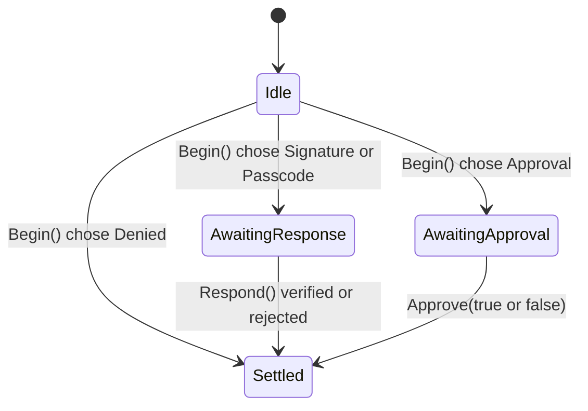

**English** · [Tiếng Việt](AUTH.vi.md) · [中文](AUTH.zh.md) · [日本語](AUTH.ja.md)

# Deskhub — Identity, pairing and the handshake

This document describes the **mechanism**: the keys each machine holds, the four
messages that admit a connection, the three ways a machine can prove itself, and what
each side writes to disk afterwards.

The policy view — which combination leads to which outcome — is §3 of
[`ARCHITECTURE.md`](ARCHITECTURE.md). The threat model is
[`SECURITY.md`](../SECURITY.md); this document does not restate it.

- **Status:** describes the current code.
- **Audience:** anyone changing `platform/auth`, `AuthProof`, the trust store or the
  paired-device list.

---

## 1. What each machine holds

Every machine — host or client, all five platforms — creates one ECDSA P-256 key pair
on first run and keeps it forever (`LoadOrCreateHostIdentity`).

| File | Holds | Who has it |
| --- | --- | --- |
| `host_key.pem` | the private key | every machine |
| `host_cert.pem` | a self-signed certificate over that key | every machine |
| `known_hosts` | host fingerprints this machine trusts (`TrustStore`, max 256) | clients |
| `paired_devices` | client fingerprints this machine has admitted (`PairedDevices`, max 128) | hosts |
| `auth_salt` | the salt the passcode verifier is derived with | hosts with a passcode |

The **fingerprint** is the SHA-256 of the SPKI DER, shown as `SHA256:` plus 43 base64
characters. It is what a person compares; `ShortFingerprint` trims it to 12 characters
for lists and log lines.

TLS uses that certificate, but TLS alone admits nobody. Admission is decided by an
application-level handshake on top of it, and `SessionTransport` drops every message
from a connection whose auth has not settled.

## 2. Four messages

```mermaid
sequenceDiagram
    participant C as Client (ClientAuth)
    participant H as Host (HostAuth)
    C->>H: AuthStart<br/>public key, client name, hasPasscode
    Note over H: fingerprint = SHA-256(public key)<br/>look it up in paired_devices<br/>pick a mode
    H->>C: AuthChallenge<br/>mode, 32-byte nonce, salt, SPAKE2 share
    Note over C: answer according to the mode
    C->>H: AuthResponse<br/>proof, confirm MAC
    Note over H: verify; pair on success
    H->>C: AuthResult<br/>code, confirm MAC
```

The host never asks for a fingerprint — it receives the **public key itself** and
hashes what arrived. Wearing someone else's identity would mean signing with a key the
impostor does not hold.

## 3. Choosing a mode

`HostAuth::Begin` picks one of four modes from two facts: is this key already paired,
and did the client bring a passcode.



A typed passcode is always checked, paired or not: offering one moves a known machine
off the silent path and onto the proving path.

## 4. What each mode proves

### Signature — a paired machine, silently

The client signs `AuthTranscript("client", nonce, hostFingerprint)` with its identity
key. The host verifies against the public key it just received. Success calls
`TouchPairedDevice`, updating the last-seen time.

The transcript binds the signature to **this** connection (the nonce) and to **this**
host (its fingerprint), so a signature captured elsewhere is useless here.

### Passcode — SPAKE2, and the host proves it too



Four properties fall out of this shape, and all four are the point:

- **The code never travels.** Only SPAKE2 shares and MACs do.
- **One guess per connection.** A wrong code fails `Finish` or the MAC comparison, and
  the exchange is over — there is nothing to grind offline.
- **Both sides prove it.** The host's own MAC over a `"host"`-labelled transcript is
  what `HostProvedThePasscode` checks. A host that cannot produce it does not know the
  code, so a client that proved a passcode remembers that host **without a prompt**.
- **MACs are bound to the host key the client actually saw.** The transcript carries
  `hostFingerprint`, which kills a relay: a machine in the middle proving to the client
  with its own key produces a MAC the client will not accept.

Success pairs the client (`RememberPairedDevice`), so the next connection can use the
silent Signature path.

### Approval — a person is the gate

No cryptographic proof is possible for a machine nobody has ever seen, so the host
parks the connection in `AwaitingApproval` and asks the person at the host
(*Let this machine in?*), showing the name and short fingerprint. `Approve(true)` pairs
the machine; `Approve(false)` settles as `Refused`.

### Denied

An unknown machine with new pairings switched off. Paired machines still get Signature —
the switch governs new pairings, not existing ones.

## 5. Host-side state



One `HostAuth` exists per peer address (`hostAuth_` in `SessionTransport`), so two
machines negotiating at once cannot disturb each other. `Respond` called in the wrong
state settles as `NotPaired` rather than trying to recover.

| `AuthResultCode` | When |
| --- | --- |
| `Accepted` | proof verified, or the person approved |
| `WrongPasscode` | SPAKE2 finish failed, or the confirm MAC did not match |
| `NotPaired` | signature failed, or a message arrived in the wrong state |
| `PairingDisabled` | unknown machine, new pairings off |
| `Refused` | the person said no |
| `TimedOut` | the approval prompt was never answered |
| `Locked` | the passcode path is locked out |

Three wrong passcodes lock that path for 30 seconds (`AuthThrottle`,
`kMaxPasscodeAttempts` = 3, `kPasscodeLockoutUs` = 30 s). The approval path needs no
throttle — a human is already the rate limit.

## 6. Client-side trust

`TrustStore` pins host keys per endpoint and returns one of three verdicts:

| `TrustVerdict` | Meaning | What happens |
| --- | --- | --- |
| `Unknown` | never connected here | settled by the handshake; a proved passcode remembers it silently, otherwise the person is asked |
| `Trusted` | fingerprint matches | connect |
| `Changed` | **different key at the same endpoint** | connection blocked behind a loud warning |

`Changed` is the case worth knowing: nothing continues automatically, because the
benign explanation (the host reinstalled) and the hostile one (someone else answering
at that address) look identical from here.

## 7. After admission

Admission settles **once per connection**. Nothing above the transport asks again: no
later message carries a passcode, and every session, terminal, file and input path
treats the whole connection as authenticated.

That is why `SetConnectionAuthenticated` exists on the terminal session table — a shell
opened over an admitted connection does not re-prove anything, while a shell asking for
one on an unauthenticated path still faces its own passcode check.

## 8. Reading map

| To understand | Read |
| --- | --- |
| Mode choice and both state machines | `platform/src/auth/AuthNegotiation.cpp` (212 lines) |
| Signatures, MACs, SPAKE2, transcripts | `platform/include/deskhubp/system/AuthProof.h` |
| Who drives the handshake | `platform/src/net/SessionTransport.cpp`, `HandleHostAuth` / `RunClientAuth` |
| Key creation and fingerprints | `platform/src/system/HostIdentity*.cpp` |
| Trust store format | `core/src/net/TrustStore.cpp` |
| Paired devices format | `core/src/net/PairedDevices.cpp` |
| Lockout | `core/include/deskhub/session/host/AuthThrottle.h` |

## 9. Known gaps

- **Pairing is by key, addresses are advisory.** `paired_devices` is keyed by
  fingerprint, but `known_hosts` is keyed by *endpoint* — so the same host reached at a
  new address is `Unknown` again, and the person is asked once more.
- **No revocation beyond forgetting.** A machine is admitted or forgotten; there is no
  expiry on a pairing and no list of keys that must never be admitted again.
- **The approval prompt is per connection, not per machine.** A machine refused once is
  not remembered as refused; it can ask again immediately.
