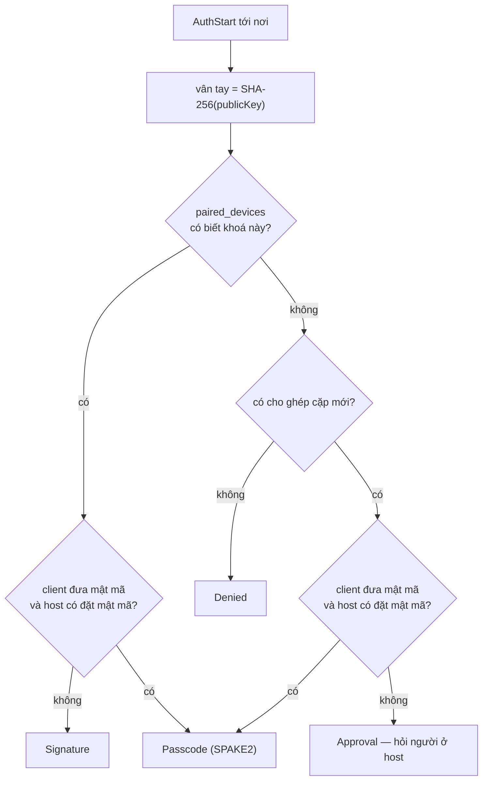
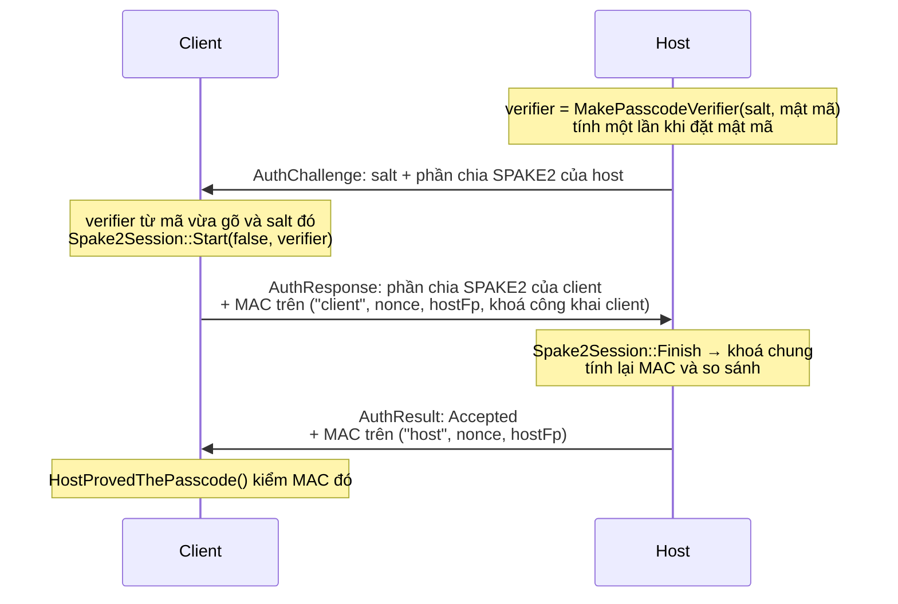
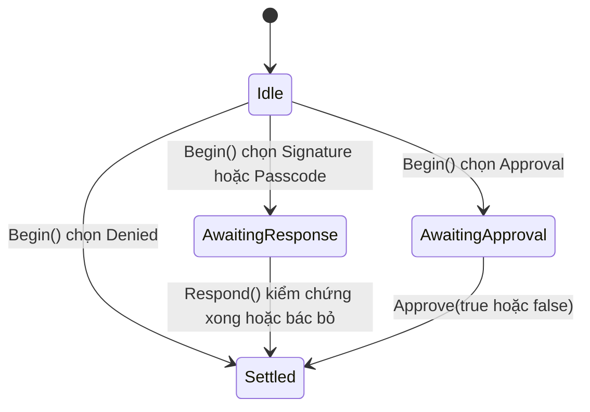

[English](AUTH.md) · **Tiếng Việt** · [中文](AUTH.zh.md) · [日本語](AUTH.ja.md)

# Deskhub — Danh tính, ghép cặp và cái bắt tay

Tài liệu này mô tả **cơ chế**: mỗi máy giữ khoá gì, bốn bản tin cho một kết nối vào
cửa, ba cách một máy tự chứng minh, và mỗi bên ghi gì ra đĩa sau đó.

Góc nhìn chính sách — tổ hợp nào dẫn tới kết quả nào — nằm ở §3 của
[`ARCHITECTURE.vi.md`](ARCHITECTURE.vi.md). Mô hình mối đe doạ nằm ở
[`SECURITY.vi.md`](../SECURITY.vi.md); tài liệu này không nhắc lại nó.

Đây là bản dịch của [`AUTH.md`](AUTH.md); khi hai bản khác nhau, bản tiếng Anh là bản
chuẩn.

- **Trạng thái:** mô tả mã nguồn hiện tại.
- **Đối tượng đọc:** bất kỳ ai sửa `platform/auth`, `AuthProof`, kho tin cậy hay danh
  sách thiết bị đã ghép cặp.

---

## 1. Mỗi máy giữ những gì

Mọi máy — host hay client, cả năm nền tảng — tạo một cặp khoá ECDSA P-256 ở lần chạy
đầu tiên và giữ nó mãi mãi (`LoadOrCreateHostIdentity`).

| Tệp | Chứa | Ai có |
| --- | --- | --- |
| `host_key.pem` | khoá riêng | mọi máy |
| `host_cert.pem` | chứng chỉ tự ký trên khoá đó | mọi máy |
| `known_hosts` | vân tay host mà máy này tin (`TrustStore`, tối đa 256) | client |
| `paired_devices` | vân tay client mà máy này đã cho vào (`PairedDevices`, tối đa 128) | host |
| `auth_salt` | muối dùng để dẫn xuất verifier của mật mã | host có đặt mật mã |

**Vân tay** là SHA-256 của SPKI DER, hiển thị dạng `SHA256:` cộng 43 ký tự base64. Đó là
thứ con người đối chiếu; `ShortFingerprint` cắt còn 12 ký tự cho danh sách và dòng log.

TLS dùng chứng chỉ đó, nhưng riêng TLS không cho ai vào cả. Việc cho vào do một cái bắt
tay ở tầng ứng dụng bên trên quyết định, và `SessionTransport` vứt mọi bản tin đến từ
một kết nối chưa ngã ngũ phần xác thực.

## 2. Bốn bản tin

```mermaid
sequenceDiagram
    participant C as Client (ClientAuth)
    participant H as Host (HostAuth)
    C->>H: AuthStart<br/>khoá công khai, tên client, hasPasscode
    Note over H: vân tay = SHA-256(khoá công khai)<br/>tra trong paired_devices<br/>chọn chế độ
    H->>C: AuthChallenge<br/>chế độ, nonce 32 byte, salt, phần chia SPAKE2
    Note over C: trả lời theo chế độ
    C->>H: AuthResponse<br/>bằng chứng, MAC xác nhận
    Note over H: kiểm chứng; thành công thì ghép cặp
    H->>C: AuthResult<br/>mã kết quả, MAC xác nhận
```

Host không bao giờ hỏi vân tay — nó nhận **chính khoá công khai** và tự băm thứ vừa
tới. Đội lốt danh tính người khác đồng nghĩa với việc phải ký bằng một khoá mà kẻ giả
mạo không có.

## 3. Chọn chế độ

`HostAuth::Begin` chọn một trong bốn chế độ từ hai dữ kiện: khoá này đã ghép cặp chưa,
và client có mang theo mật mã không.



Mật mã đã gõ thì luôn được kiểm, dù đã ghép cặp hay chưa: đưa mật mã sẽ đẩy một máy quen
ra khỏi đường im lặng và vào đường phải chứng minh.

## 4. Mỗi chế độ chứng minh điều gì

### Signature — máy đã ghép cặp, vào im lặng

Client ký `AuthTranscript("client", nonce, hostFingerprint)` bằng khoá danh tính của
nó. Host kiểm chứng với khoá công khai vừa nhận được. Thành công thì gọi
`TouchPairedDevice`, cập nhật thời điểm gặp gần nhất.

Bản ghi ký buộc chữ ký vào **kết nối này** (nhờ nonce) và vào **host này** (nhờ vân tay
của nó), nên một chữ ký bắt được ở nơi khác là vô dụng ở đây.

### Passcode — SPAKE2, và host cũng phải chứng minh



Bốn tính chất rơi ra từ hình dạng này, và cả bốn đều là chủ đích:

- **Mã không bao giờ đi qua đường truyền.** Chỉ có phần chia SPAKE2 và MAC đi qua.
- **Một lần đoán cho mỗi kết nối.** Mã sai thì `Finish` hỏng hoặc MAC không khớp, và cuộc
  trao đổi kết thúc — không còn gì để nghiền ngoại tuyến.
- **Cả hai bên đều chứng minh.** MAC của chính host trên bản ghi mang nhãn `"host"` là
  thứ `HostProvedThePasscode` kiểm. Một host không tạo ra được nó thì không biết mã, nên
  một client đã chứng minh mật mã sẽ nhớ host đó **mà không cần hỏi lại người dùng**.
- **MAC bị buộc vào đúng khoá host mà client thật sự thấy.** Bản ghi mang theo
  `hostFingerprint`, và điều đó giết chết kiểu tiếp sức: một máy đứng giữa chứng minh với
  client bằng khoá của chính nó sẽ tạo ra MAC mà client không chấp nhận.

Thành công thì client được ghép cặp (`RememberPairedDevice`), nên lần kết nối sau có thể
dùng đường Signature im lặng.

### Approval — con người là cửa

Không thể có bằng chứng mật mã học cho một máy chưa ai từng thấy, nên host giữ kết nối ở
`AwaitingApproval` và hỏi người đang ngồi ở host (*Cho máy này vào chứ?*), kèm tên và vân
tay ngắn. `Approve(true)` ghép cặp máy đó; `Approve(false)` chốt là `Refused`.

### Denied

Máy lạ trong khi công tắc ghép cặp mới đang tắt. Máy đã ghép cặp vẫn đi đường Signature —
công tắc này quản việc ghép cặp mới, không quản những cặp đã có.

## 5. Trạng thái phía host



Mỗi địa chỉ phía bên kia có một `HostAuth` riêng (`hostAuth_` trong `SessionTransport`),
nên hai máy đàm phán cùng lúc không quấy nhau được. `Respond` bị gọi sai trạng thái sẽ
chốt là `NotPaired` chứ không cố cứu vãn.

| `AuthResultCode` | Khi nào |
| --- | --- |
| `Accepted` | bằng chứng hợp lệ, hoặc người dùng đã đồng ý |
| `WrongPasscode` | SPAKE2 finish hỏng, hoặc MAC xác nhận không khớp |
| `NotPaired` | chữ ký sai, hoặc bản tin tới sai trạng thái |
| `PairingDisabled` | máy lạ, ghép cặp mới đang tắt |
| `Refused` | người dùng nói không |
| `TimedOut` | lời hỏi đồng ý không bao giờ được trả lời |
| `Locked` | đường mật mã đang bị khoá |

Ba lần mật mã sai khoá đường đó 30 giây (`AuthThrottle`, `kMaxPasscodeAttempts` = 3,
`kPasscodeLockoutUs` = 30 giây). Đường approval không cần chặn — con người vốn đã là bộ
giới hạn nhịp.

## 6. Tin cậy phía client

`TrustStore` ghim khoá host theo từng endpoint và trả về một trong ba phán quyết:

| `TrustVerdict` | Nghĩa | Chuyện gì xảy ra |
| --- | --- | --- |
| `Unknown` | chưa từng kết nối tới đây | do cái bắt tay quyết; mật mã đã chứng minh thì nhớ luôn, còn lại thì hỏi người dùng |
| `Trusted` | vân tay khớp | kết nối |
| `Changed` | **khoá khác tại cùng endpoint** | chặn kết nối sau một cảnh báo lớn |

`Changed` là trường hợp đáng biết: không có gì tự động đi tiếp, vì lời giải thích lành
tính (host cài lại máy) và lời giải thích thù địch (người khác đang trả lời ở địa chỉ đó)
nhìn từ đây giống hệt nhau.

## 7. Sau khi được cho vào

Việc cho vào ngã ngũ **một lần cho mỗi kết nối**. Không gì bên trên transport hỏi lại: các
bản tin sau không mang mật mã, và mọi đường phiên, terminal, tệp và input đều coi cả kết
nối là đã xác thực.

Đó là lý do bảng phiên terminal có `SetConnectionAuthenticated` — một shell mở trên kết
nối đã được cho vào không chứng minh lại gì cả, còn shell xin mở trên đường chưa xác thực
thì vẫn phải qua bài kiểm mật mã của riêng nó.

## 8. Bản đồ đọc code

| Muốn hiểu | Đọc |
| --- | --- |
| Cách chọn chế độ và cả hai máy trạng thái | `platform/src/auth/AuthNegotiation.cpp` (212 dòng) |
| Chữ ký, MAC, SPAKE2, bản ghi ký | `platform/include/deskhubp/system/AuthProof.h` |
| Ai lái cái bắt tay | `platform/src/net/SessionTransport.cpp`, `HandleHostAuth` / `RunClientAuth` |
| Tạo khoá và vân tay | `platform/src/system/HostIdentity*.cpp` |
| Định dạng kho tin cậy | `core/src/net/TrustStore.cpp` |
| Định dạng danh sách ghép cặp | `core/src/net/PairedDevices.cpp` |
| Khoá tạm sau nhiều lần sai | `core/include/deskhub/session/host/AuthThrottle.h` |

## 9. Những khoảng trống đã biết

- **Ghép cặp theo khoá, còn địa chỉ chỉ mang tính tham khảo.** `paired_devices` lập chỉ
  mục theo vân tay, nhưng `known_hosts` lập chỉ mục theo *endpoint* — nên cùng một host
  đến từ địa chỉ mới lại thành `Unknown`, và người dùng bị hỏi thêm một lần nữa.
- **Không có cơ chế thu hồi nào ngoài quên đi.** Một máy chỉ ở trạng thái được cho vào
  hoặc bị quên; không có hạn dùng cho một lần ghép cặp và không có danh sách khoá cấm
  vĩnh viễn.
- **Lời hỏi đồng ý theo kết nối chứ không theo máy.** Một máy bị từ chối không được ghi
  nhớ là đã từ chối; nó có thể hỏi lại ngay lập tức.
