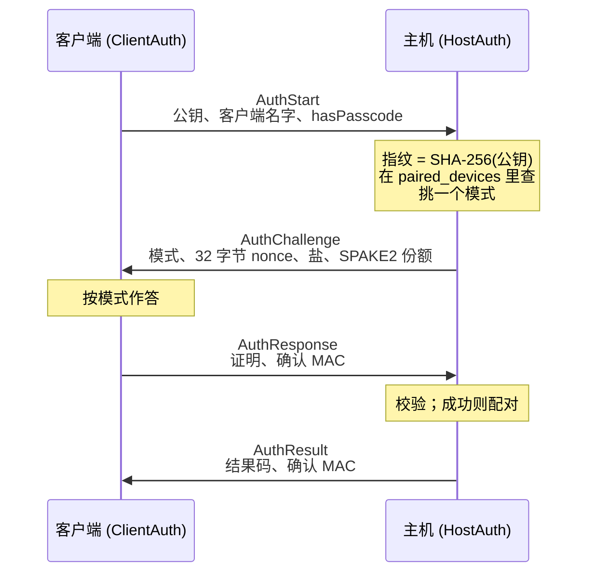
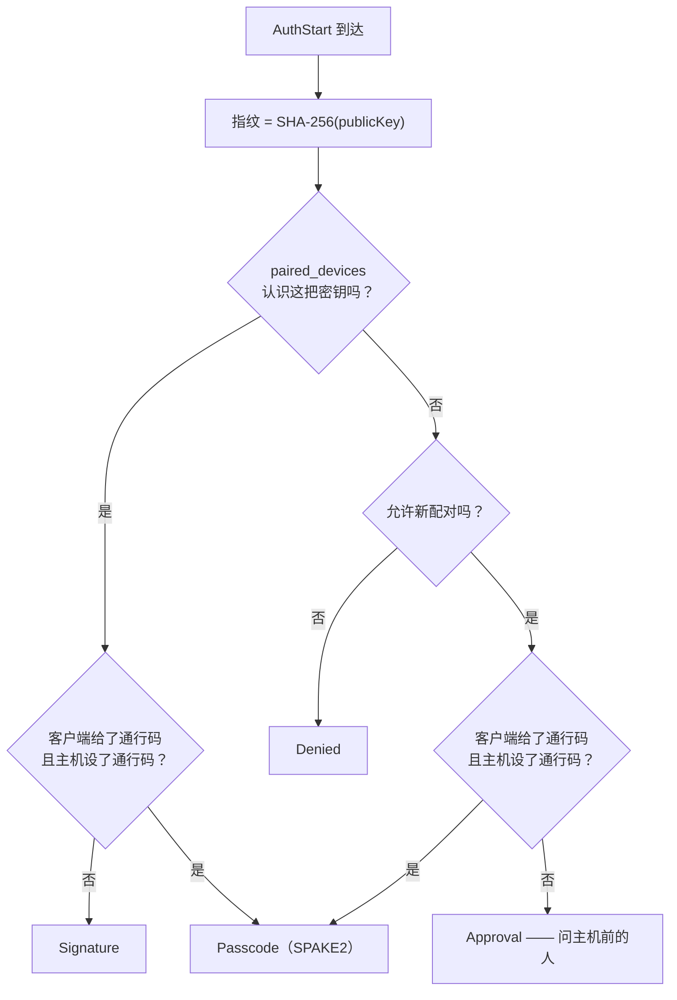
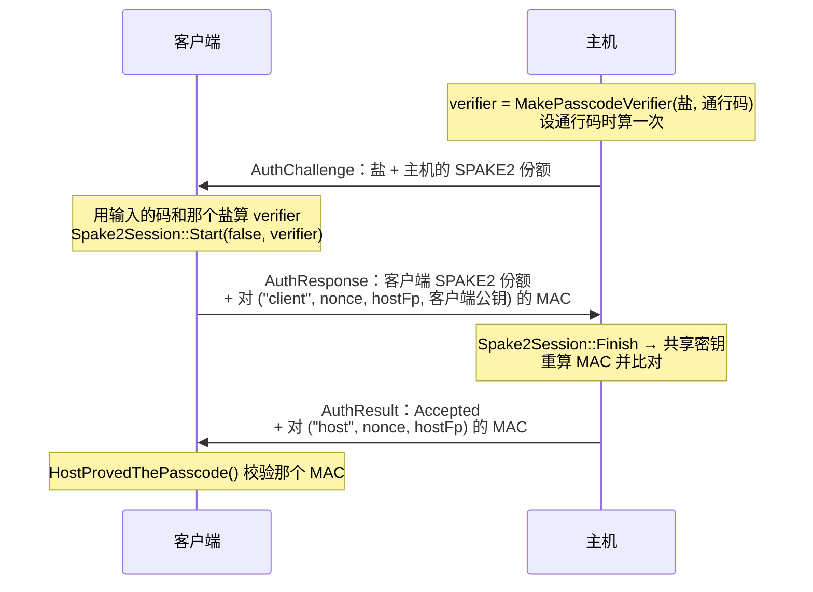
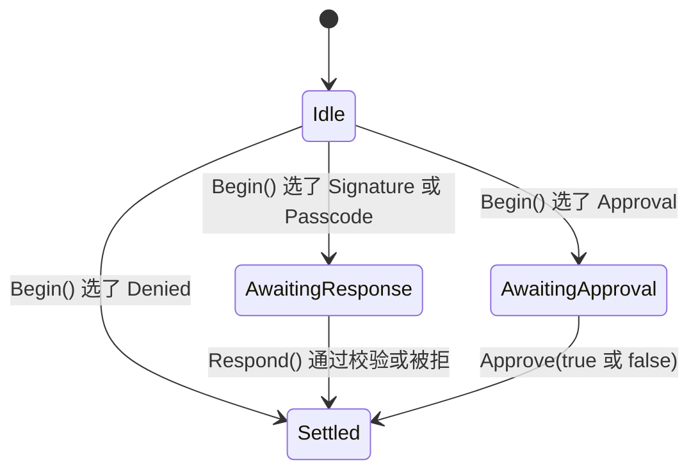

[English](AUTH.md) · [Tiếng Việt](AUTH.vi.md) · **中文** · [日本語](AUTH.ja.md)

# Deskhub —— 身份、配对与握手

本文档描述**机制**：每台机器持有哪些密钥、让一条连接获准的四条消息、一台机器自证的三种
方式，以及事后两边各自往磁盘写了什么。

策略视角——哪种组合导致哪种结果——在 [`ARCHITECTURE.zh.md`](ARCHITECTURE.zh.md) 的 §3。
威胁模型在 [`SECURITY.zh.md`](../SECURITY.zh.md)；本文档不重复它。

本文件是 [`AUTH.md`](AUTH.md) 的译本；若两者有出入，以英文版为准。

- **状态：** 描述的是当前代码。
- **读者：** 任何要改 `platform/auth`、`AuthProof`、信任库或已配对设备列表的人。

---

## 1. 每台机器持有什么

每台机器——无论主机还是客户端，五个平台都一样——在首次运行时生成一对 ECDSA P-256 密钥，
并一直保留（`LoadOrCreateHostIdentity`）。

| 文件 | 内容 | 谁有 |
| --- | --- | --- |
| `host_key.pem` | 私钥 | 每台机器 |
| `host_cert.pem` | 基于该密钥的自签名证书 | 每台机器 |
| `known_hosts` | 本机信任的主机指纹（`TrustStore`，最多 256） | 客户端 |
| `paired_devices` | 本机放行过的客户端指纹（`PairedDevices`，最多 128） | 主机 |
| `auth_salt` | 派生通行码 verifier 用的盐 | 设了通行码的主机 |

**指纹**是 SPKI DER 的 SHA-256，显示为 `SHA256:` 加 43 个 base64 字符。它是给人核对的；
`ShortFingerprint` 把它裁到 12 个字符，用于列表和日志行。

TLS 用的是那张证书，但只有 TLS 谁也放不进来。准入由其上的应用层握手决定，而
`SessionTransport` 会丢弃来自尚未定案连接的每一条消息。

## 2. 四条消息

主机从不索要指纹——它收到的是**公钥本身**，并对收到的东西做散列。冒用他人身份就意味着
要用一把冒名者并不持有的密钥来签名。

## 3. 挑选模式

`HostAuth::Begin` 依据两个事实挑出四种模式之一：这把密钥是否已配对，以及客户端有没有带
通行码。

只要输入了通行码就一定会被检查，配对与否都一样：给出通行码会把一台已知机器从静默路径挪
到必须自证的路径上。

## 4. 每种模式证明了什么

### Signature —— 已配对的机器，静默进入

客户端用自己的身份密钥签
`AuthTranscript("client", nonce, hostFingerprint)`。主机拿刚收到的公钥去验。成功则调用
`TouchPairedDevice`，更新最后出现时间。

这份转录把签名绑在**这条连接**（靠 nonce）和**这台主机**（靠它的指纹）上，所以在别处截获
的签名在这里毫无用处。

### Passcode —— SPAKE2，而且主机也要证明

这个形状带来四条性质，而四条都是刻意为之：

- **通行码从不上线。** 上线的只有 SPAKE2 份额与 MAC。
- **每条连接只能猜一次。** 码错了就是 `Finish` 失败或 MAC 不匹配，交换到此结束——没有可
  供离线穷举的东西。
- **两边都要证明。** 主机自己那条以 `"host"` 为标签的转录 MAC，正是
  `HostProvedThePasscode` 要检查的。给不出它的主机就是不知道那个码，所以证明过通行码的
  客户端会**不加提示地**记住那台主机。
- **MAC 绑定在客户端真正看到的那把主机密钥上。** 转录里带着 `hostFingerprint`，这一点掐
  死了中继：中间那台机器用自己的密钥向客户端证明，产出的 MAC 客户端不会接受。

成功即配对客户端（`RememberPairedDevice`），于是下次连接可以走静默的 Signature 路径。

### Approval —— 人就是那道门

对一台谁都没见过的机器不可能有密码学证明，于是主机把连接停在 `AwaitingApproval`，并询问
主机前的人（*让这台机器进来吗？*），同时显示名字和短指纹。`Approve(true)` 配对该机器；
`Approve(false)` 定案为 `Refused`。

### Denied

陌生机器，且新配对开关是关的。已配对的机器仍走 Signature——这个开关管的是新配对，不是既
有的配对。

## 5. 主机侧状态

每个对端地址对应一个 `HostAuth`（`SessionTransport` 里的 `hostAuth_`），所以两台机器同时
协商也互不干扰。在错误状态下调用 `Respond` 会定案为 `NotPaired`，而不是试图挽救。

| `AuthResultCode` | 何时 |
| --- | --- |
| `Accepted` | 证明通过，或有人点了同意 |
| `WrongPasscode` | SPAKE2 finish 失败，或确认 MAC 不匹配 |
| `NotPaired` | 签名不过，或消息来错了状态 |
| `PairingDisabled` | 陌生机器，新配对已关 |
| `Refused` | 人说了不 |
| `TimedOut` | 同意提示始终没人回答 |
| `Locked` | 通行码路径处于锁定中 |

三次通行码错误会把该路径锁 30 秒（`AuthThrottle`，`kMaxPasscodeAttempts` = 3，
`kPasscodeLockoutUs` = 30 秒）。同意这条路不需要限速——人本身就是限速器。

## 6. 客户端侧的信任

`TrustStore` 按端点钉住主机密钥，并给出三种判定之一：

| `TrustVerdict` | 含义 | 会发生什么 |
| --- | --- | --- |
| `Unknown` | 从没连过这里 | 由握手决定；证明过通行码就静默记住，否则询问用户 |
| `Trusted` | 指纹一致 | 连接 |
| `Changed` | **同一端点上换了密钥** | 连接被拦在一条醒目警告之后 |

`Changed` 是值得知道的那种情况：不会有任何东西自动继续，因为良性解释（主机重装了）和敌
意解释（那个地址上换了别人在应答）从这里看完全一样。

## 7. 准入之后

准入**每条连接只定案一次**。传输层之上不再有人追问：后续消息不带通行码，会话、终端、文
件与输入的每条路径都把整条连接视为已认证。

这正是终端会话表上 `SetConnectionAuthenticated` 存在的理由——在已准入连接上打开的 shell
不再重新自证，而在未认证路径上申请的 shell 仍要面对它自己的通行码检查。

## 8. 阅读地图

| 想弄懂 | 就读 |
| --- | --- |
| 模式选择与两个状态机 | `platform/src/auth/AuthNegotiation.cpp`（212 行） |
| 签名、MAC、SPAKE2、转录 | `platform/include/deskhubp/system/AuthProof.h` |
| 谁在驱动握手 | `platform/src/net/SessionTransport.cpp` 的 `HandleHostAuth` / `RunClientAuth` |
| 密钥生成与指纹 | `platform/src/system/HostIdentity*.cpp` |
| 信任库格式 | `core/src/net/TrustStore.cpp` |
| 已配对设备格式 | `core/src/net/PairedDevices.cpp` |
| 锁定 | `core/include/deskhub/session/host/AuthThrottle.h` |

## 9. 已知的缺口

- **配对认密钥，地址只是参考。** `paired_devices` 以指纹为索引，但 `known_hosts` 以*端点*
  为索引——所以同一台主机换个地址过来就又是 `Unknown`，用户会被再问一次。
- **除了遗忘之外没有吊销。** 一台机器要么被准入要么被遗忘；配对没有有效期，也没有一份永
  不再准入的密钥名单。
- **同意提示按连接而非按机器。** 被拒过一次的机器不会被记成已拒绝；它可以立刻再问一次。
