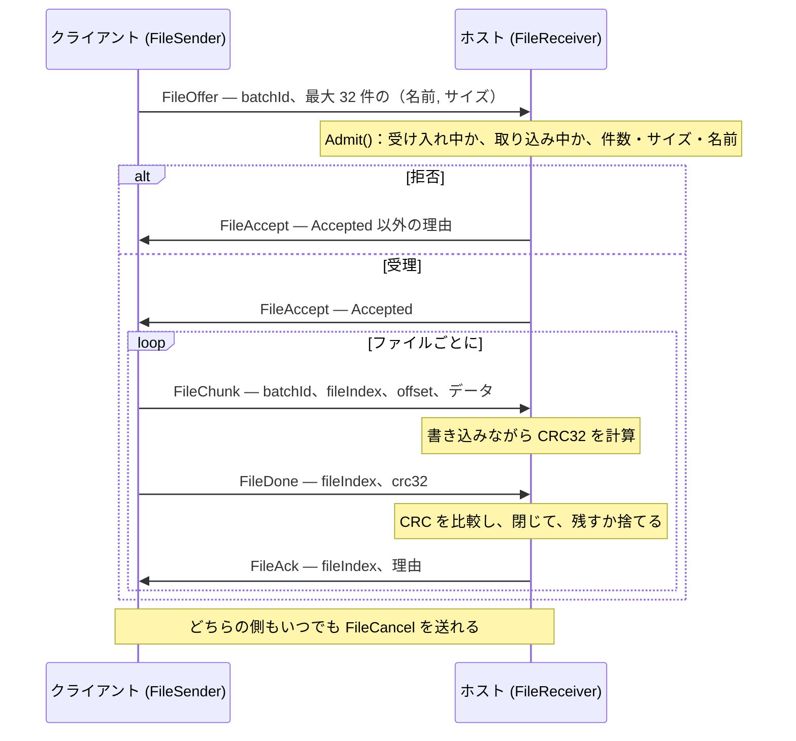
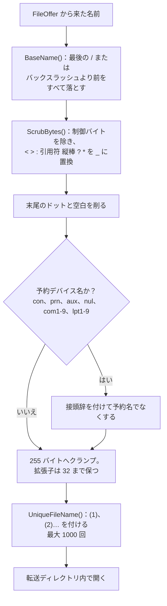
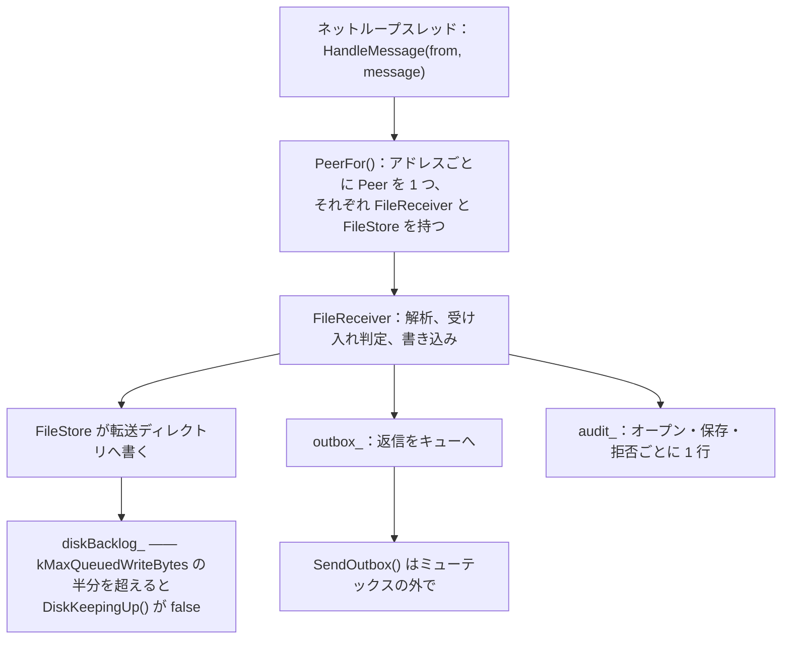

[English](FILE-TRANSFER.md) · [Tiếng Việt](FILE-TRANSFER.vi.md) · [中文](FILE-TRANSFER.zh.md) · **日本語**

# Deskhub — ファイル転送

ファイルは一方向にしか動かない。クライアントが送り、ホストがひとつのディレクトリへ受け取
る。本書はそのプロトコル、各段階で課される上限、ネットワークから来た名前がファイルシステム
に触れる前にどう安全化されるか、そしてバッチの途中でリンクが切れたとき何が起きるかを記述
する。

より大きな配置は [`ARCHITECTURE.ja.md`](ARCHITECTURE.ja.md) に、受け入れは
[`AUTH.ja.md`](AUTH.ja.md) にある。

本書は [`FILE-TRANSFER.md`](FILE-TRANSFER.md) の翻訳である。相違がある場合は英語版が正典と
なる。

- **状態：** 現在のコードを記述している。
- **読者：** `core/session/*/File*`、`core/transfer`、`FileHost`、`FileUpload` を変更する
  すべての人。

---

## 1. 転送のかたち

**バッチ**とは 1 回の申し出である。最大 32 ファイルを順に送り、それぞれ到着時に検証する。

チャンクは個別に確認応答されない。応答されるのはファイル単位だけである。送信側を前に進める
のは `FileDone` ごとの `FileAck` であり、ホストが書き終えてチェックサムを照合するまで、その
ファイルが届いたとは決してみなされない。

## 2. 上限と、それぞれが効く場所

| 上限 | 値 | 課す場所 |
| --- | --- | --- |
| バッチあたりのファイル数 | 32（`kMaxTransferFiles`） | `FileReceiver::Admit` → `TooManyFiles` |
| ファイルあたりのバイト数 | 8 GiB（`kMaxTransferFileBytes`） | `Admit` → `TooLarge` |
| バッチあたりのバイト数 | 32 GiB（`kMaxTransferBatchBytes`） | `Admit` → `TooLarge` |
| 名前の長さ | 255 バイト（`kMaxTransferNameBytes`） | ワイヤのパーサと `SafeFileName` |
| チャンクのペイロード | レコードサイズ − 14 B ヘッダ（`kMaxFileChunkBytes`） | `BuildFileChunk` |

申し出の最悪ケースは願望ではなくコンパイル時の事実である。名前が 255 バイトの 32 件でも
1 レコードに収まることを `static_assert` が証明している。

`FileReceiverLimits` によって、ホストはプロトコルに触れずに実行時に 3 つの数値上限を絞れる。

拒否は必ず自分の名を名乗り、その理由は送信側の UI まで戻る：

| `TransferReason` | 意味 |
| --- | --- |
| `Accepted` | 申し出が受理された、またはファイルが保存され検証された |
| `NotAccepting` | ホストがファイルを受け取らない設定 |
| `Busy` | この相手からの別のバッチが進行中 |
| `TooManyFiles` | 32 件超過 |
| `TooLarge` | ファイルまたはバッチが上限超過 |
| `BadName` | ワイヤ上不正な名前 |
| `WriteFailed` | ファイルシステムが拒んだ |
| `Corrupt` | `FileDone` で CRC32 が不一致 |
| `Cancelled` | どちらかが取り消した |
| `LinkLost` | バッチ途中で接続が消えた |
| `ReadFailed` | *送信側*が自分のファイルを読めなかった |

## 3. ネットワークから来た名前はファイル名ではない

入ってくる名前は、何かがディスクに触れる前にすべて `SafeFileName`
（`core/src/transfer/SafeName.cpp`）を通る。送信側は遠隔で、受信側は本物のファイルシステム
だから、意図的に猜疑的に作られている：

ここで塞がれる攻撃は 3 種類あり、名指しする価値がある。ディレクトリトラバーサル
（`BaseName`——パスは最後の要素に切り詰められるので `../../etc/passwd` は `passwd` になる）、
Windows のデバイス名（`con`、`lpt1`——そこへ書くのはファイルを書くことではない）、そして
静かな上書き（`UniqueFileName`——既存のファイルは決して置き換えられず、接尾辞が付く）である。

`IsWireLegalFileName` は最悪の名前をパーサの時点で弾く。`Admit` が走る前に終わっている。

## 4. ホスト側

相手ごとに `FileReceiver` が 1 つあるので、2 台が同時に送っても衝突しない。一方 `Busy` は、
1 台のマシンが自分で 2 つ目のバッチを始めることを依然として止める。

返信と監査行はロックの下で送らずキューに積まれる。受信側はネットループスレッドで動くので、
そこで詰まらせれば他のすべてのチャネルが止まってしまう。

中途半端な名前で保存されるものはない。ファイルは開かれ、書かれ、CRC32 が一致したときにだけ
*残される*。不一致なら `keep = false` で閉じられ、バッチは `Corrupt` で打ち切られる。

## 5. クライアント側

`FileUpload` は `FileSender` に、送信側が必要とするファイル読み出しを組み合わせたものだ：

- `InspectFiles` は先にパスを stat し、項目一覧かエラーのどちらかを持つ `FileBatch` を返す。
  誤った選択はワイヤに何も出る前に失敗する。
- `Pump(kFileChunksPerTick = 8)` は 1 tick に最大 8 チャンクを送り、先読みは
  `kMaxReadAheadBytes` = 1 MiB まで。送出は tick で律速されるので、速いディスクがリンクを
  追い越すことはない。
- `ReadFailed` は送信側自身の失敗——バッチ途中でファイルが消えた、読めなくなった——であり、
  ゼロを送りつける代わりにバッチを取り消す。

## 6. リンクが切れたとき

両端に `LinkLost()` があり、どちらもそれをそのバッチの終わりとして扱う。進行中のファイルは
残さずに閉じられ、バッチは `LinkLost` で終わる。

**再開はない。** 90% まで進んだバッチも、やり直せば最初のファイルから始まる。オフセットは
すべてのチャンクに載っているので再開は不可能ではない——ただ実装されていないだけであり、
`TransferRecord.live` は進行中の転送と完了した転送を UI で区別するために存在する。

## 7. 監査

意味のある手順はすべて `TransferAuditLine` で 1 行を残す。相手のエンドポイント、名前、鍵
フィンガープリント、バッチ id、何が起きたか、そして詳細である。何がマシンを出入りしたかの
記録はこれであり、ファイル一覧そのものは他のどこにも保存されない。

## 8. 読み進める地図

| 理解したいこと | 読むもの |
| --- | --- |
| 送信側の状態機械 | `core/src/session/client/FileSender.cpp` |
| 受信側、受け入れ判定、CRC | `core/src/session/host/FileReceiver.cpp` |
| 名前の安全化 | `core/src/transfer/SafeName.cpp` |
| チェックサム | `core/src/transfer/Crc32.cpp` |
| 相手ごとのホスト側配線 | `platform/src/host/FileHost.cpp` |
| ファイル読み出しと速度調整 | `platform/include/deskhubp/client/FileUpload.h` |
| ワイヤ上のメッセージと上限 | `core/include/deskhub/protocol/Wire.h` |

## 9. 既知の隙間

- **再開がない。** 切断はバッチ全体を失わせる。再開を可能にするオフセットのフィールドは、
  すでにワイヤ上にある。
- **一方向のみ。** ホストがクライアントへファイルを送ることはない。ここにあるすべては
  クライアント → ホストである。
- **CRC32 は完全性の検査であって安全性の検査ではない。** 壊れた転送は捕まえるが、意図的に
  改変された転送は捕まえない。改変を難しくしているのはトランスポート自身の暗号化であり、
  チェックサムはその代わりにはならない。
- **転送ディレクトリは名前以上のサンドボックスを持たない。** `SafeFileName` は名前をディ
  レクトリ内に留めるが、1 バッチ 32 GiB の上限を除けば、許可された相手がディスクをどれだけ
  埋められるかを制限するものはない。
