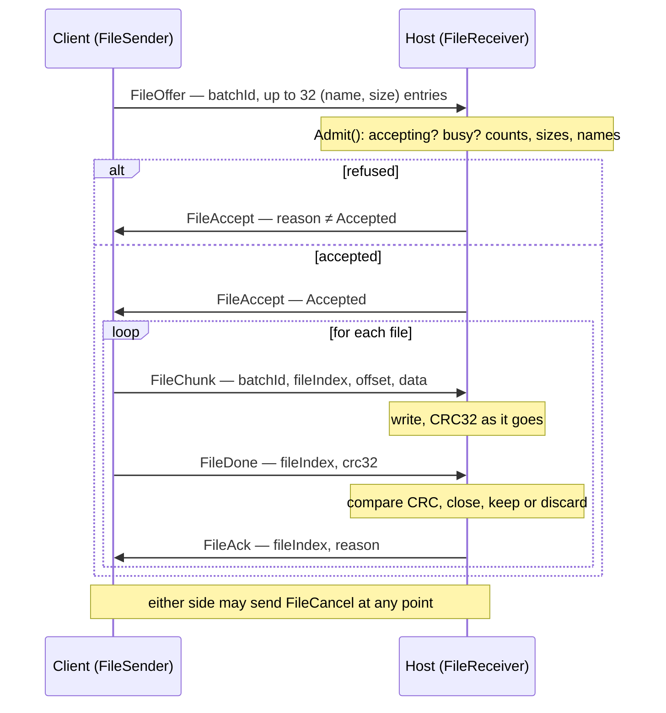
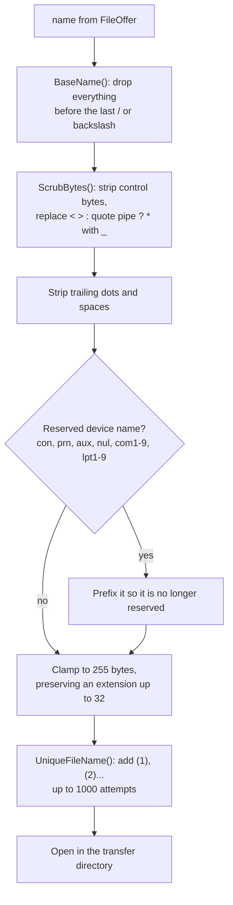
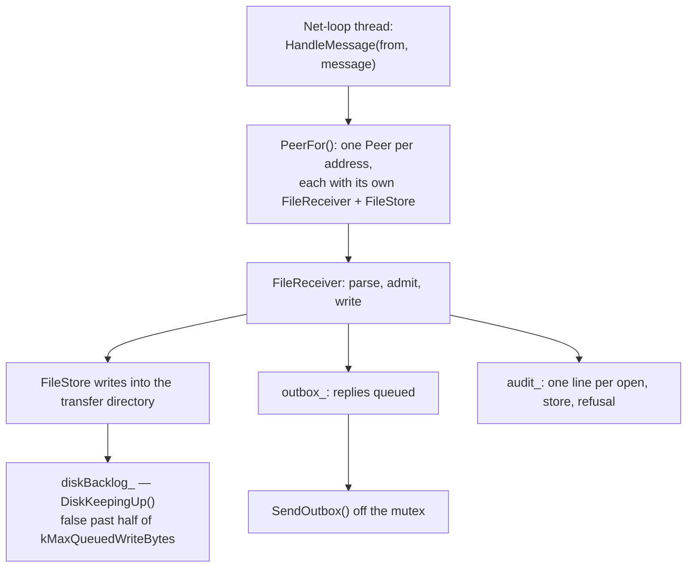

**English** · [Tiếng Việt](FILE-TRANSFER.vi.md) · [中文](FILE-TRANSFER.zh.md) · [日本語](FILE-TRANSFER.ja.md)

# Deskhub — File transfer

Files move one way: a client sends, a host receives into one directory. This document
describes the protocol, the limits enforced at every step, how a name from the network
is made safe before it reaches a filesystem, and what happens when the link drops
mid-batch.

The wider layout is in [`ARCHITECTURE.md`](ARCHITECTURE.md); admission is in
[`AUTH.md`](AUTH.md).

- **Status:** describes the current code.
- **Audience:** anyone changing `core/session/*/File*`, `core/transfer`, `FileHost` or
  `FileUpload`.

---

## 1. Shape of a transfer

A **batch** is one offer: up to 32 files sent in order, each verified on arrival.

Chunks are not acknowledged individually — only whole files are. The `FileAck` after
each `FileDone` is what advances the sender, so a file is never considered delivered
until the host has written it and checked its checksum.

## 2. Limits, and where each is enforced

| Limit | Value | Enforced by |
| --- | --- | --- |
| Files per batch | 32 (`kMaxTransferFiles`) | `FileReceiver::Admit` → `TooManyFiles` |
| Bytes per file | 8 GiB (`kMaxTransferFileBytes`) | `Admit` → `TooLarge` |
| Bytes per batch | 32 GiB (`kMaxTransferBatchBytes`) | `Admit` → `TooLarge` |
| Name length | 255 bytes (`kMaxTransferNameBytes`) | wire parser and `SafeFileName` |
| Chunk payload | record size − 14 B header (`kMaxFileChunkBytes`) | `BuildFileChunk` |

The offer's worst case is a compile-time fact, not a hope: a `static_assert` proves
that 32 entries with 255-byte names still fit in one record.

`FileReceiverLimits` lets a host tighten all three numeric limits at runtime without
touching the protocol.

Every refusal names itself, and the reason travels back to the sender's UI:

| `TransferReason` | Meaning |
| --- | --- |
| `Accepted` | offer admitted, or a file stored and verified |
| `NotAccepting` | the host is not taking files |
| `Busy` | another batch from this peer is in flight |
| `TooManyFiles` | over 32 entries |
| `TooLarge` | a file or the batch is over the limit |
| `BadName` | a name that is not wire-legal |
| `WriteFailed` | the filesystem refused |
| `Corrupt` | CRC32 mismatch at `FileDone` |
| `Cancelled` | either side cancelled |
| `LinkLost` | the connection went away mid-batch |
| `ReadFailed` | the *sender* could not read its own file |

## 3. A name from the network is not a filename

Every incoming name goes through `SafeFileName` (`core/src/transfer/SafeName.cpp`)
before anything touches the disk. It is deliberately paranoid, because the sender is
remote and the receiver is a real filesystem:

Three separate classes of attack are closed here, and it is worth naming them:
directory traversal (`BaseName` — a path is reduced to its last component, so
`../../etc/passwd` becomes `passwd`), Windows device names (`con`, `lpt1` — writing to
those is not writing a file), and silent overwriting (`UniqueFileName` — an existing
file is never replaced, a suffix is added instead).

`IsWireLegalFileName` rejects the worst names at the parser, before `Admit` even runs.

## 4. On the host

One `FileReceiver` per peer means two machines sending at once do not collide, while
`Busy` still stops one machine from starting a second batch of its own.

Replies and audit lines are queued rather than sent under the lock — the receiver runs
on the net-loop thread, and blocking there would stall every other channel.

Nothing is stored under a partial name: a file is opened, written and only *kept* on a
matching CRC32. A mismatch closes it with `keep = false` and the batch aborts with
`Corrupt`.

## 5. On the client

`FileUpload` wraps `FileSender` with the file reading a sender needs:

- `InspectFiles` stats the paths first and returns a `FileBatch` with either the entries
  or an error, so a bad selection fails before anything reaches the wire.
- `Pump(kFileChunksPerTick = 8)` sends at most eight chunks per tick, keeping at most
  `kMaxReadAheadBytes` = 1 MiB read ahead. Sending is paced by the tick, so a fast disk
  cannot outrun the link.
- `ReadFailed` is the sender's own failure — a file that vanished or became unreadable
  mid-batch — and it cancels the batch rather than sending zeros.

## 6. When the link drops

Both ends have a `LinkLost()`, and both treat it as terminal for the batch: the current
file is closed without keeping it, and the batch ends with `LinkLost`.

**There is no resume.** A batch that was 90% through starts again from the first file if
the person retries. Offsets travel in every chunk, so resuming is not impossible — it
is simply not implemented, and `TransferRecord.live` exists to show the difference
between a transfer in flight and a finished one in the UI.

## 7. Audit

Every consequential step writes one line through `TransferAuditLine`: the peer's
endpoint, name and key fingerprint, the batch id, what happened, and a detail. That is
the record of what left or entered a machine — the file list itself is not kept
anywhere else.

## 8. Reading map

| To understand | Read |
| --- | --- |
| Sender state machine | `core/src/session/client/FileSender.cpp` |
| Receiver, admission, CRC | `core/src/session/host/FileReceiver.cpp` |
| Name safety | `core/src/transfer/SafeName.cpp` |
| Checksum | `core/src/transfer/Crc32.cpp` |
| Per-peer host plumbing | `platform/src/host/FileHost.cpp` |
| Reading files, pacing | `platform/include/deskhubp/client/FileUpload.h` |
| Wire messages and limits | `core/include/deskhub/protocol/Wire.h` |

## 9. Known gaps

- **No resume.** A dropped link costs the whole batch; the offset field that would make
  resume possible is already on the wire.
- **One direction only.** A host never sends files to a client. Everything here is
  client → host.
- **CRC32 is an integrity check, not a security one.** It catches a corrupted transfer,
  not a deliberately altered one — the transport's own encryption is what makes
  tampering hard, and the checksum is not a substitute for it.
- **The transfer directory is not sandboxed beyond the name.** `SafeFileName` keeps a
  name inside the directory, but nothing limits how much of the disk a permitted peer
  can fill beyond the 32 GiB batch cap.
