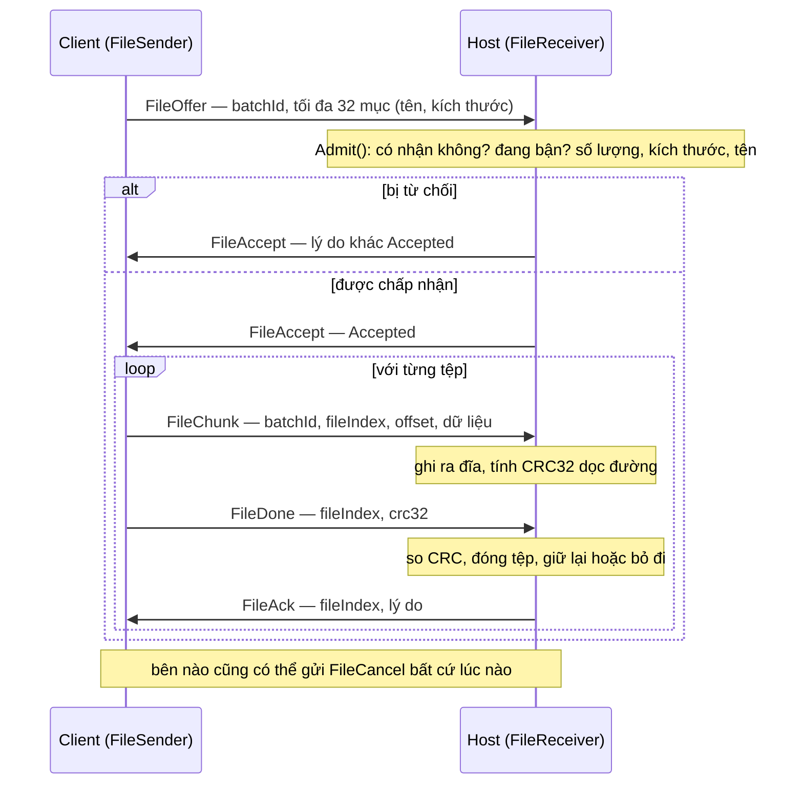
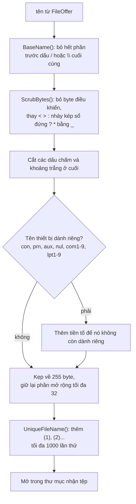
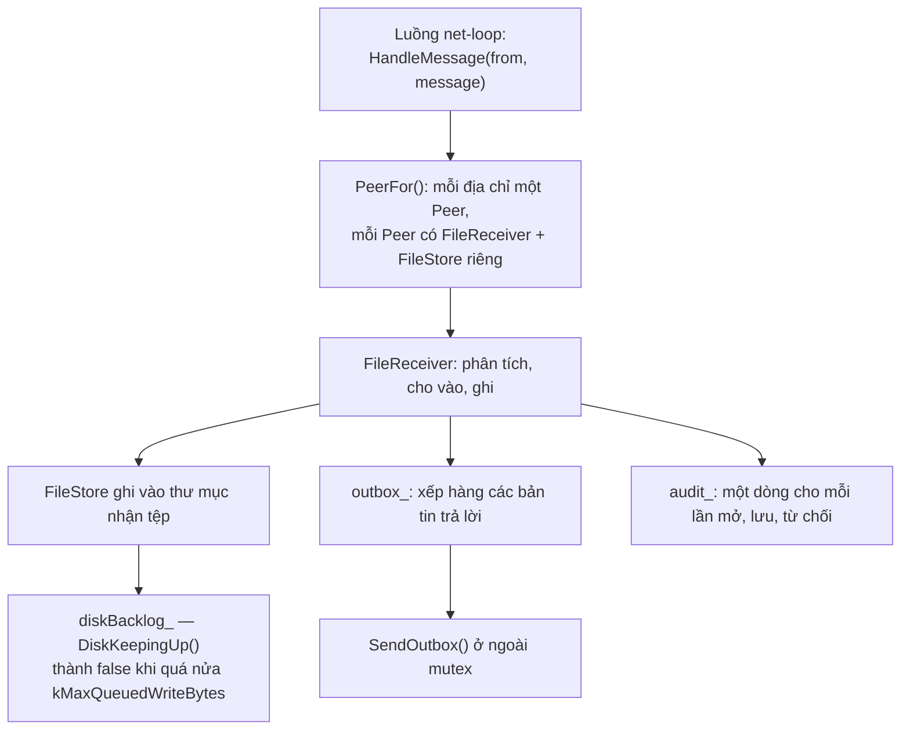

[English](FILE-TRANSFER.md) · **Tiếng Việt** · [中文](FILE-TRANSFER.zh.md) · [日本語](FILE-TRANSFER.ja.md)

# Deskhub — Truyền tệp

Tệp đi một chiều: client gửi, host nhận vào một thư mục. Tài liệu này mô tả giao thức,
các giới hạn được áp ở từng bước, cách một cái tên đến từ mạng được làm cho an toàn trước
khi chạm vào hệ tệp, và điều gì xảy ra khi kết nối rớt giữa chừng.

Bố cục tổng thể nằm ở [`ARCHITECTURE.vi.md`](ARCHITECTURE.vi.md); phần cho vào cửa nằm ở
[`AUTH.vi.md`](AUTH.vi.md).

Đây là bản dịch của [`FILE-TRANSFER.md`](FILE-TRANSFER.md); khi hai bản khác nhau, bản
tiếng Anh là bản chuẩn.

- **Trạng thái:** mô tả mã nguồn hiện tại.
- **Đối tượng đọc:** bất kỳ ai sửa `core/session/*/File*`, `core/transfer`, `FileHost`
  hay `FileUpload`.

---

## 1. Hình dạng một lần truyền

Một **lô** là một lời chào hàng: tối đa 32 tệp gửi theo thứ tự, mỗi tệp được kiểm chứng
khi tới nơi.

Từng khối không được báo nhận riêng lẻ — chỉ trọn tệp mới được. Chính `FileAck` sau mỗi
`FileDone` đẩy bên gửi đi tiếp, nên một tệp không bao giờ được coi là đã giao cho tới khi
host ghi xong và đã kiểm tổng kiểm tra của nó.

## 2. Các giới hạn, và nơi từng cái được áp

| Giới hạn | Giá trị | Do ai áp |
| --- | --- | --- |
| Số tệp mỗi lô | 32 (`kMaxTransferFiles`) | `FileReceiver::Admit` → `TooManyFiles` |
| Byte mỗi tệp | 8 GiB (`kMaxTransferFileBytes`) | `Admit` → `TooLarge` |
| Byte mỗi lô | 32 GiB (`kMaxTransferBatchBytes`) | `Admit` → `TooLarge` |
| Độ dài tên | 255 byte (`kMaxTransferNameBytes`) | bộ phân tích wire và `SafeFileName` |
| Tải mỗi khối | kích thước bản ghi − 14 B header (`kMaxFileChunkBytes`) | `BuildFileChunk` |

Trường hợp xấu nhất của lời chào hàng là một sự thật tại thời điểm biên dịch, không phải
một hy vọng: một `static_assert` chứng minh rằng 32 mục với tên dài 255 byte vẫn vừa một
bản ghi.

`FileReceiverLimits` cho phép host siết cả ba con số đó lúc chạy mà không đụng tới giao
thức.

Mọi lần từ chối đều tự nêu tên, và lý do đó đi ngược về UI của bên gửi:

| `TransferReason` | Nghĩa |
| --- | --- |
| `Accepted` | lời chào hàng được nhận, hoặc một tệp đã lưu và kiểm chứng xong |
| `NotAccepting` | host không nhận tệp |
| `Busy` | đã có một lô khác từ chính máy này đang chạy |
| `TooManyFiles` | quá 32 mục |
| `TooLarge` | một tệp hoặc cả lô vượt giới hạn |
| `BadName` | một cái tên không hợp lệ ở mức giao thức |
| `WriteFailed` | hệ tệp từ chối |
| `Corrupt` | CRC32 không khớp ở `FileDone` |
| `Cancelled` | một trong hai bên huỷ |
| `LinkLost` | kết nối biến mất giữa lô |
| `ReadFailed` | *bên gửi* không đọc nổi tệp của chính nó |

## 3. Một cái tên từ mạng không phải là tên tệp

Mọi cái tên đi vào đều qua `SafeFileName` (`core/src/transfer/SafeName.cpp`) trước khi
bất cứ thứ gì chạm vào đĩa. Nó hoang tưởng một cách có chủ đích, vì bên gửi ở xa còn bên
nhận là một hệ tệp thật:

Ba lớp tấn công khác nhau bị chặn ở đây, và đáng gọi tên chúng ra: đi ngược thư mục
(`BaseName` — một đường dẫn bị rút về thành phần cuối, nên `../../etc/passwd` trở thành
`passwd`), tên thiết bị của Windows (`con`, `lpt1` — ghi vào những thứ đó không phải là
ghi một tệp), và ghi đè âm thầm (`UniqueFileName` — một tệp đang tồn tại không bao giờ bị
thay thế, thay vào đó một hậu tố được thêm vào).

`IsWireLegalFileName` loại những cái tên tệ nhất ngay ở bộ phân tích, trước cả khi `Admit`
chạy.

## 4. Phía host

Mỗi máy một `FileReceiver` nghĩa là hai máy gửi cùng lúc không va nhau, trong khi `Busy`
vẫn ngăn một máy tự mở lô thứ hai của chính nó.

Bản tin trả lời và dòng kiểm toán được xếp hàng chứ không gửi khi đang giữ khoá — bộ nhận
chạy trên luồng net-loop, và chặn ở đó sẽ làm đứng mọi kênh khác.

Không gì được lưu dưới một cái tên dở dang: một tệp được mở, được ghi, và chỉ được *giữ
lại* khi CRC32 khớp. Không khớp thì đóng với `keep = false` và cả lô huỷ với lý do
`Corrupt`.

## 5. Phía client

`FileUpload` bọc `FileSender` cùng phần đọc tệp mà bên gửi cần:

- `InspectFiles` xem trước các đường dẫn và trả về một `FileBatch` gồm hoặc danh sách mục
  hoặc một lỗi, nên một lựa chọn sai sẽ hỏng trước khi có gì đi lên đường truyền.
- `Pump(kFileChunksPerTick = 8)` gửi tối đa tám khối mỗi nhịp, và đọc trước nhiều nhất
  `kMaxReadAheadBytes` = 1 MiB. Việc gửi bị nhịp này điều tiết, nên một ổ đĩa nhanh không
  thể vượt mặt đường truyền.
- `ReadFailed` là lỗi của chính bên gửi — một tệp biến mất hoặc không đọc được giữa lô —
  và nó huỷ cả lô thay vì gửi đi một mớ số không.

## 6. Khi kết nối rớt

Cả hai đầu đều có `LinkLost()`, và cả hai đều coi đó là dấu chấm hết cho lô đó: tệp đang
dở được đóng mà không giữ lại, và lô kết thúc với lý do `LinkLost`.

**Không có chuyện tiếp tục dở dang.** Một lô đã đi được 90% sẽ bắt đầu lại từ tệp đầu tiên
nếu người dùng thử lại. Offset có mặt trong mọi khối, nên việc tiếp tục không phải là bất
khả — chỉ là chưa được cài đặt, và `TransferRecord.live` tồn tại để UI phân biệt một lần
truyền đang chạy với một lần đã xong.

## 7. Kiểm toán

Mọi bước có hệ quả đều ghi một dòng qua `TransferAuditLine`: endpoint, tên và vân tay khoá
của phía bên kia, id lô, chuyện gì đã xảy ra, và một mẩu chi tiết. Đó là bản ghi về những
gì đã rời khỏi hay đi vào một máy — danh sách tệp không được giữ ở bất cứ nơi nào khác.

## 8. Bản đồ đọc code

| Muốn hiểu | Đọc |
| --- | --- |
| Máy trạng thái bên gửi | `core/src/session/client/FileSender.cpp` |
| Bên nhận, việc cho vào, CRC | `core/src/session/host/FileReceiver.cpp` |
| An toàn tên tệp | `core/src/transfer/SafeName.cpp` |
| Tổng kiểm tra | `core/src/transfer/Crc32.cpp` |
| Đường ống phía host theo từng máy | `platform/src/host/FileHost.cpp` |
| Đọc tệp, điều nhịp | `platform/include/deskhubp/client/FileUpload.h` |
| Bản tin và giới hạn trên đường truyền | `core/include/deskhub/protocol/Wire.h` |

## 9. Những khoảng trống đã biết

- **Không có tiếp tục dở dang.** Một lần rớt kết nối tốn cả lô; trường offset — thứ khiến
  việc tiếp tục trở nên khả thi — thì đã có sẵn trên đường truyền.
- **Chỉ một chiều.** Host không bao giờ gửi tệp cho client. Mọi thứ ở đây là client → host.
- **CRC32 là kiểm tra toàn vẹn, không phải kiểm tra an ninh.** Nó bắt được một lần truyền
  bị hỏng, chứ không bắt được một lần bị sửa có chủ đích — chính lớp mã hoá của transport
  mới là thứ khiến việc can thiệp trở nên khó, và tổng kiểm tra không thay thế được nó.
- **Thư mục nhận tệp không được cô lập ngoài phần tên.** `SafeFileName` giữ cái tên nằm
  trong thư mục, nhưng không có gì giới hạn một máy được phép có thể lấp đầy bao nhiêu đĩa,
  ngoài trần 32 GiB cho mỗi lô.
