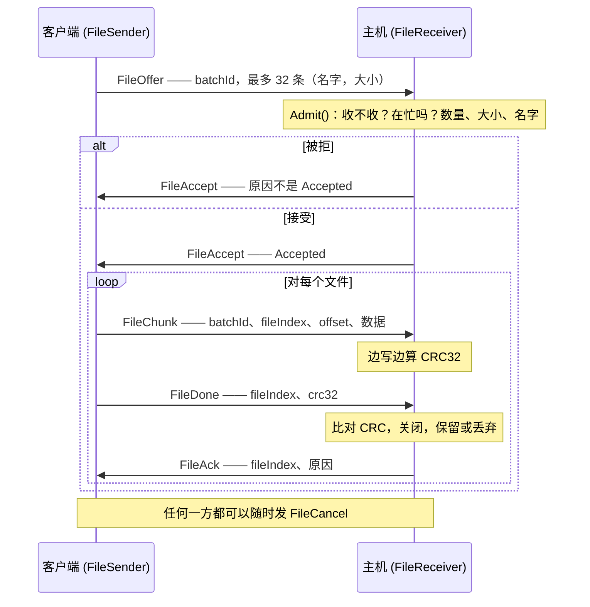
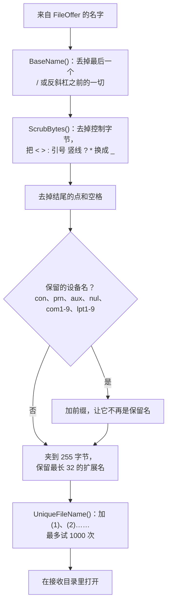
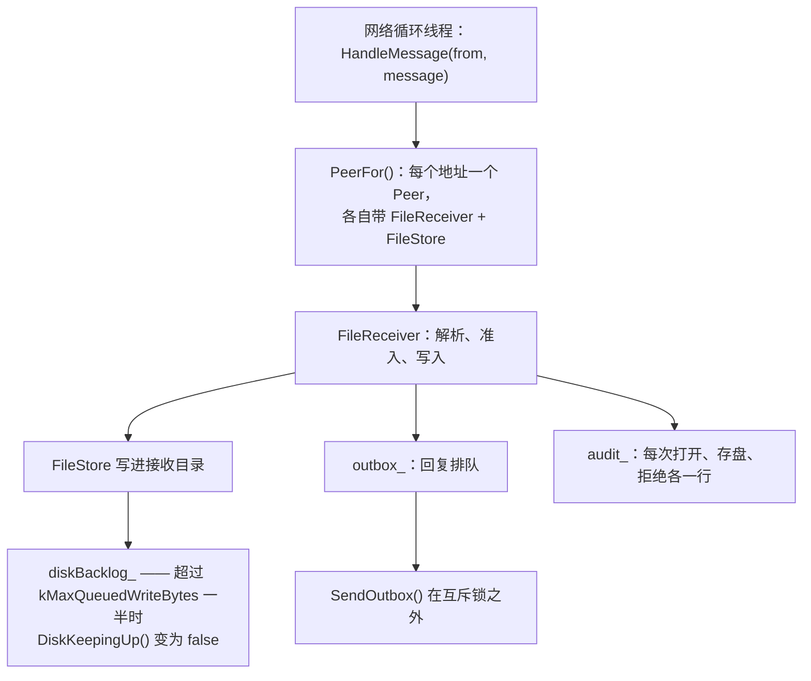

[English](FILE-TRANSFER.md) · [Tiếng Việt](FILE-TRANSFER.vi.md) · **中文** · [日本語](FILE-TRANSFER.ja.md)

# Deskhub —— 文件传输

文件只往一个方向走：客户端发送，主机接收到一个目录里。本文档描述协议、每一步施加的限制、
一个来自网络的名字在碰到文件系统之前是怎样被弄安全的，以及批次进行到一半链路断掉时会发生
什么。

更大的布局在 [`ARCHITECTURE.zh.md`](ARCHITECTURE.zh.md)；准入在
[`AUTH.zh.md`](AUTH.zh.md)。

本文件是 [`FILE-TRANSFER.md`](FILE-TRANSFER.md) 的译本；若两者有出入，以英文版为准。

- **状态：** 描述的是当前代码。
- **读者：** 任何要改 `core/session/*/File*`、`core/transfer`、`FileHost` 或 `FileUpload`
  的人。

---

## 1. 一次传输的形状

一个**批次**就是一次要约：最多 32 个文件按顺序发送，每个在到达时被校验。

分块不单独确认——只有整个文件才确认。推动发送端前进的正是每个 `FileDone` 之后的
`FileAck`，所以在主机写完并核对校验和之前，一个文件绝不算送达。

## 2. 各项限制，以及各自在哪里生效

| 限制 | 取值 | 由谁施加 |
| --- | --- | --- |
| 每批文件数 | 32（`kMaxTransferFiles`） | `FileReceiver::Admit` → `TooManyFiles` |
| 每文件字节 | 8 GiB（`kMaxTransferFileBytes`） | `Admit` → `TooLarge` |
| 每批字节 | 32 GiB（`kMaxTransferBatchBytes`） | `Admit` → `TooLarge` |
| 名字长度 | 255 字节（`kMaxTransferNameBytes`） | 线上解析器与 `SafeFileName` |
| 每块负载 | 记录大小 − 14 B 头部（`kMaxFileChunkBytes`） | `BuildFileChunk` |

要约的最坏情况是编译期的事实，而不是一种指望：一条 `static_assert` 证明了 32 条、名字各
255 字节的条目仍然装得进一条记录。

`FileReceiverLimits` 让主机在运行时收紧这三个数值上限，而不必改动协议。

每一次拒绝都会自报家门，原因会一路回到发送端的界面：

| `TransferReason` | 含义 |
| --- | --- |
| `Accepted` | 要约被接受，或某个文件已存好并校验通过 |
| `NotAccepting` | 主机不收文件 |
| `Busy` | 来自这个对端的另一个批次正在进行 |
| `TooManyFiles` | 超过 32 条 |
| `TooLarge` | 某个文件或整批超限 |
| `BadName` | 线上不合法的名字 |
| `WriteFailed` | 文件系统拒绝了 |
| `Corrupt` | `FileDone` 处 CRC32 不匹配 |
| `Cancelled` | 有一方取消了 |
| `LinkLost` | 批次中途连接消失 |
| `ReadFailed` | *发送端*读不了自己的文件 |

## 3. 来自网络的名字不是文件名

每个进来的名字在任何东西碰到磁盘之前，都要过一遍 `SafeFileName`
（`core/src/transfer/SafeName.cpp`）。它刻意偏执，因为发送方在远端，而接收方是一个真实的
文件系统：

三类不同的攻击在这里被堵住，值得逐一点名：目录穿越（`BaseName`——路径被削成最后一段，于
是 `../../etc/passwd` 变成 `passwd`）、Windows 设备名（`con`、`lpt1`——往那些东西写并不是
在写文件），以及静默覆盖（`UniqueFileName`——已存在的文件绝不被替换，而是加后缀）。

`IsWireLegalFileName` 在解析器处就把最糟的名字挡掉，`Admit` 还没跑就先拒了。

## 4. 主机侧

每个对端一个 `FileReceiver`，意味着两台机器同时发不会撞车，而 `Busy` 仍然阻止同一台机器自
己再开第二个批次。

回复与审计行是排队而不是在锁内发送的——接收端跑在网络循环线程上，在那里阻塞会让其他每一条
通道都停摆。

没有东西会以半成品的名字留下：文件被打开、被写入，只有 CRC32 匹配时才被*保留*。不匹配就以
`keep = false` 关闭，整批以 `Corrupt` 中止。

## 5. 客户端侧

`FileUpload` 把 `FileSender` 和发送端需要的文件读取包在一起：

- `InspectFiles` 先 stat 一遍路径，返回一个 `FileBatch`，要么是条目列表要么是错误，于是错误
  的选择在任何东西上线之前就失败了。
- `Pump(kFileChunksPerTick = 8)` 每个 tick 最多发八块，预读最多 `kMaxReadAheadBytes` = 1 MiB。
  发送由 tick 控速，所以快盘跑不过链路。
- `ReadFailed` 是发送端自己的失败——批次中途文件消失或读不了——它会取消整批，而不是发一堆
  零出去。

## 6. 链路断掉时

两端都有 `LinkLost()`，也都把它当作该批次的终结：当前文件被关闭且不保留，批次以 `LinkLost`
结束。

**没有续传。** 一个已经走了 90% 的批次，如果用户重试，会从第一个文件重新开始。偏移量在每一
块里都带着，所以续传并非不可能——只是没有实现，而 `TransferRecord.live` 的存在是为了让界面
区分进行中的传输和已完成的传输。

## 7. 审计

每一个有后果的步骤都通过 `TransferAuditLine` 写下一行：对端的端点、名字与密钥指纹、批次 id、
发生了什么，以及一段细节。那就是什么东西离开或进入了一台机器的记录——文件列表本身不会保存
在别的任何地方。

## 8. 阅读地图

| 想弄懂 | 就读 |
| --- | --- |
| 发送端状态机 | `core/src/session/client/FileSender.cpp` |
| 接收端、准入、CRC | `core/src/session/host/FileReceiver.cpp` |
| 名字安全 | `core/src/transfer/SafeName.cpp` |
| 校验和 | `core/src/transfer/Crc32.cpp` |
| 主机侧按对端的管道 | `platform/src/host/FileHost.cpp` |
| 读文件与控速 | `platform/include/deskhubp/client/FileUpload.h` |
| 线上消息与限制 | `core/include/deskhub/protocol/Wire.h` |

## 9. 已知的缺口

- **没有续传。** 一次断链要付出整批的代价；而让续传成为可能的偏移字段，早就在线上了。
- **只有一个方向。** 主机从不给客户端发文件。这里的一切都是客户端 → 主机。
- **CRC32 是完整性检查，不是安全检查。** 它能抓住被损坏的传输，抓不住被故意篡改的传输——让
  篡改变难的是传输层自己的加密，校验和不是它的替代品。
- **接收目录除了名字之外没有沙箱。** `SafeFileName` 把名字限制在目录内，但除了 32 GiB 的
  单批上限之外，没有东西限制一个被允许的对端能占掉多少磁盘。
