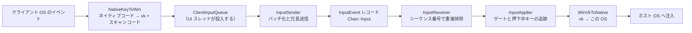
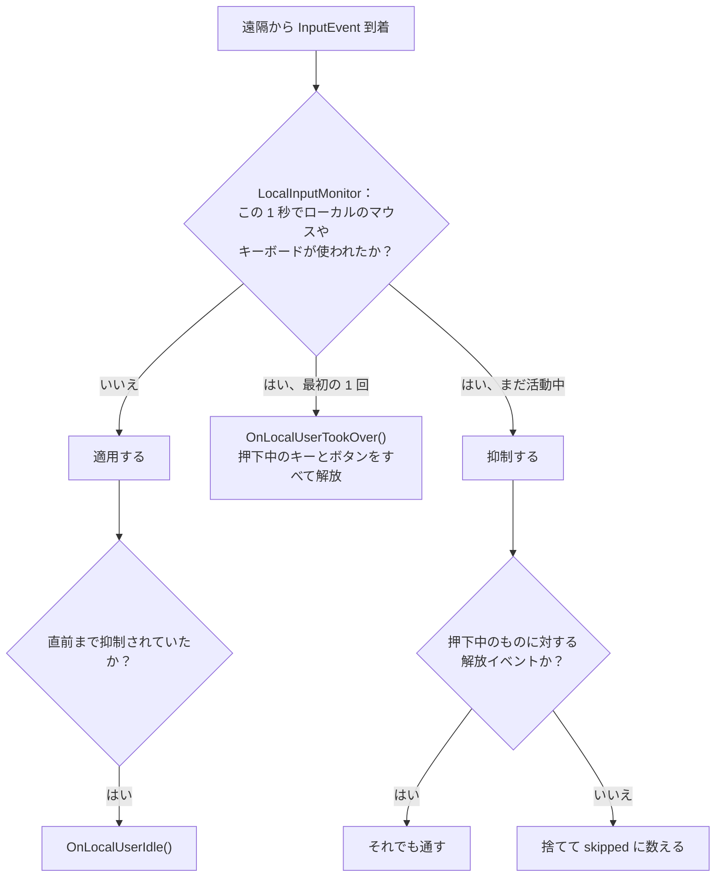

[English](INPUT.md) · [Tiếng Việt](INPUT.vi.md) · [中文](INPUT.zh.md) · **日本語**

# Deskhub — リモート入力

スマートフォンで押されたキーが、Windows デスクトップ上のアプリケーションに届かなければ
ならない。本書はその経路を記述する。ワイヤ上を何が流れるか、5 つの異なるキーボード規約を
どう折り合わせるか、ホスト側にいる人が自分のマウスに手を伸ばしたときどちらが勝つか、そし
てリンクが切れたときに押しっぱなしのキーはどうなるかである。

より大きな配置は [`ARCHITECTURE.ja.md`](ARCHITECTURE.ja.md) に、ユーザーに何ができるかは
[`SPECIFICATION.ja.md`](SPECIFICATION.ja.md) にある。

本書は [`INPUT.md`](INPUT.md) の翻訳である。相違がある場合は英語版が正典となる。

- **状態：** 現在のコードを記述している。
- **読者：** `core/input`、`platform/input`、またはクライアントの入力処理を変更するすべて
  の人。

---

## 1. 経路

鎖全体が**ひとつの語彙**で話す。Windows の仮想キーコードと Set 1 スキャンコードだ。Windows
が特別だからではなく、語彙をひとつに固定すれば、各プラットフォームはそこへの翻訳を 1 本
書けば済み、プラットフォームの組ごとに書かずに済むからである。

`InputEvent` は意図的に小さい——種別、タイムスタンプ、2 つの `int32_t`（`a`、`b`）、状態
バイト、絶対座標フラグ。`a` と `b` の意味は種別で決まる：

| 種別 | `a` | `b` | `state` |
| --- | --- | --- | --- |
| `Key` | 仮想キーコード | Set 1 スキャンコード（拡張キーは `\| 0x100`） | 1 押下、0 解放 |
| `MouseMove` | x | y | ——（`absolute` がどちらの座標系かを示す） |
| `MouseButton` | `MouseButton` の値 | — | 1 押下、0 解放 |
| `MouseWheel` | — | delta（1 ノッチ 120） | — |

## 2. TCP なしで確実に届ける

入力は専用のチャネルを通り、`InputSender` はパケットが失われる前提で動く。仕組みは 3 つ。
入力イベントは数バイトなので、どれも安い：

| 仕組み | 定数 | 効果 |
| --- | --- | --- |
| 冗長 | `kInputRedundancy` = 8 | 送信のたび直近 8 イベントを繰り返す |
| 再送 | `kInputRepeatCount` = 2、`kInputRepeatIntervalUs` = 25 ms | 末尾をさらに 2 回送る |
| バッチ | `kInputBatchMax` = 24 | 1 パケットに最大 24 イベント |

`InputReceiver` はシーケンス番号で重複を排除する。各イベントは番号を持ち、最後に適用した
番号以下のものは重複として捨てられ、前方への飛びは損失として数えられる。だからパケットが
1 つ落ちても通常は無害で——次のパケットが同じイベントを再び運ぶ——重複したパケットがキーを
2 度押すこともない。

## 3. ひとつの語彙、5 つのキーボード

`ScancodeTable` はプラットフォームごとの constexpr な表で、ネイティブキーコードを双方向に
写す。`PreferLeftModifier` は逆変換の際にあいまいな `Shift`/`Control`/`Alt` を左側の変種
へ寄せる。修飾キーを 1 つしか持たないクライアントから来た総称的な修飾キーが、ホスト上では
具体的なキーになる。

| プラットフォーム | ネイティブ側 | ファイル |
| --- | --- | --- |
| Windows | 仮想キーコード（ほぼ恒等） | `NativeKeyMapWin.cpp` |
| Linux | X11 keysym / evdev | `NativeKeyMapLinux.cpp` |
| macOS | CGKeyCode | `NativeKeyMapMac.cpp` |
| Android | `KeyEvent` コード | `NativeKeyMapAndroid.cpp` |
| iOS | UIKey コード | `NativeKeyMapIos.cpp` |

ネイティブにそのキーが存在しない場合——スマートフォンではほとんどがそうだ——クライアントは
代わりに**文字**を送る。`CharToKeyChord`（`KeyMap.h`）がコードポイントを仮想キーと shift
フラグに変えるので、スマートフォンのキーボードで打った `@` はホスト上で `Shift` + `2` に
なる。`VkToSet1Scancode` がスキャンコードを埋める。仮想キーではなくスキャンコードを読む
アプリケーションがあるからだ。

タッチ系クライアントには `kTouchHotkeys`——Esc、Tab、Enter、方向キー、Del、Ctrl+C、Ctrl+V
——が固定のボタン列として用意され、`DispatchHotkey` からタップまたは和音として送られる。

## 4. ポインタの幾何

クライアントが送る絶対座標は**正規化**されている。ピクセルではなく、映像の幅いっぱいで
0〜65535 である。換算は `PointerMap`（`AbsCoordToPixel`、`AxisToAbsCoord`、
`ClampAbsCoord`）が担うので、スマートフォンから 4K のホストを操っても解像度の合意は要らず、
セッション途中でサイズが変わってもカーソルはずれない。

- **ホイール**も Windows 形である。1 ノッチ 120 単位で、`WheelNotches` と
  `ScrollNotchesFromLines` が各プラットフォーム固有のスクロール単位をノッチへ落とす。
- **X11 のボタン**は `X11ButtonToMouseButton` が `MouseButton` に畳み込む（8 と 9 が X1 と
  X2 になる）。
- **タッチ系クライアント**は自前のポインタを持たないので、`TrackpadCursor` が指でドラッグ
  される正規化カーソルを保持し、`ClampToVisible` が見えている映像の矩形内に留める。スマート
  フォンがタッチスクリーンではなくトラックパッドのように振る舞うのはこれによる。

`PointerLockState` はデスクトップ側の話を扱う。F9（`kViewerLockToggleVk`）でポインタ
ロックを切り替え、Escape で解除し、ウィンドウのフォーカス喪失はロックを解くと同時に——ここ
が肝心だが——押下中のキーとボタンをすべて解放するよう求める。

## 5. ホストが勝つ

ホストの前に座っている人は、常に遠隔の人より上位である。

`LocalInputMonitor::kQuietUs` は 1 秒。ローカルの人が動いているあいだと、やめてから 1 秒の
あいだ、遠隔側は抑制される。注入したイベントには印が付いている（`kInjectedUserData`）ので、
モニタが Deskhub 自身の注入を人のキー入力と取り違えることはない。

図の中の例外は規則そのものより重要である。**解放イベントは抑制中でも必ず通る**。さもなけ
れば、ホストの持ち主がマウスに触れる直前に押された `Ctrl` が、ホスト上で永久に押されたまま
になってしまう。

## 6. 何も引っかかったままにならない

`PressedInputTracker` は現在押されているキーとボタンを、解放に必要なネイティブコードごと
覚えている。それを空にする出来事が 3 つある：

| 出来事 | 何が起きるか |
| --- | --- |
| ローカルの人が引き取る | `ReleaseAll()`——抑制が始まる前に押下中のものをすべて解放 |
| 入力が切られる（`LocalInputGate::SetEnabled(false)`） | `ReleaseAll()` |
| ビューアがフォーカスを失う、または切断する | クライアントが `ReleaseAll` を送り、ホストは残りを解放 |

「ホストが勝つ」が修飾キーの押しっぱなしを残さないのはこのためであり、ドラッグ中にビューア
の窓を閉じてもホストのマウスボタンが押されたままにならないのもこのためである。

## 7. クライアント側のタイミング

`ClientInputQueue` はスレッドの境界である。UI スレッドが投入し、ネットワークスレッドが取り
出す。さらに小さな**遅延**キューを持つ。正しく解釈されるために、時間的に離れていなければ
ならないイベントがあるからだ：

- `KeyTap` は押下と解放のあいだに `kTapHoldUs` = 50 ms を置く——瞬時の押下・解放の組は取り
  こぼすアプリケーションがある。
- `KeyChord` は同じ間隔で、修飾キー押下・キー押下・キー解放・修飾キー解放の順に並べる。
- `CharTap` はまずコードポイントを `CharToKeyChord` に通し、和音のない文字については失敗を
  返す。

`ReleaseAll` は両方のキューを空にし、現在押下中のすべてに解放イベントを出す。

## 8. 読み進める地図

| 理解したいこと | 読むもの |
| --- | --- |
| ワイヤ上の形 | `core/include/deskhub/protocol/Wire.h` の `InputEvent` |
| 冗長送信とバッチ化 | `core/src/input/InputSender.cpp` |
| 重複排除と損失計数 | `core/include/deskhub/input/InputReceiver.h` |
| ゲートと押下中キーの規則 | `core/include/deskhub/input/InputApplier.h` |
| キーの翻訳 | `core/include/deskhub/input/ScancodeTable.h`、`platform/src/input/NativeKeyMap*.cpp` |
| キーのない文字 | `core/include/deskhub/input/KeyMap.h` |
| ポインタの算術 | `core/include/deskhub/input/PointerMap.h` |
| ローカル利用の検出 | `platform/src/input/LocalInput*.cpp` |

## 9. 既知の隙間

- **語彙が Windows 形である。** どのプラットフォームも仮想キーと Set 1 スキャンコードへ翻訳
  するため、その語彙のどちら側にも存在しないキー（メディアキー、一部の各国配列）は行き場が
  ない。
- **配列はホストのものであってクライアントのものではない。** クライアントが送るのはキーの
  位置で、ホストは自分のキーボード配列を適用する——AZERTY のクライアントが QWERTY のホスト
  を操れば、打たれるのは QWERTY だ。`CharToKeyChord` は入力テキストについてこれを回避する
  が、対応する ASCII 範囲に限られる。
- **マウスイベントは共有ターミナルに届かない。** ターミナルセッションが運ぶのはキーだけで
  ある。[`TERMINAL.ja.md`](TERMINAL.ja.md) の §9 を参照。
