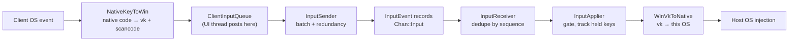
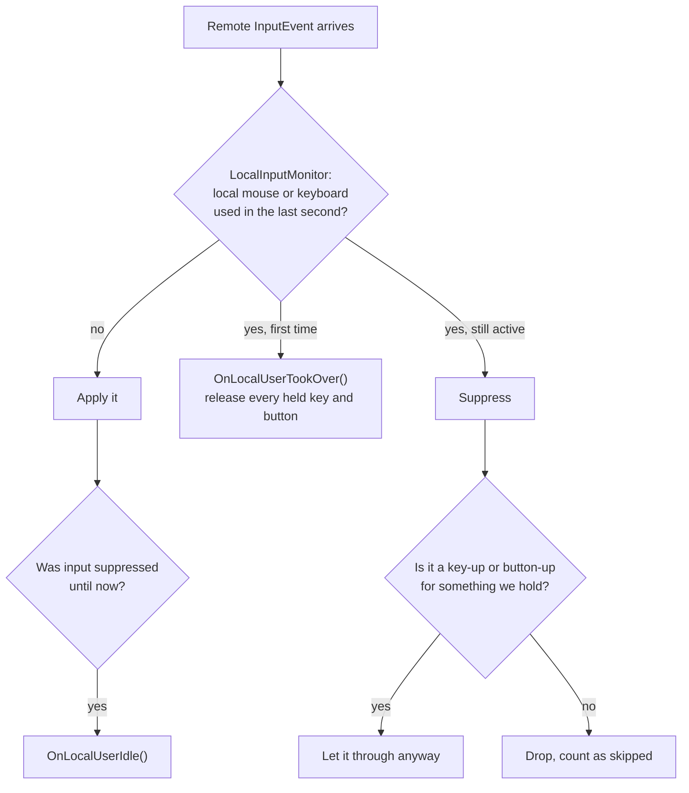

**English** · [Tiếng Việt](INPUT.vi.md) · [中文](INPUT.zh.md) · [日本語](INPUT.ja.md)

# Deskhub — Remote input

A key pressed on a phone has to end up in an application on a Windows desktop. This
document describes the path: what travels on the wire, how five different keyboard
conventions are reconciled, who wins when the person at the host reaches for their own
mouse, and what happens to a key that is held down when the link drops.

The wider layout is in [`ARCHITECTURE.md`](ARCHITECTURE.md); what a user may do is in
[`SPECIFICATION.md`](SPECIFICATION.md).

- **Status:** describes the current code.
- **Audience:** anyone changing `core/input`, `platform/input`, or a client's input
  handling.

---

## 1. The path

The whole chain speaks **one vocabulary**: Windows virtual-key codes plus Set 1
scancodes. Not because Windows is special, but because a single fixed vocabulary means
each platform writes one translation to it instead of one translation per pair of
platforms.

`InputEvent` is deliberately tiny — type, timestamp, two `int32_t` (`a`, `b`), a state
byte and an absolute flag. What `a` and `b` mean depends on the type:

| Type | `a` | `b` | `state` |
| --- | --- | --- | --- |
| `Key` | virtual-key code | Set 1 scancode (`\| 0x100` when extended) | 1 down, 0 up |
| `MouseMove` | x | y | — (`absolute` says which frame) |
| `MouseButton` | `MouseButton` value | — | 1 down, 0 up |
| `MouseWheel` | — | delta (120 per notch) | — |

## 2. Getting there reliably without TCP

Input rides its own channel, and `InputSender` assumes packets go missing. Three
mechanisms, all cheap because an input event is a handful of bytes:

| Mechanism | Constant | Effect |
| --- | --- | --- |
| Redundancy | `kInputRedundancy` = 8 | every send repeats the last 8 events |
| Repeats | `kInputRepeatCount` = 2, `kInputRepeatIntervalUs` = 25 ms | the tail is sent again twice |
| Batching | `kInputBatchMax` = 24 | up to 24 events per packet |

`InputReceiver` deduplicates by sequence number: each event carries one, anything at or
below the last applied sequence is counted as a duplicate and dropped, and a jump
forward is counted as loss. So a lost packet usually costs nothing — the next one
carries the same events again — and a duplicated packet can never press a key twice.

## 3. One vocabulary, five keyboards

`ScancodeTable` is a constexpr table per platform mapping the native key code both ways.
`PreferLeftModifier` collapses the ambiguous `Shift`/`Control`/`Alt` codes onto their
left-hand variants when translating back, so a generic modifier from a client that has
only one becomes a concrete key on the host.

| Platform | Native side | File |
| --- | --- | --- |
| Windows | virtual-key codes (identity, mostly) | `NativeKeyMapWin.cpp` |
| Linux | X11 keysyms / evdev | `NativeKeyMapLinux.cpp` |
| macOS | CGKeyCode | `NativeKeyMapMac.cpp` |
| Android | `KeyEvent` codes | `NativeKeyMapAndroid.cpp` |
| iOS | UIKey codes | `NativeKeyMapIos.cpp` |

Where a key does not exist natively — most of the phone cases — the client sends
**characters** instead: `CharToKeyChord` (`KeyMap.h`) turns a codepoint into a
virtual-key plus a shift flag, so typing `@` on a phone keyboard becomes
`Shift` + `2` on the host. `VkToSet1Scancode` fills in the scancode, because some
applications read the scancode rather than the virtual key.

Touch clients also get `kTouchHotkeys` — Esc, Tab, Enter, arrows, Del, Ctrl+C, Ctrl+V —
as a fixed row of buttons, dispatched through `DispatchHotkey` as taps or chords.

## 4. Pointer geometry

The client sends **normalised** absolute coordinates: 0…65535 across the video, not
pixels. `PointerMap` does the conversions (`AbsCoordToPixel`, `AxisToAbsCoord`,
`ClampAbsCoord`), so a 4K host driven from a phone needs no agreement on resolution and
a stream that changes size mid-session does not shift the cursor.

- **Wheel** is Windows-shaped too: 120 units per notch, `WheelNotches` and
  `ScrollNotchesFromLines` reduce a platform's own scroll units to notches.
- **X11 buttons** are folded into `MouseButton` by `X11ButtonToMouseButton` (8 and 9
  become X1 and X2).
- **Touch clients** have no pointer of their own, so `TrackpadCursor` keeps a
  normalised cursor the finger drags around, clamped to the visible video rectangle by
  `ClampToVisible`. That is what makes a phone behave like a trackpad rather than a
  touchscreen.

`PointerLockState` handles the desktop case: F9 (`kViewerLockToggleVk`) toggles pointer
lock, Escape releases it, and losing window focus both releases the lock and — the
important part — asks for every held key and button to be released.

## 5. Host wins

The person sitting at the host always outranks the remote one.

`LocalInputMonitor::kQuietUs` is one second: the remote side is suppressed while the
local person is active and for one second after they stop. Injected events are tagged
(`kInjectedUserData`) so the monitor does not mistake Deskhub's own injection for a
person at the keyboard.

The exception in that diagram matters more than the rule. **Releases are always let
through**, even while suppressed — otherwise a `Ctrl` pressed just before the host's
owner touched their mouse would stay down forever on the host.

## 6. Nothing stays stuck

`PressedInputTracker` remembers every key and button currently down, with the native
code needed to release it. Three events drain it:

| Event | What happens |
| --- | --- |
| The local person takes over | `ReleaseAll()` — everything held is released before suppression begins |
| Input is switched off (`LocalInputGate::SetEnabled(false)`) | `ReleaseAll()` |
| The viewer loses focus or disconnects | the client sends `ReleaseAll`, and the host releases what it still holds |

This is why "host wins" does not leave a machine with a stuck modifier, and why closing
a viewer window mid-drag does not leave the host's mouse button down.

## 7. Timing on the client side

`ClientInputQueue` is the thread boundary: UI threads post into it, the network thread
drains it. It also holds a small **delayed** queue, because some events must be
separated in time to be understood:

- `KeyTap` presses and releases with `kTapHoldUs` = 50 ms between them — an
  instantaneous press-release pair is missed by some applications.
- `KeyChord` orders modifier-down, key-down, key-up, modifier-up with the same spacing.
- `CharTap` runs a codepoint through `CharToKeyChord` first, and reports failure for
  characters with no chord.

`ReleaseAll` empties both queues and emits an up event for everything currently held.

## 8. Reading map

| To understand | Read |
| --- | --- |
| Wire shape | `InputEvent` in `core/include/deskhub/protocol/Wire.h` |
| Redundancy and batching | `core/src/input/InputSender.cpp` |
| Dedupe and loss counting | `core/include/deskhub/input/InputReceiver.h` |
| The gate and held-key rules | `core/include/deskhub/input/InputApplier.h` |
| Key translation | `core/include/deskhub/input/ScancodeTable.h`, `platform/src/input/NativeKeyMap*.cpp` |
| Characters without a key | `core/include/deskhub/input/KeyMap.h` |
| Pointer maths | `core/include/deskhub/input/PointerMap.h` |
| Host-wins detection | `platform/src/input/LocalInput*.cpp` |

## 9. Known gaps

- **The vocabulary is Windows-shaped.** Every platform translates to virtual keys and
  Set 1 scancodes, so a key that exists on neither side of that vocabulary (media keys,
  some international layouts) has nowhere to go.
- **Layout is the host's, not the client's.** The client sends key positions, and the
  host applies its own keyboard layout — a client on an AZERTY layout driving a QWERTY
  host types QWERTY. `CharToKeyChord` sidesteps this for typed text but only for the
  ASCII range it covers.
- **Mouse events never reach a shared terminal.** Terminal sessions carry keys only;
  see §9 of [`TERMINAL.md`](TERMINAL.md).
