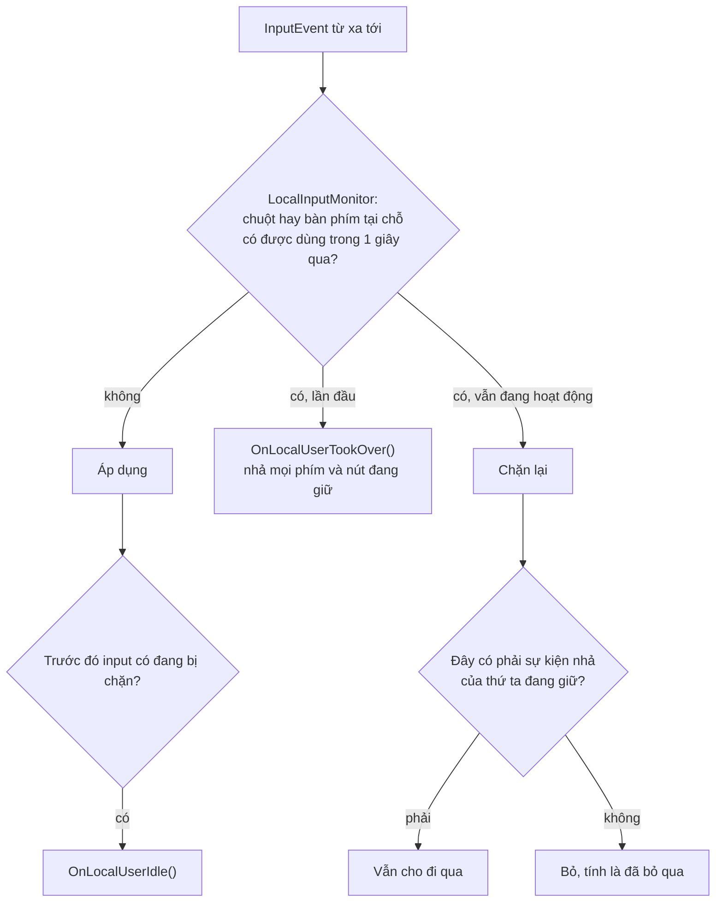

[English](INPUT.md) · **Tiếng Việt** · [中文](INPUT.zh.md) · [日本語](INPUT.ja.md)

# Deskhub — Điều khiển từ xa

Một phím bấm trên điện thoại phải đi tới được một ứng dụng trên máy để bàn Windows. Tài
liệu này mô tả con đường đó: cái gì đi trên đường truyền, năm quy ước bàn phím khác nhau
được hoà giải ra sao, ai thắng khi người ngồi ở host với tay lấy chuột của họ, và điều gì
xảy ra với một phím đang giữ khi kết nối rớt.

Bố cục tổng thể nằm ở [`ARCHITECTURE.vi.md`](ARCHITECTURE.vi.md); người dùng được làm gì
nằm ở [`SPECIFICATION.vi.md`](SPECIFICATION.vi.md).

Đây là bản dịch của [`INPUT.md`](INPUT.md); khi hai bản khác nhau, bản tiếng Anh là bản
chuẩn.

- **Trạng thái:** mô tả mã nguồn hiện tại.
- **Đối tượng đọc:** bất kỳ ai sửa `core/input`, `platform/input`, hay phần xử lý input
  của một client.

---

## 1. Con đường

```mermaid
flowchart LR
    OS1["Sự kiện của OS phía client"] --> MAP1["NativeKeyToWin<br/>mã native → vk + scancode"]
    MAP1 --> Q["ClientInputQueue<br/>(luồng UI đẩy vào đây)"]
    Q --> SEND["InputSender<br/>gom lô + dư thừa"]
    SEND --> WIRE["Bản ghi InputEvent<br/>Chan::Input"]
    WIRE --> RECV["InputReceiver<br/>khử trùng lặp theo số thứ tự"]
    RECV --> APP["InputApplier<br/>cổng chặn, theo dõi phím đang giữ"]
    APP --> MAP2["WinVkToNative<br/>vk → OS này"]
    MAP2 --> OS2["Tiêm vào OS phía host"]
```

Toàn bộ chuỗi nói **một thứ tiếng**: mã phím ảo của Windows cộng scancode Set 1. Không
phải vì Windows đặc biệt, mà vì một thứ tiếng cố định nghĩa là mỗi nền tảng chỉ viết một
bản dịch sang nó, thay vì một bản dịch cho từng cặp nền tảng.

`InputEvent` cố ý nhỏ — kiểu, mốc thời gian, hai `int32_t` (`a`, `b`), một byte trạng
thái và một cờ tuyệt đối. `a` và `b` mang nghĩa gì thì tuỳ kiểu:

| Kiểu | `a` | `b` | `state` |
| --- | --- | --- | --- |
| `Key` | mã phím ảo | scancode Set 1 (`\| 0x100` khi là phím mở rộng) | 1 nhấn, 0 nhả |
| `MouseMove` | x | y | — (cờ `absolute` cho biết hệ quy chiếu) |
| `MouseButton` | giá trị `MouseButton` | — | 1 nhấn, 0 nhả |
| `MouseWheel` | — | delta (120 mỗi nấc) | — |

## 2. Tới nơi một cách đáng tin mà không cần TCP

Input đi trên kênh riêng của nó, và `InputSender` giả định rằng gói tin sẽ mất. Ba cơ
chế, tất cả đều rẻ vì một sự kiện input chỉ vài byte:

| Cơ chế | Hằng số | Tác dụng |
| --- | --- | --- |
| Dư thừa | `kInputRedundancy` = 8 | mỗi lần gửi lặp lại 8 sự kiện gần nhất |
| Lặp lại | `kInputRepeatCount` = 2, `kInputRepeatIntervalUs` = 25 ms | phần đuôi được gửi thêm hai lần |
| Gom lô | `kInputBatchMax` = 24 | tối đa 24 sự kiện mỗi gói |

`InputReceiver` khử trùng lặp theo số thứ tự: mỗi sự kiện mang một số, thứ gì ở mức bằng
hoặc thấp hơn số đã áp dụng gần nhất bị tính là trùng và bỏ đi, còn một bước nhảy tiến
được tính là mất. Nhờ vậy một gói mất thường không tốn gì — gói kế tiếp mang lại chính
các sự kiện đó — và một gói bị nhân đôi không bao giờ nhấn phím hai lần.

## 3. Một thứ tiếng, năm bàn phím

`ScancodeTable` là một bảng constexpr cho mỗi nền tảng, ánh xạ mã phím native theo cả hai
chiều. `PreferLeftModifier` gộp các mã `Shift`/`Control`/`Alt` mập mờ về biến thể bên
trái khi dịch ngược, nên một phím bổ trợ chung chung từ client chỉ có một phím sẽ thành
một phím cụ thể trên host.

| Nền tảng | Phía native | Tệp |
| --- | --- | --- |
| Windows | mã phím ảo (gần như trùng khớp) | `NativeKeyMapWin.cpp` |
| Linux | keysym X11 / evdev | `NativeKeyMapLinux.cpp` |
| macOS | CGKeyCode | `NativeKeyMapMac.cpp` |
| Android | mã `KeyEvent` | `NativeKeyMapAndroid.cpp` |
| iOS | mã UIKey | `NativeKeyMapIos.cpp` |

Ở đâu một phím không tồn tại ở dạng native — phần lớn trường hợp trên điện thoại — client
gửi **ký tự** thay thế: `CharToKeyChord` (`KeyMap.h`) biến một điểm mã thành phím ảo cộng
cờ shift, nên gõ `@` trên bàn phím điện thoại trở thành `Shift` + `2` trên host.
`VkToSet1Scancode` điền nốt scancode, vì một số ứng dụng đọc scancode chứ không đọc phím
ảo.

Client cảm ứng còn có `kTouchHotkeys` — Esc, Tab, Enter, các phím mũi tên, Del, Ctrl+C,
Ctrl+V — dưới dạng một hàng nút cố định, phát đi qua `DispatchHotkey` như một cú gõ hoặc
một tổ hợp.

## 4. Hình học con trỏ

Client gửi toạ độ tuyệt đối đã **chuẩn hoá**: 0…65535 trải ngang khung hình, không phải
điểm ảnh. `PointerMap` lo phần quy đổi (`AbsCoordToPixel`, `AxisToAbsCoord`,
`ClampAbsCoord`), nên một host 4K được điều khiển từ điện thoại không cần hai bên thống
nhất độ phân giải, và một luồng đổi kích thước giữa chừng không làm con trỏ lệch đi.

- **Con lăn** cũng mang hình dạng Windows: 120 đơn vị mỗi nấc, `WheelNotches` và
  `ScrollNotchesFromLines` quy đơn vị cuộn riêng của từng nền tảng về số nấc.
- **Nút chuột X11** được gộp vào `MouseButton` bởi `X11ButtonToMouseButton` (8 và 9 thành
  X1 và X2).
- **Client cảm ứng** không có con trỏ riêng, nên `TrackpadCursor` giữ một con trỏ đã chuẩn
  hoá mà ngón tay kéo đi, bị kẹp trong hình chữ nhật video đang thấy bởi `ClampToVisible`.
  Đó là thứ làm một chiếc điện thoại cư xử như bàn di chuột chứ không như màn hình cảm ứng.

`PointerLockState` lo trường hợp máy để bàn: F9 (`kViewerLockToggleVk`) bật tắt khoá con
trỏ, Escape nhả nó ra, và mất tiêu điểm cửa sổ vừa nhả khoá vừa — đây mới là phần quan
trọng — yêu cầu nhả mọi phím và nút đang giữ.

## 5. Host thắng

Người đang ngồi ở host luôn có quyền cao hơn người ở xa.

`LocalInputMonitor::kQuietUs` là một giây: phía từ xa bị chặn trong lúc người tại chỗ còn
hoạt động và thêm một giây sau khi họ dừng. Các sự kiện do Deskhub tiêm vào được gắn thẻ
(`kInjectedUserData`) để bộ theo dõi không nhầm chính việc tiêm của Deskhub thành một
người đang gõ phím.

Ngoại lệ trong sơ đồ đó quan trọng hơn cả quy tắc. **Sự kiện nhả luôn được cho qua**, kể
cả khi đang bị chặn — nếu không, một phím `Ctrl` vừa nhấn ngay trước lúc chủ máy chạm vào
chuột sẽ kẹt ở trạng thái nhấn mãi mãi trên host.

## 6. Không gì bị kẹt lại

`PressedInputTracker` nhớ mọi phím và nút đang ở trạng thái nhấn, kèm mã native cần dùng
để nhả nó. Ba sự kiện làm cạn nó:

| Sự kiện | Chuyện gì xảy ra |
| --- | --- |
| Người tại chỗ giành quyền | `ReleaseAll()` — nhả mọi thứ đang giữ trước khi bắt đầu chặn |
| Input bị tắt (`LocalInputGate::SetEnabled(false)`) | `ReleaseAll()` |
| Viewer mất tiêu điểm hoặc mất kết nối | client gửi `ReleaseAll`, và host nhả những gì nó còn giữ |

Đó là lý do "host thắng" không để lại một máy với phím bổ trợ kẹt cứng, và là lý do đóng
cửa sổ viewer giữa lúc đang kéo không để lại nút chuột của host ở trạng thái nhấn.

## 7. Định thời phía client

`ClientInputQueue` là ranh giới giữa các luồng: các luồng UI đẩy vào, luồng mạng rút ra.
Nó cũng giữ một hàng đợi **trễ** nhỏ, vì một số sự kiện phải cách nhau về thời gian thì
mới được hiểu đúng:

- `KeyTap` nhấn rồi nhả với `kTapHoldUs` = 50 ms ở giữa — một cặp nhấn-nhả tức thời bị một
  số ứng dụng bỏ sót.
- `KeyChord` xếp thứ tự nhấn bổ trợ, nhấn phím, nhả phím, nhả bổ trợ với cùng khoảng cách
  đó.
- `CharTap` cho điểm mã đi qua `CharToKeyChord` trước, và báo thất bại với những ký tự
  không có tổ hợp tương ứng.

`ReleaseAll` dọn sạch cả hai hàng đợi và phát sự kiện nhả cho mọi thứ đang được giữ.

## 8. Bản đồ đọc code

| Muốn hiểu | Đọc |
| --- | --- |
| Hình dạng trên đường truyền | `InputEvent` trong `core/include/deskhub/protocol/Wire.h` |
| Dư thừa và gom lô | `core/src/input/InputSender.cpp` |
| Khử trùng lặp và đếm mất gói | `core/include/deskhub/input/InputReceiver.h` |
| Cổng chặn và quy tắc phím đang giữ | `core/include/deskhub/input/InputApplier.h` |
| Dịch phím | `core/include/deskhub/input/ScancodeTable.h`, `platform/src/input/NativeKeyMap*.cpp` |
| Ký tự không có phím tương ứng | `core/include/deskhub/input/KeyMap.h` |
| Toán học con trỏ | `core/include/deskhub/input/PointerMap.h` |
| Phát hiện người tại chỗ | `platform/src/input/LocalInput*.cpp` |

## 9. Những khoảng trống đã biết

- **Bộ từ vựng mang hình dạng Windows.** Mọi nền tảng đều dịch sang phím ảo và scancode
  Set 1, nên một phím không tồn tại ở cả hai phía bộ từ vựng đó (phím media, một số bố cục
  quốc tế) không có chỗ nào để đi.
- **Bố cục bàn phím là của host, không phải của client.** Client gửi vị trí phím, còn host
  áp bố cục bàn phím của chính nó — một client dùng AZERTY điều khiển host QWERTY sẽ gõ ra
  QWERTY. `CharToKeyChord` né được chuyện này cho văn bản gõ vào, nhưng chỉ trong phạm vi
  ASCII mà nó bao phủ.
- **Sự kiện chuột không bao giờ tới được terminal được chia sẻ.** Phiên terminal chỉ mang
  phím; xem §9 của [`TERMINAL.vi.md`](TERMINAL.vi.md).
