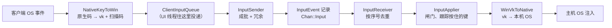
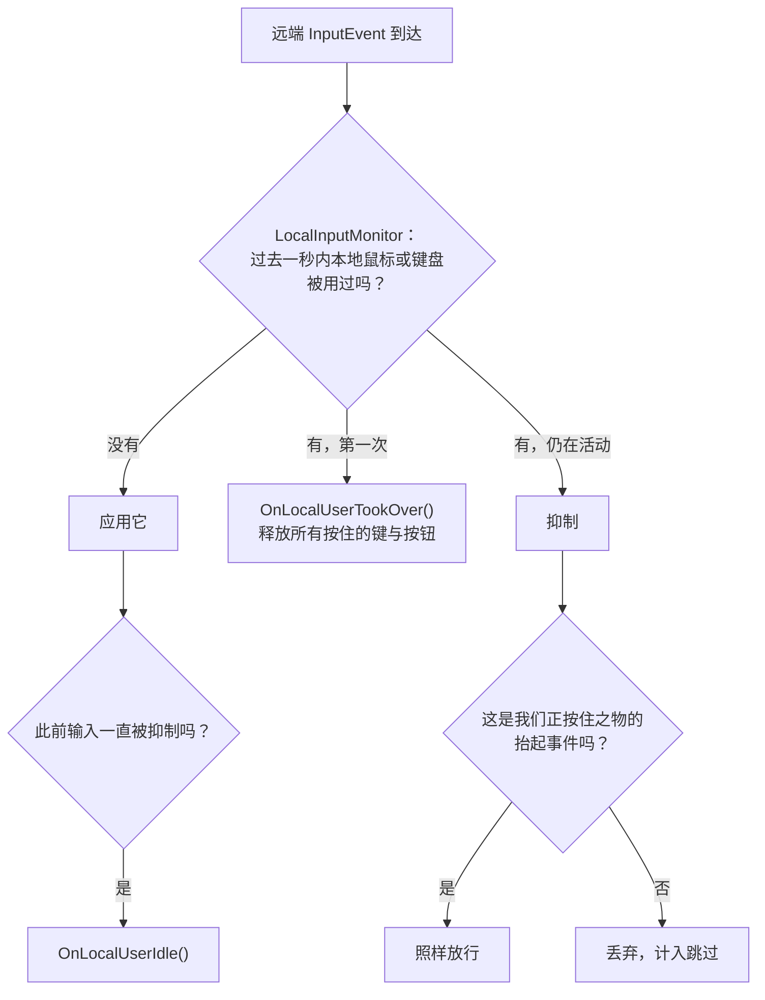

[English](INPUT.md) · [Tiếng Việt](INPUT.vi.md) · **中文** · [日本語](INPUT.ja.md)

# Deskhub —— 远程输入

在手机上按下的一个键，最终要落到 Windows 桌面上的某个应用里。本文档描述这条路径：线上传
的是什么，五套不同的键盘约定如何被调和，当坐在主机前的人伸手去拿自己的鼠标时谁说了算，以
及链路断开时那个正被按住的键会怎样。

更大的布局在 [`ARCHITECTURE.zh.md`](ARCHITECTURE.zh.md)；用户可以做什么在
[`SPECIFICATION.zh.md`](SPECIFICATION.zh.md)。

本文件是 [`INPUT.md`](INPUT.md) 的译本；若两者有出入，以英文版为准。

- **状态：** 描述的是当前代码。
- **读者：** 任何要改 `core/input`、`platform/input` 或某个客户端输入处理的人。

---

## 1. 这条路径

整条链路只说**一种语言**：Windows 虚拟键码加 Set 1 扫描码。不是因为 Windows 特殊，而是因
为固定一种语言意味着每个平台只需写一份到它的翻译，而不是为每一对平台各写一份。

`InputEvent` 刻意做得很小——类型、时间戳、两个 `int32_t`（`a`、`b`）、一个状态字节和一个
绝对坐标标志。`a` 和 `b` 的含义取决于类型：

| 类型 | `a` | `b` | `state` |
| --- | --- | --- | --- |
| `Key` | 虚拟键码 | Set 1 扫描码（扩展键时 `\| 0x100`） | 1 按下，0 抬起 |
| `MouseMove` | x | y | ——（`absolute` 说明是哪种坐标系） |
| `MouseButton` | `MouseButton` 取值 | — | 1 按下，0 抬起 |
| `MouseWheel` | — | delta（每格 120） | — |

## 2. 不用 TCP 也可靠送达

输入走自己的通道，`InputSender` 假定数据包会丢。三个机制，都很便宜，因为一个输入事件不过
几个字节：

| 机制 | 常量 | 效果 |
| --- | --- | --- |
| 冗余 | `kInputRedundancy` = 8 | 每次发送都重复最近 8 个事件 |
| 重发 | `kInputRepeatCount` = 2，`kInputRepeatIntervalUs` = 25 ms | 队尾再补发两次 |
| 成批 | `kInputBatchMax` = 24 | 每包最多 24 个事件 |

`InputReceiver` 按序号去重：每个事件带一个序号，凡是不大于最后应用序号的都算重复并丢弃，
而向前跳跃则记为丢失。于是丢一个包通常没有代价——下一个包又带着同样的事件——而重复的包也
绝不会把一个键按两次。

## 3. 一种语言，五种键盘

`ScancodeTable` 是每个平台一张 constexpr 表，双向映射原生键码。`PreferLeftModifier` 在反
向翻译时把含糊的 `Shift`/`Control`/`Alt` 码收敛到左侧变体，于是来自只有一个修饰键的客户端
的通用修饰键，在主机上会变成一个具体的键。

| 平台 | 原生侧 | 文件 |
| --- | --- | --- |
| Windows | 虚拟键码（基本一一对应） | `NativeKeyMapWin.cpp` |
| Linux | X11 keysym / evdev | `NativeKeyMapLinux.cpp` |
| macOS | CGKeyCode | `NativeKeyMapMac.cpp` |
| Android | `KeyEvent` 码 | `NativeKeyMapAndroid.cpp` |
| iOS | UIKey 码 | `NativeKeyMapIos.cpp` |

某个键在原生一侧根本不存在时——手机上大多数情况都是如此——客户端改发**字符**：
`CharToKeyChord`（`KeyMap.h`）把一个码点变成虚拟键加 shift 标志，于是在手机键盘上打 `@`
到了主机上就成了 `Shift` + `2`。`VkToSet1Scancode` 补上扫描码，因为有些应用读的是扫描码而
不是虚拟键。

触屏客户端还有 `kTouchHotkeys`——Esc、Tab、Enter、方向键、Del、Ctrl+C、Ctrl+V——作为一排固
定按钮，经 `DispatchHotkey` 以单击或组合键的形式发出。

## 4. 指针几何

客户端发的是**归一化**的绝对坐标：横跨视频的 0…65535，而不是像素。`PointerMap` 负责换算
（`AbsCoordToPixel`、`AxisToAbsCoord`、`ClampAbsCoord`），于是用手机操控 4K 主机不需要两边
就分辨率达成一致，会话中途改变尺寸的流也不会让光标错位。

- **滚轮**同样是 Windows 形状：每格 120 单位，`WheelNotches` 和 `ScrollNotchesFromLines`
  把各平台自己的滚动单位归到格数。
- **X11 按键**由 `X11ButtonToMouseButton` 折入 `MouseButton`（8 和 9 变成 X1 和 X2）。
- **触屏客户端**没有自己的指针，于是 `TrackpadCursor` 维护一个由手指拖动的归一化光标，并
  被 `ClampToVisible` 夹在可见的视频矩形内。正是它让手机表现得像触控板而不是触摸屏。

`PointerLockState` 管桌面那种情况：F9（`kViewerLockToggleVk`）切换指针锁定，Escape 释放
它，而窗口失去焦点既释放锁定，又——这才是要点——要求释放所有按住的键与按钮。

## 5. 主机说了算

坐在主机前的人，永远高过远端那位。

`LocalInputMonitor::kQuietUs` 是一秒：本地的人在活动期间以及停止后的一秒内，远端都被抑制。
注入的事件带有标记（`kInjectedUserData`），这样监视器不会把 Deskhub 自己的注入误认成有人在
敲键盘。

图里的那条例外比规则更重要。**抬起事件永远放行**，即使正在被抑制——否则一个恰好在主机主人
碰鼠标之前按下的 `Ctrl`，会在主机上永远保持按下状态。

## 6. 没有东西会卡住

`PressedInputTracker` 记住当前按下的每一个键与按钮，连同释放它所需的原生码。三种事件会把它
排空：

| 事件 | 会发生什么 |
| --- | --- |
| 本地的人接管 | `ReleaseAll()`——在抑制开始前先释放所有按住之物 |
| 输入被关闭（`LocalInputGate::SetEnabled(false)`） | `ReleaseAll()` |
| 查看端失焦或断开 | 客户端发 `ReleaseAll`，主机释放它仍持有的部分 |

这就是为什么"主机说了算"不会给机器留下一个卡住的修饰键，也是为什么拖拽到一半关掉查看窗口
不会让主机的鼠标键一直按着。

## 7. 客户端侧的时序

`ClientInputQueue` 是线程边界：UI 线程往里投，网络线程往外取。它还持有一个小小的**延迟**队
列，因为有些事件必须在时间上分开才能被正确理解：

- `KeyTap` 按下与抬起之间间隔 `kTapHoldUs` = 50 ms——瞬时的按下-抬起对会被某些应用漏掉。
- `KeyChord` 按同样的间隔排出修饰键按下、主键按下、主键抬起、修饰键抬起的顺序。
- `CharTap` 先把码点过一遍 `CharToKeyChord`，对没有对应组合的字符报告失败。

`ReleaseAll` 清空两个队列，并为当前按住的一切发出抬起事件。

## 8. 阅读地图

| 想弄懂 | 就读 |
| --- | --- |
| 线上形状 | `core/include/deskhub/protocol/Wire.h` 里的 `InputEvent` |
| 冗余与成批 | `core/src/input/InputSender.cpp` |
| 去重与丢包计数 | `core/include/deskhub/input/InputReceiver.h` |
| 闸门与按住键规则 | `core/include/deskhub/input/InputApplier.h` |
| 按键翻译 | `core/include/deskhub/input/ScancodeTable.h`、`platform/src/input/NativeKeyMap*.cpp` |
| 没有对应键的字符 | `core/include/deskhub/input/KeyMap.h` |
| 指针数学 | `core/include/deskhub/input/PointerMap.h` |
| 本地用户检测 | `platform/src/input/LocalInput*.cpp` |

## 9. 已知的缺口

- **这套词汇是 Windows 形状的。** 每个平台都翻译成虚拟键与 Set 1 扫描码，所以在这套词汇两
  侧都不存在的键（多媒体键、某些国际布局）无处可去。
- **布局属于主机而不是客户端。** 客户端发的是键位，主机应用的是自己的键盘布局——用 AZERTY
  布局的客户端操控 QWERTY 主机，打出来的是 QWERTY。`CharToKeyChord` 为键入文本绕开了这一
  点，但只覆盖它所涵盖的 ASCII 范围。
- **鼠标事件从不进入共享终端。** 终端会话只承载按键；见 [`TERMINAL.zh.md`](TERMINAL.zh.md)
  的 §9。
