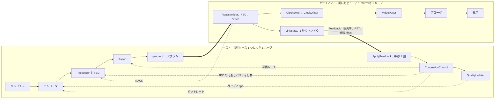
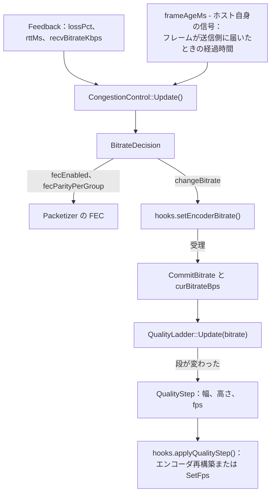
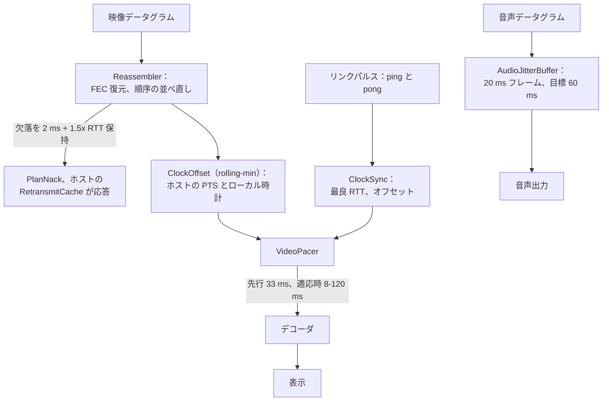
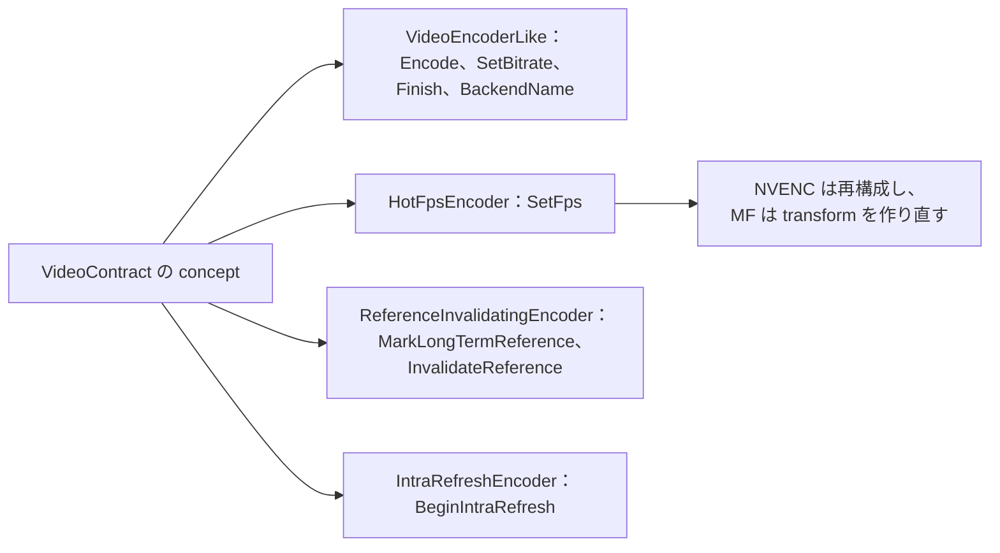
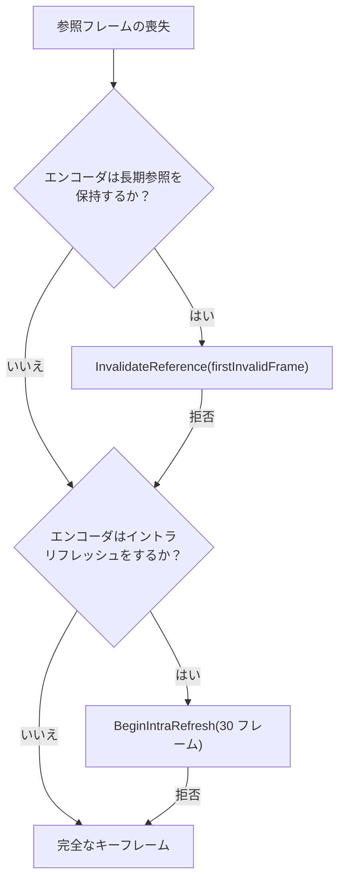

[English](MEDIA-PIPELINE.md) · [Tiếng Việt](MEDIA-PIPELINE.vi.md) · [中文](MEDIA-PIPELINE.zh.md) · **日本語**

# Deskhub — メディアパイプラインと制御プレーン

本書は、**ホストから何ビット出ていくか、各フレームをいつ表示するか**を決める 2 つの
フィードバックループと、そのビットが通るコーデック経路を記述する。`core/control`、
`core/transport`、`core/session` のメディア側半分、そして `client/*` のエンコーダと
デコーダへの地図である。

より大きな配置——レイヤ、スレッド、ワイヤプロトコル——は
[`ARCHITECTURE.ja.md`](ARCHITECTURE.ja.md) にある。製品がユーザーから見て何をするかは
[`SPECIFICATION.ja.md`](SPECIFICATION.ja.md) にある。

本書は [`MEDIA-PIPELINE.md`](MEDIA-PIPELINE.md) の翻訳である。相違がある場合は英語版が
正典となる。

- **状態：** 現在のコードを記述している。
- **読者：** キャプチャ、エンコード、レート制御、再生を変更するすべての人。

---

## 1. ループは 2 つ、それだけ

レート制御と再生タイミングは、互いを呼び出さない別々のループである。両者が出会うのは
ただ 1 つの小さなメッセージ、`Feedback` だけだ。

ホスト側のループは*どれだけ送るか*に答える。クライアント側のループは*届いたものをいつ
表示するか*に答える。どちらも相手の内部を知らない。

## 2. ホストのループ：フィードバックからエンコーダへ

各ビューアは 1 秒のウィンドウ（`LinkStats`）を閉じ、それを `Feedback` レコードにして送る
（`core/src/session/client/ScreenClient.cpp:203`）。ホスト側では `ApplyFeedback`
（`core/src/session/host/ViewerFeedback.cpp:6`）がループ全体が存在する**唯一**の場所で
ある——45 行。

これを正直に保つ規則が 2 つある。エンコーダのフックがビットレートを**受理**して初めて
制御器はそれを確定させること、そして梯子に渡すのは確定したビットレートであって要求値
ではないこと。

### 既定の AIMD

`BitrateController`（`core/src/control/BitrateController.cpp:12`）が `aimd` 戦略そのもの
である。損失と滞留は同じ種類の証拠として扱われる：

| 証拠 | 反応 |
| --- | --- |
| 損失 ≥ 5% **または** フレーム経過時間 ≥ 400 ms | −25% |
| 損失 ≥ 2% **または** フレーム経過時間 ≥ 150 ms | −10% |
| 損失 ≤ 1% で、前回の引き下げから 2 秒経過 | 上限の +5% |
| 現在レートの 2% 未満の変化 | 無視（デッドバンド） |

上限は設定された `--bitrate`、下限は `HostEngine::kMinBitrateBps`、すなわち 1 Mbps。

FEC は最初のフレームから入っており、**10 秒連続でクリーン**になって初めて下ろされる。
FEC が守る種類の損失は、最初の報告より先に現れるからだ。パリティ行数は実測損失に従う：
3% 未満で 1 行、3–5% で 2 行、6% 以上で 3 行。滞留が FEC を入れることは決してない——
パリティは行列を深くするだけだからである。`--fec-parity` は行数を固定し、
`--fec-arm always|never` はスイッチを固定する。

### 品質の梯子

`QualityLadder`（`core/src/control/QualityLadder.cpp`）はビットレートを解像度とフレーム
レートに変換する。ソース自身の最大値から導かれる 6 段：

| 段 | 縮尺 | fps |
| --- | --- | --- |
| 0 | 100% | 60 |
| 1 | 100% | 30 |
| 2 | 100% | 20 |
| 3 | 75% | 20 |
| 4 | 50% | 20 |
| 5 | 50% | 12 |

1 段の予算は**1 画素あたり毎秒 0.08 ビット**（`kBppNum/kBppDen`）。互いに重なる段や、
160×64 を下回る段は、梯子を組む時点で落とされる。

**下げる**のは即座。**上げる**には上の段の予算の 120% を、滞留時間のあいだ保つ必要が
ある：fps だけが変わるときは 5 秒、解像度が変わるときは 15 秒——リサイズはキーフレームと
デコーダの再構築を要するため、しぶしぶ行われる。

### アプリの下：ペーシングと CUBIC

`Pacer`（`core/include/deskhub/transport/Pacer.h`）は現在のビットレートの**2 倍**でパケ
ットをならし、自身の滞留を 100 ms で抑え、500 µs 未満は決してスリープしない。その下では
quiche の CUBIC が QUIC データグラム経路を司る。両者は直列に働く：quiche がマシンから出
る量を縛り、アプリはその結果生じた損失に合わせてエンコーダを調整する。

## 3. クライアントのループ：データグラムから画素へ

`VideoPacer`（`core/include/deskhub/control/VideoPacer.h`）は推定したホスト時計に対する
先行時間を保つ。適応先行が有効なら、その先行は実測ジッタの 3 倍を、8 ms から 120 ms の
あいだで追う。タイムベースが 250 ms 以上ずれれば再同期し、PTS が 2 秒を超えて飛べば新し
いストリームとして扱う。

NACK はビューアごと（`sendNacks`、`ScreenViewer::Config` で既定は有効）。欠落は 2 ms と
1.5× RTT のあいだ保持されてから再要求され、10 ms より密には送られない。ホストは
`RespondToNack` で `RetransmitCache` から応答する。

## 4. コーデック：何が交渉され、何が実際に動くか

ワイヤは 4 つのコーデックを宣言し、能力マスクで交渉する。優先順位は
AV1 → HEVC → H.264 4:4:4 → H.264（`core/src/media/CodecNegotiation.cpp`）。

**現在のコードで端から端まで存在するのは H.264 だけである。** `ScreenClient` は
`kCodecMaskH264` しか広告せず（`core/src/session/client/ScreenClient.cpp:58`）、
`ScreenHostSession::SetCodecMask` はテスト以外に呼び出し元がない。したがって
`NegotiateCodec` は常に H.264 に落ち着く。残る 3 つの列挙値はワイヤ上の余地であって
コード経路ではない——それらをエンコードもデコードするクライアントは存在しない。

| コーデック | ワイヤ上 | どれかのクライアントにエンコーダ | どれかのクライアントにデコーダ |
| --- | --- | --- | --- |
| H.264 | あり | あり | あり |
| H.264 4:4:4 | マスクビットのみ | なし | なし |
| HEVC | マスクビットのみ | なし | なし |
| AV1 | マスクビットのみ | なし | なし |

### OS ごとのエンコーダとデコーダ

| OS | エンコード | デコード | 場所 |
| --- | --- | --- | --- |
| Windows | NVENC、Media Foundation | Media Foundation | `client/windows/cpp/encode`、`.../decode` |
| Linux | NVENC、VA-API | FFmpeg | `client/linux/cpp/encode/HwEncoder.h`、`.../decode/AvDecoder.cpp` |
| macOS、iOS | VideoToolbox | VideoToolbox | `platform/src/media/VtEncoderApple.mm`、`VtDecoderApple.mm` |
| Android | MediaCodec | MediaCodec | `client/android/app/src/main/cpp/encode`、`.../decode` |
| 音声、5 つすべて | Opus | Opus | `platform/src/media/OpusCodec.cpp` |

共通の基底クラスを継承するエンコーダはない。契約は
`core/include/deskhub/media/VideoContract.h` にある **concept** の集合であり、各バック
エンドがコンパイル時にそれらへ対して静的表明を行う：

Windows では `auto` がアダプタのベンダでバックエンドを選ぶ
（`core/src/media/EncoderBackend.cpp`）。NVIDIA はまず NVENC、Intel はまず Media
Foundation——どちらも計測済み。AMD で Media Foundation を先にしているのは**推測**であり、
計測ではない。コマンドラインで名指しされたバックエンドが、黙って別のものへ落ちることは
決してない。

## 5. フレームの回復

受け取れなかった参照フレームをビューアが報告しても、ホストは自動的に IDR を送らない。
`media::RecoveryPolicy` がエンコーダに実際にできる最も安い修復を選び、`PrepareRecovery`
（`platform/include/deskhubp/host/EncoderRecovery.h`）がそれを適用する：

長期参照は 30 フレームごとに印を付ける。すべてのフォールバックは理由とともにログへ記録
されるので、能力を黙って欠くバックエンドは映像ではなくログに現れる。

## 6. 音声

Opus、48 kHz ステレオ、1 フレーム 960 サンプル（20 ms）、64 kbps。1 度だけエンコードし、
音声を求めたすべてのビューアへ送る。受信側の `AudioJitterBuffer` は既定で 60 ms の遅延を
目標にし、許されていれば適応し、欠けたフレームは止まるのではなく隠蔽する。音声には独自
のレート制御がない——映像に比べて小さく一定だからである。

## 7. すべてのつまみと、その落ちる先

| フラグ | 効く先 | 既定 |
| --- | --- | --- |
| `--bitrate` | ループ全体の上限 | 設定から |
| `--fps`、`--max-dim` | 梯子の第 0 段 | 設定から |
| `--cc` | `aimd`、`delay-trend`、`scream`、`hybrid` | `aimd` |
| `--fec` | `xor`、`rs` | `xor` |
| `--fec-parity` | グループごとのパリティ行数を固定 | 適応 |
| `--fec-depth` | フレームあたりの FEC グループ数 | エンコーダ任せ |
| `--fec-arm` | `always` または `never` | 適応 |
| `--encoder` | `auto`、`nvenc`、`mf`、`vaapi`、`videotoolbox` | `auto` |
| `--nack`、`--no-nack` | クライアントの再送要求 | 有効 |
| `--audio-delay`、`--audio-adaptive` | ジッタバッファ | 60 ms、適応 |

クロックオフセット推定器（`rolling-min`、`kalman`、`trendline`）は、コマンドラインフラグ
を**持たない**唯一の差し替え可能な部品である。設定は
`ScreenViewer::Config::clockOffset` からのみ行う。

## 8. 読み進める地図

この順で始めるとよい：

| 理解したいこと | 読むもの |
| --- | --- |
| ホストのループ全体 | `core/src/session/host/ViewerFeedback.cpp`（45 行） |
| ビットレートが動いた理由 | `core/src/control/BitrateController.cpp` |
| 解像度が動いた理由 | `core/src/control/QualityLadder.cpp` |
| 1 つのソースが抱える状態 | `core/include/deskhub/session/host/SourcePipelineState.h` |
| フレームがパケットになるまで | `core/src/transport/Packetizer.cpp` |
| パケットがフレームに戻るまで | `core/src/transport/Reassembler.cpp` |
| フレームが表示される時刻 | `core/src/control/VideoPacer.cpp` |
| どのエンコーダが選ばれたか | `client/windows/cpp/encode/EncoderFactory.cpp` |

## 9. 既知の隙間

バグとして再発見されないよう書き留めておく：

- **コーデックの表面はコードより広い。** 交渉できるのは 4 つ、実装は 1 つ。残る 3 つに
  経路を与えるか、列挙を H.264 まで縮めてマスクだけをワイヤ上の余地として残すかである。
- **戦略の数が、試験されている組み合わせを上回っている。** 4 つの輻輳制御、3 つのクロッ
  ク推定器、2 つの FEC 方式で 24 通り。CI で端から端まで動かしているのはちょうど 1 つ、
  `aimd` + `rolling-min` + `xor` だけである。残りはフラグで届く実験であり、そう読むべき
  ものだ。
- **`SourcePipelineState` は god object である。** 1 つの構造体におよそ 35 個のアトミック
  と 7 つのサブシステム。ホスト側のすべてのスレッドがこれに触れる。ホストループのどの部分
  も局所的に推論できない理由がここにある。
- **AMD のバックエンド順は推測である。** §4 を参照——バックエンド表のうち、背後に計測を
  持たない唯一の行だ。
