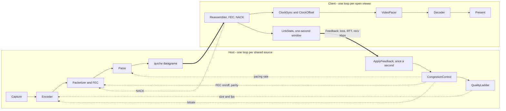
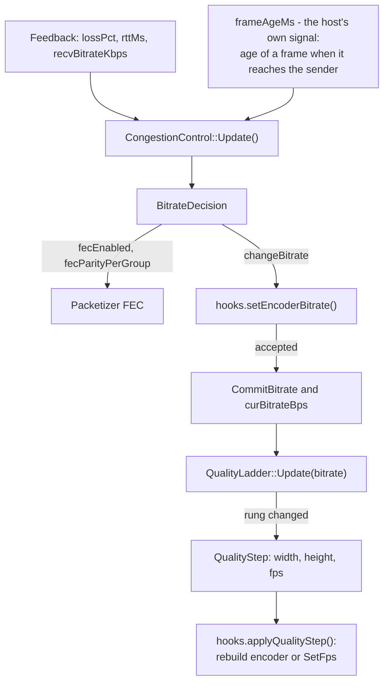
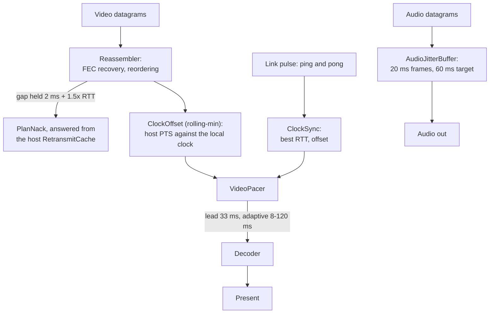
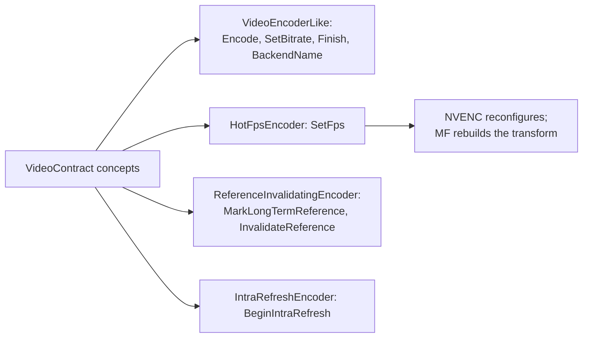
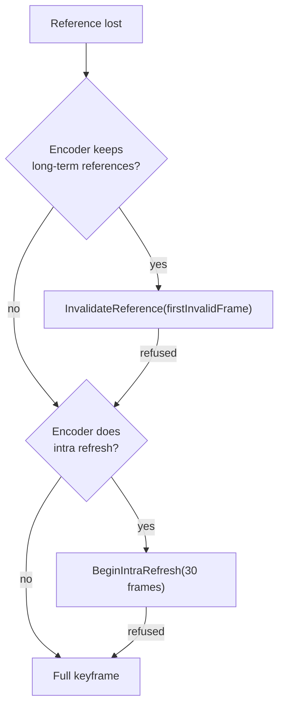

**English** · [Tiếng Việt](MEDIA-PIPELINE.vi.md) · [中文](MEDIA-PIPELINE.zh.md) · [日本語](MEDIA-PIPELINE.ja.md)

# Deskhub — Media pipeline and control plane

This document describes the two feedback loops that decide **how many bits leave the
host and when each frame is shown**, and the codec path those bits travel through. It
is the map to `core/control`, `core/transport`, the media half of `core/session`, and
the encoders and decoders in `client/*`.

The wider layout — layers, threads, wire protocol — is in
[`ARCHITECTURE.md`](ARCHITECTURE.md). What the product does for a user is in
[`SPECIFICATION.md`](SPECIFICATION.md).

- **Status:** describes the current code.
- **Audience:** anyone changing capture, encoding, rate control or playback.

---

## 1. Two loops, and only two

Rate control and playback timing are separate loops that never call each other. They
meet at one small message: `Feedback`.

The host loop answers *how much to send*. The client loop answers *when to show what
arrived*. Neither knows the other's internals.

## 2. Host loop: from feedback to encoder

Every viewer closes a one-second window (`LinkStats`), turns it into a `Feedback`
record and sends it (`core/src/session/client/ScreenClient.cpp:203`). On the host,
`ApplyFeedback` (`core/src/session/host/ViewerFeedback.cpp:6`) is the **only** place
the whole loop lives — 45 lines.

Two rules keep this honest: the encoder hook must **accept** a bitrate before the
controller commits to it, and the ladder is fed the committed bitrate, never the
requested one.

### The AIMD default

`BitrateController` (`core/src/control/BitrateController.cpp:12`) is the `aimd`
strategy. Loss and backlog are treated as the same kind of evidence:

| Evidence | Reaction |
| --- | --- |
| loss ≥ 5% **or** frame age ≥ 400 ms | −25% |
| loss ≥ 2% **or** frame age ≥ 150 ms | −10% |
| loss ≤ 1% and 2 s since the last decrease | +5% of the ceiling |
| change smaller than 2% of the current rate | ignored (deadband) |

The ceiling is the configured `--bitrate`; the floor is `HostEngine::kMinBitrateBps`,
1 Mbps.

FEC is armed from the very first frame and only stood down after **10 consecutive
clean seconds**, because the loss it protects against shows up before the first report
does. Parity rows follow measured loss: 1 row below 3%, 2 rows at 3–5%, 3 rows at 6%
and above. A backlog never arms FEC — parity would only deepen the queue.
`--fec-parity` pins the row count, `--fec-arm always|never` pins the switch.

### The quality ladder

`QualityLadder` (`core/src/control/QualityLadder.cpp`) turns a bitrate into a
resolution and a frame rate. Six rungs, derived from the source's own maximum:

| Rung | Scale | fps |
| --- | --- | --- |
| 0 | 100% | 60 |
| 1 | 100% | 30 |
| 2 | 100% | 20 |
| 3 | 75% | 20 |
| 4 | 50% | 20 |
| 5 | 50% | 12 |

A rung's budget is **0.08 bit per pixel per second** (`kBppNum/kBppDen`). Rungs that
collapse into one another, or that fall below 160×64, are dropped when the ladder is
built.

Going **down** is immediate. Going **up** needs 120% of the higher rung's budget, held
for a dwell time: 5 s when only fps changes, 15 s when the resolution changes — a
resize costs a keyframe and a decoder rebuild, so it is made reluctantly.

### Below the app: pacing and CUBIC

`Pacer` (`core/include/deskhub/transport/Pacer.h`) spreads packets at **twice** the
current bitrate, caps its own backlog at 100 ms and never sleeps for less than 500 µs.
Under it, quiche's CUBIC governs the QUIC datagram path. The two act in series: quiche
bounds what leaves the machine, the app adapts the encoder to the loss that results.

## 3. Client loop: from datagram to pixel

`VideoPacer` (`core/include/deskhub/control/VideoPacer.h`) holds a lead time over the
estimated host clock. With the adaptive lead on, that lead tracks 3× the measured
jitter, between 8 ms and 120 ms. A timebase more than 250 ms out is resynced; a PTS
jump beyond 2 s is treated as a new stream.

NACKs are per viewer (`sendNacks`, on by default in `ScreenViewer::Config`). A gap is
held for 2 ms plus 1.5× RTT before it is asked for again, and no more often than every
10 ms; the host answers out of `RetransmitCache` in `RespondToNack`.

## 4. Codecs: what is negotiated, what actually runs

The wire declares four codecs and negotiates by capability mask, preferring
AV1 → HEVC → H.264 4:4:4 → H.264 (`core/src/media/CodecNegotiation.cpp`).

**In the current code only H.264 exists end to end.** `ScreenClient` advertises
`kCodecMaskH264` and nothing else (`core/src/session/client/ScreenClient.cpp:58`), and
`ScreenHostSession::SetCodecMask` has no caller outside tests, so `NegotiateCodec`
always settles on H.264. The other three enum values are wire-level headroom, not a
code path — no client encodes or decodes them.

| Codec | On the wire | Encoder in any client | Decoder in any client |
| --- | --- | --- | --- |
| H.264 | yes | yes | yes |
| H.264 4:4:4 | mask bit only | no | no |
| HEVC | mask bit only | no | no |
| AV1 | mask bit only | no | no |

### Encoders and decoders per OS

| OS | Encode | Decode | Where |
| --- | --- | --- | --- |
| Windows | NVENC, Media Foundation | Media Foundation | `client/windows/cpp/encode`, `.../decode` |
| Linux | NVENC, VA-API | FFmpeg | `client/linux/cpp/encode/HwEncoder.h`, `.../decode/AvDecoder.cpp` |
| macOS, iOS | VideoToolbox | VideoToolbox | `platform/src/media/VtEncoderApple.mm`, `VtDecoderApple.mm` |
| Android | MediaCodec | MediaCodec | `client/android/app/src/main/cpp/encode`, `.../decode` |
| Audio, all five | Opus | Opus | `platform/src/media/OpusCodec.cpp` |

No encoder inherits from a shared base class. The contract is a set of **concepts** in
`core/include/deskhub/media/VideoContract.h`, and each backend asserts against them at
compile time:

On Windows, `auto` picks a backend by adapter vendor
(`core/src/media/EncoderBackend.cpp`): NVIDIA tries NVENC first, Intel tries Media
Foundation first — both measured. AMD is ordered Media Foundation first as a **guess**,
not a measurement. A backend named explicitly on the command line never silently falls
back to another one.

## 5. Frame recovery

When a viewer reports a reference frame it never received, the host does not
automatically send an IDR. `media::RecoveryPolicy` picks the cheapest repair the
encoder can actually perform, and `PrepareRecovery`
(`platform/include/deskhubp/host/EncoderRecovery.h`) applies it:

A long-term reference is marked every 30 frames. Every fallback is logged with its
reason, so a backend that quietly lacks a capability shows up in the log rather than in
the picture.

## 6. Audio

Opus, 48 kHz stereo, 960 samples (20 ms) per frame, 64 kbps, encoded once and sent to
every viewer that asked for audio. The receiving `AudioJitterBuffer` targets 60 ms of
delay by default, adapts when allowed, and conceals a missing frame rather than
stalling. Audio has no rate control of its own — next to video it is small and
constant.

## 7. Every knob, and where it lands

| Flag | Reaches | Default |
| --- | --- | --- |
| `--bitrate` | the ceiling of the whole loop | from settings |
| `--fps`, `--max-dim` | ladder rung 0 | from settings |
| `--cc` | `aimd`, `delay-trend`, `scream`, `hybrid` | `aimd` |
| `--fec` | `xor`, `rs` | `xor` |
| `--fec-parity` | pins parity rows per group | adaptive |
| `--fec-depth` | FEC groups per frame | the encoder's choice |
| `--fec-arm` | `always` or `never` | adaptive |
| `--encoder` | `auto`, `nvenc`, `mf`, `vaapi`, `videotoolbox` | `auto` |
| `--nack`, `--no-nack` | client retransmit requests | on |
| `--audio-delay`, `--audio-adaptive` | jitter buffer | 60 ms, adaptive |

The clock-offset estimator (`rolling-min`, `kalman`, `trendline`) is the one pluggable
piece with **no** command-line flag: it is set through
`ScreenViewer::Config::clockOffset` only.

## 8. Reading map

Start here, in this order:

| To understand | Read |
| --- | --- |
| The whole host loop | `core/src/session/host/ViewerFeedback.cpp` (45 lines) |
| Why the bitrate moved | `core/src/control/BitrateController.cpp` |
| Why the resolution moved | `core/src/control/QualityLadder.cpp` |
| What state a source carries | `core/include/deskhub/session/host/SourcePipelineState.h` |
| How a frame becomes packets | `core/src/transport/Packetizer.cpp` |
| How packets become a frame | `core/src/transport/Reassembler.cpp` |
| When a frame is shown | `core/src/control/VideoPacer.cpp` |
| Which encoder was chosen | `client/windows/cpp/encode/EncoderFactory.cpp` |

## 9. Known gaps

Written down so they are not rediscovered as bugs:

- **The codec surface is wider than the code.** Four codecs are negotiable, one is
  implemented. Either the other three get a path, or the enum shrinks to H.264 and the
  mask stays as wire headroom.
- **Strategies outnumber the tested combination.** Four congestion controllers, three
  clock estimators and two FEC schemes make 24 combinations; exactly one — `aimd` +
  `rolling-min` + `xor` — is exercised end to end in CI. The rest are experiments
  reachable by flag, and should be read that way.
- **`SourcePipelineState` is a god object.** Roughly 35 atomics plus seven subsystems
  in one struct. Every host thread touches it, which is why no part of the host loop
  can be reasoned about locally.
- **The AMD encoder order is a guess.** See §4 — it is the one row of the backend table
  with no measurement behind it.
