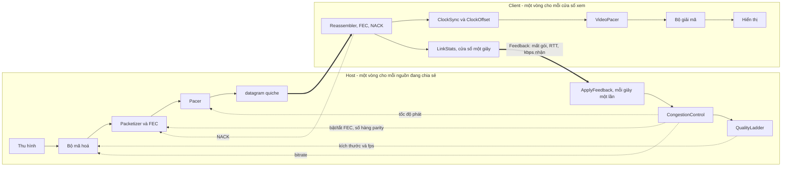
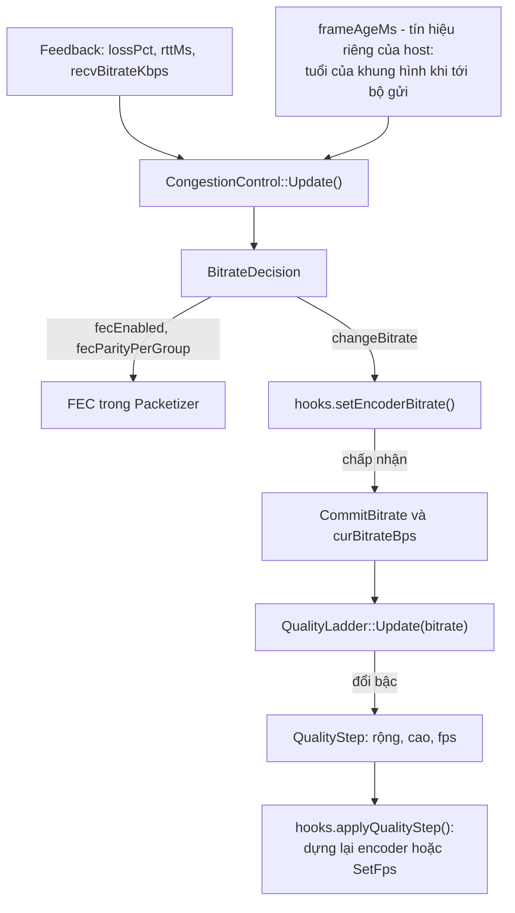
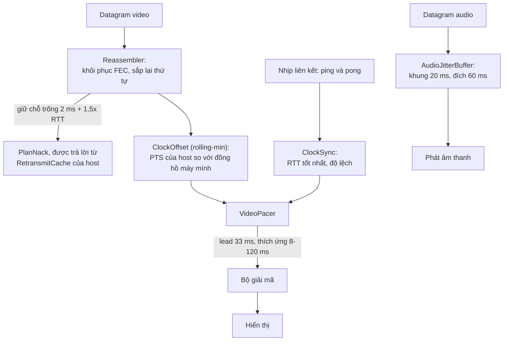
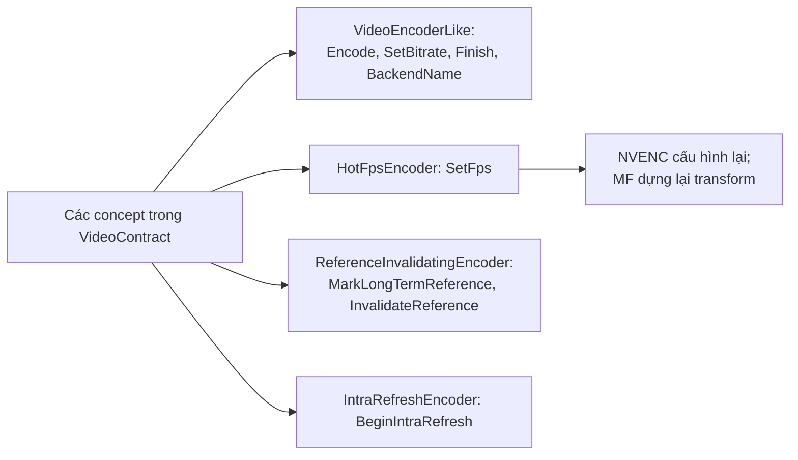
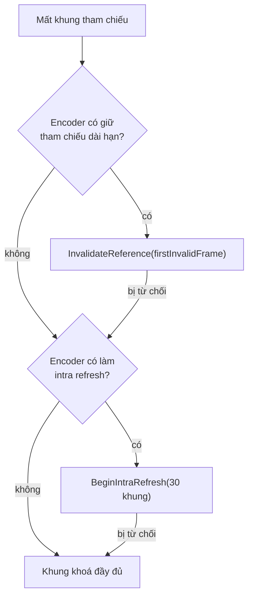

[English](MEDIA-PIPELINE.md) · **Tiếng Việt** · [中文](MEDIA-PIPELINE.zh.md) · [日本語](MEDIA-PIPELINE.ja.md)

# Deskhub — Đường media và mặt phẳng điều tiết

Tài liệu này mô tả hai vòng phản hồi quyết định **bao nhiêu bit rời khỏi host và mỗi
khung hình được hiển thị khi nào**, cùng đường codec mà số bit đó đi qua. Đây là bản đồ
của `core/control`, `core/transport`, nửa media của `core/session`, và các bộ mã hoá,
giải mã trong `client/*`.

Bố cục tổng thể — các tầng, luồng, giao thức trên đường truyền — nằm ở
[`ARCHITECTURE.vi.md`](ARCHITECTURE.vi.md). Sản phẩm làm gì dưới góc nhìn người dùng nằm
ở [`SPECIFICATION.vi.md`](SPECIFICATION.vi.md).

Đây là bản dịch của [`MEDIA-PIPELINE.md`](MEDIA-PIPELINE.md); khi hai bản khác nhau, bản
tiếng Anh là bản chuẩn.

- **Trạng thái:** mô tả mã nguồn hiện tại.
- **Đối tượng đọc:** bất kỳ ai sửa phần thu hình, mã hoá, điều tiết tốc độ hay phát lại.

---

## 1. Hai vòng, và chỉ hai

Điều tiết tốc độ và định thời phát lại là hai vòng riêng biệt, không vòng nào gọi vòng
nào. Chúng gặp nhau ở đúng một bản tin nhỏ: `Feedback`.

Vòng host trả lời câu hỏi *gửi bao nhiêu*. Vòng client trả lời câu hỏi *hiển thị thứ đã
tới khi nào*. Không vòng nào biết ruột gan của vòng kia.

## 2. Vòng host: từ phản hồi tới bộ mã hoá

Mỗi người xem đóng một cửa sổ một giây (`LinkStats`), biến nó thành bản ghi `Feedback`
rồi gửi đi (`core/src/session/client/ScreenClient.cpp:203`). Ở phía host,
`ApplyFeedback` (`core/src/session/host/ViewerFeedback.cpp:6`) là nơi **duy nhất** chứa
toàn bộ vòng lặp — 45 dòng.

Hai quy tắc giữ cho vòng này trung thực: hook của encoder phải **chấp nhận** bitrate thì
bộ điều tiết mới ghi nhận nó, và thang chất lượng luôn được nạp bitrate đã ghi nhận, không
bao giờ là bitrate vừa đề nghị.

### Mặc định AIMD

`BitrateController` (`core/src/control/BitrateController.cpp:12`) chính là chiến lược
`aimd`. Mất gói và ứ đọng được coi là cùng một loại bằng chứng:

| Bằng chứng | Phản ứng |
| --- | --- |
| mất gói ≥ 5% **hoặc** tuổi khung hình ≥ 400 ms | −25% |
| mất gói ≥ 2% **hoặc** tuổi khung hình ≥ 150 ms | −10% |
| mất gói ≤ 1% và đã 2 giây kể từ lần giảm gần nhất | +5% của trần |
| thay đổi nhỏ hơn 2% tốc độ hiện tại | bỏ qua (vùng chết) |

Trần là `--bitrate` đã cấu hình; sàn là `HostEngine::kMinBitrateBps`, tức 1 Mbps.

FEC được bật ngay từ khung hình đầu tiên và chỉ hạ xuống sau **10 giây sạch liên tiếp**,
vì loại mất gói mà nó bảo vệ xuất hiện trước cả báo cáo đầu tiên. Số hàng parity bám theo
mức mất gói đo được: 1 hàng khi dưới 3%, 2 hàng ở 3–5%, 3 hàng từ 6% trở lên. Ứ đọng không
bao giờ bật FEC — parity chỉ làm hàng đợi sâu thêm. `--fec-parity` ghim số hàng,
`--fec-arm always|never` ghim công tắc.

### Thang chất lượng

`QualityLadder` (`core/src/control/QualityLadder.cpp`) biến bitrate thành độ phân giải và
tốc độ khung hình. Sáu bậc, suy ra từ mức tối đa của chính nguồn:

| Bậc | Tỷ lệ | fps |
| --- | --- | --- |
| 0 | 100% | 60 |
| 1 | 100% | 30 |
| 2 | 100% | 20 |
| 3 | 75% | 20 |
| 4 | 50% | 20 |
| 5 | 50% | 12 |

Ngân sách của một bậc là **0,08 bit trên mỗi điểm ảnh mỗi giây** (`kBppNum/kBppDen`). Các
bậc trùng nhau, hoặc rơi xuống dưới 160×64, bị loại khi dựng thang.

Đi **xuống** là tức thì. Đi **lên** cần 120% ngân sách của bậc trên, giữ đủ một khoảng
chờ: 5 giây khi chỉ đổi fps, 15 giây khi đổi độ phân giải — đổi kích thước tốn một khung
hình khoá và một lần dựng lại bộ giải mã, nên nó được làm một cách dè dặt.

### Bên dưới ứng dụng: pacing và CUBIC

`Pacer` (`core/include/deskhub/transport/Pacer.h`) rải gói ở **gấp đôi** bitrate hiện tại,
chặn ứ đọng của chính nó ở 100 ms và không bao giờ ngủ dưới 500 µs. Dưới nó, CUBIC của
quiche cai quản đường datagram QUIC. Hai thứ này mắc nối tiếp: quiche chặn thứ rời khỏi
máy, còn ứng dụng chỉnh bộ mã hoá theo mức mất gói mà điều đó tạo ra.

## 3. Vòng client: từ datagram tới điểm ảnh

`VideoPacer` (`core/include/deskhub/control/VideoPacer.h`) giữ một khoảng đi trước so với
đồng hồ host ước lượng được. Khi bật lead thích ứng, khoảng đó bám theo 3× jitter đo được,
trong phạm vi 8 ms đến 120 ms. Mốc thời gian lệch quá 250 ms sẽ được đồng bộ lại; PTS nhảy
quá 2 giây được coi là một luồng mới.

NACK bật theo từng người xem (`sendNacks`, mặc định bật trong `ScreenViewer::Config`). Một
chỗ trống được giữ 2 ms cộng 1,5× RTT trước khi hỏi lại, và không dày hơn mỗi 10 ms; host
trả lời từ `RetransmitCache` trong `RespondToNack`.

## 4. Codec: cái gì được đàm phán, cái gì thật sự chạy

Giao thức khai báo bốn codec và đàm phán bằng mask năng lực, ưu tiên
AV1 → HEVC → H.264 4:4:4 → H.264 (`core/src/media/CodecNegotiation.cpp`).

**Trong mã nguồn hiện tại chỉ H.264 tồn tại từ đầu đến cuối.** `ScreenClient` chỉ quảng bá
`kCodecMaskH264` chứ không gì khác (`core/src/session/client/ScreenClient.cpp:58`), và
`ScreenHostSession::SetCodecMask` không có nơi nào gọi ngoài test, nên `NegotiateCodec`
luôn chốt ở H.264. Ba giá trị enum còn lại là chỗ trống dành sẵn ở mức giao thức, không
phải một đường thực thi — không client nào mã hoá hay giải mã chúng.

| Codec | Trên đường truyền | Bộ mã hoá ở client nào đó | Bộ giải mã ở client nào đó |
| --- | --- | --- | --- |
| H.264 | có | có | có |
| H.264 4:4:4 | chỉ có bit mask | không | không |
| HEVC | chỉ có bit mask | không | không |
| AV1 | chỉ có bit mask | không | không |

### Bộ mã hoá và giải mã theo từng OS

| OS | Mã hoá | Giải mã | Ở đâu |
| --- | --- | --- | --- |
| Windows | NVENC, Media Foundation | Media Foundation | `client/windows/cpp/encode`, `.../decode` |
| Linux | NVENC, VA-API | FFmpeg | `client/linux/cpp/encode/HwEncoder.h`, `.../decode/AvDecoder.cpp` |
| macOS, iOS | VideoToolbox | VideoToolbox | `platform/src/media/VtEncoderApple.mm`, `VtDecoderApple.mm` |
| Android | MediaCodec | MediaCodec | `client/android/app/src/main/cpp/encode`, `.../decode` |
| Âm thanh, cả năm | Opus | Opus | `platform/src/media/OpusCodec.cpp` |

Không bộ mã hoá nào kế thừa từ một lớp cha chung. Hợp đồng là một tập **concept** trong
`core/include/deskhub/media/VideoContract.h`, và mỗi backend tự kiểm chứng với chúng ngay
lúc biên dịch:

Trên Windows, `auto` chọn backend theo hãng của card đồ hoạ
(`core/src/media/EncoderBackend.cpp`): NVIDIA thử NVENC trước, Intel thử Media Foundation
trước — cả hai đều đã đo. AMD được xếp Media Foundation trước như một **phỏng đoán**, không
phải kết quả đo. Backend được gọi tên tường minh trên dòng lệnh không bao giờ âm thầm rơi
sang backend khác.

## 5. Phục hồi khung hình

Khi một người xem báo rằng có khung hình tham chiếu nó chưa từng nhận được, host không tự
động gửi IDR. `media::RecoveryPolicy` chọn cách vá rẻ nhất mà bộ mã hoá thật sự làm được,
còn `PrepareRecovery` (`platform/include/deskhubp/host/EncoderRecovery.h`) áp dụng nó:

Cứ 30 khung hình lại đánh dấu một tham chiếu dài hạn. Mọi lần rơi về phương án dự phòng đều
được ghi log kèm lý do, nên một backend âm thầm thiếu năng lực sẽ lộ ra trong log chứ không
phải trong hình.

## 6. Âm thanh

Opus, 48 kHz stereo, 960 mẫu (20 ms) mỗi khung, 64 kbps, mã hoá một lần và gửi tới mọi
người xem có yêu cầu âm thanh. `AudioJitterBuffer` bên nhận nhắm độ trễ 60 ms mặc định, tự
thích ứng khi được cho phép, và che một khung hình bị mất thay vì đứng hình. Âm thanh không
có cơ chế điều tiết riêng — so với video nó nhỏ và đều.

## 7. Mọi nút vặn, và nơi nó rơi vào

| Cờ | Tác động tới | Mặc định |
| --- | --- | --- |
| `--bitrate` | trần của cả vòng lặp | theo cài đặt |
| `--fps`, `--max-dim` | bậc 0 của thang | theo cài đặt |
| `--cc` | `aimd`, `delay-trend`, `scream`, `hybrid` | `aimd` |
| `--fec` | `xor`, `rs` | `xor` |
| `--fec-parity` | ghim số hàng parity mỗi nhóm | thích ứng |
| `--fec-depth` | số nhóm FEC mỗi khung hình | do encoder chọn |
| `--fec-arm` | `always` hoặc `never` | thích ứng |
| `--encoder` | `auto`, `nvenc`, `mf`, `vaapi`, `videotoolbox` | `auto` |
| `--nack`, `--no-nack` | yêu cầu truyền lại từ client | bật |
| `--audio-delay`, `--audio-adaptive` | bộ đệm jitter | 60 ms, thích ứng |

Bộ ước lượng lệch đồng hồ (`rolling-min`, `kalman`, `trendline`) là mảnh cắm được duy nhất
**không** có cờ dòng lệnh: nó chỉ được đặt qua `ScreenViewer::Config::clockOffset`.

## 8. Bản đồ đọc code

Bắt đầu từ đây, theo thứ tự này:

| Muốn hiểu | Đọc |
| --- | --- |
| Toàn bộ vòng host | `core/src/session/host/ViewerFeedback.cpp` (45 dòng) |
| Vì sao bitrate đổi | `core/src/control/BitrateController.cpp` |
| Vì sao độ phân giải đổi | `core/src/control/QualityLadder.cpp` |
| Một nguồn mang theo trạng thái gì | `core/include/deskhub/session/host/SourcePipelineState.h` |
| Khung hình thành gói ra sao | `core/src/transport/Packetizer.cpp` |
| Gói thành khung hình ra sao | `core/src/transport/Reassembler.cpp` |
| Khung hình được hiển thị khi nào | `core/src/control/VideoPacer.cpp` |
| Backend nào đã được chọn | `client/windows/cpp/encode/EncoderFactory.cpp` |

## 9. Những khoảng trống đã biết

Ghi lại để không ai phát hiện lại chúng như thể là lỗi:

- **Bề mặt codec rộng hơn mã nguồn.** Bốn codec đàm phán được, một codec được cài đặt.
  Hoặc ba cái còn lại có đường đi, hoặc enum thu về H.264 và mask ở lại như chỗ trống dành
  sẵn ở mức giao thức.
- **Số chiến lược nhiều hơn tổ hợp được kiểm thử.** Bốn bộ điều tiết tắc nghẽn, ba bộ ước
  lượng đồng hồ và hai sơ đồ FEC tạo ra 24 tổ hợp; đúng một tổ hợp — `aimd` +
  `rolling-min` + `xor` — được chạy đầu-cuối trong CI. Số còn lại là thử nghiệm chạm tới
  được bằng cờ, và nên được đọc theo nghĩa đó.
- **`SourcePipelineState` là một god object.** Khoảng 35 biến atomic cộng bảy hệ thống con
  trong một struct. Mọi luồng phía host đều chạm vào nó, và đó là lý do không phần nào của
  vòng host suy luận cục bộ được.
- **Thứ tự backend cho AMD là phỏng đoán.** Xem §4 — đó là hàng duy nhất của bảng backend
  không có phép đo nào đứng sau.
