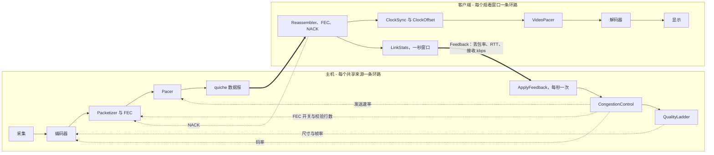
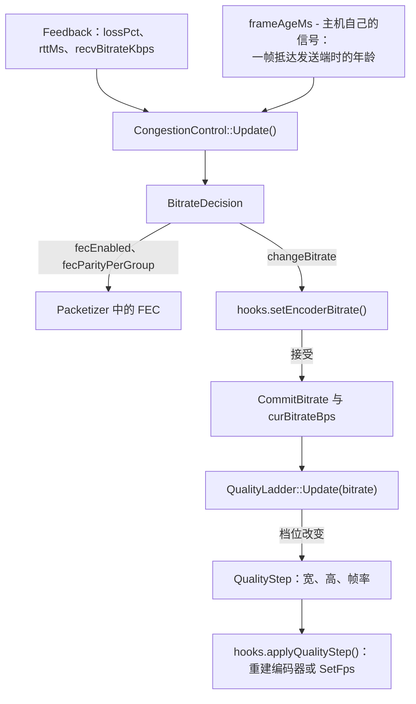
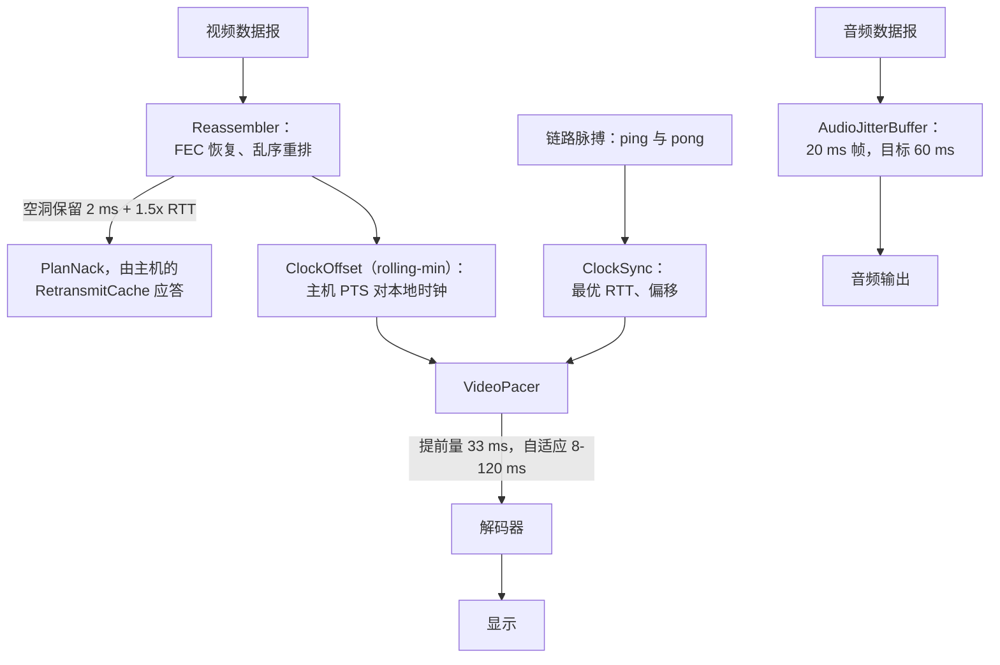
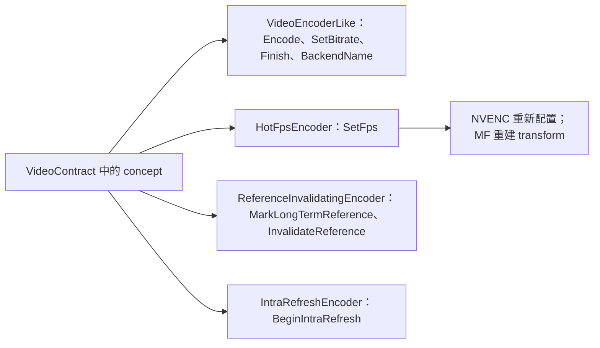
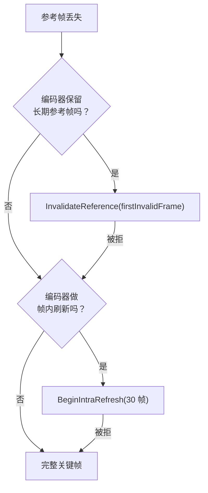

[English](MEDIA-PIPELINE.md) · [Tiếng Việt](MEDIA-PIPELINE.vi.md) · **中文** · [日本語](MEDIA-PIPELINE.ja.md)

# Deskhub —— 媒体管线与调控平面

本文档描述两条反馈环路：它们决定**多少比特离开主机、每一帧何时被显示**，以及这些比特
所经过的编解码路径。这是通往 `core/control`、`core/transport`、`core/session` 的媒体那
一半，以及 `client/*` 中各编码器与解码器的地图。

更大的布局——分层、线程、线上协议——在
[`ARCHITECTURE.zh.md`](ARCHITECTURE.zh.md)。产品在用户眼里做什么，在
[`SPECIFICATION.zh.md`](SPECIFICATION.zh.md)。

本文件是 [`MEDIA-PIPELINE.md`](MEDIA-PIPELINE.md) 的译本；若两者有出入，以英文版为准。

- **状态：** 描述的是当前代码。
- **读者：** 任何要改采集、编码、码率调控或播放的人。

---

## 1. 两条环路，只有两条

码率调控与播放定时是两条互不调用的独立环路。它们只在一个很小的消息上相遇：`Feedback`。

主机环路回答*发多少*。客户端环路回答*已经到达的东西何时显示*。两者都不知道对方的内部。

## 2. 主机环路：从反馈到编码器

每个观看端关闭一个一秒窗口（`LinkStats`），把它变成一条 `Feedback` 记录并发出
（`core/src/session/client/ScreenClient.cpp:203`）。在主机侧，`ApplyFeedback`
（`core/src/session/host/ViewerFeedback.cpp:6`）是整条环路**唯一**所在之处——45 行。

两条规则保证它诚实：编码器钩子必须**接受**某个码率，调控器才会认下它；而阶梯拿到的永远
是已认下的码率，绝不是刚请求的那个。

### 默认的 AIMD

`BitrateController`（`core/src/control/BitrateController.cpp:12`）就是 `aimd` 策略。丢包
与积压被当作同一类证据：

| 证据 | 反应 |
| --- | --- |
| 丢包 ≥ 5% **或** 帧年龄 ≥ 400 ms | −25% |
| 丢包 ≥ 2% **或** 帧年龄 ≥ 150 ms | −10% |
| 丢包 ≤ 1%，且距上次下调已 2 秒 | 上限的 +5% |
| 变化小于当前码率的 2% | 忽略（死区） |

上限是配置的 `--bitrate`；下限是 `HostEngine::kMinBitrateBps`，即 1 Mbps。

FEC 从第一帧起就是开着的，只有在**连续 10 秒干净**之后才撤下，因为它所防的那种丢包会在
第一份报告之前就出现。校验行数跟随实测丢包：低于 3% 用 1 行，3–5% 用 2 行，6% 及以上用
3 行。积压永远不会开启 FEC——校验只会让队列更深。`--fec-parity` 钉住行数，
`--fec-arm always|never` 钉住开关。

### 质量阶梯

`QualityLadder`（`core/src/control/QualityLadder.cpp`）把码率换算成分辨率与帧率。六个档
位，从来源自身的最大值推出：

| 档位 | 缩放 | 帧率 |
| --- | --- | --- |
| 0 | 100% | 60 |
| 1 | 100% | 30 |
| 2 | 100% | 20 |
| 3 | 75% | 20 |
| 4 | 50% | 20 |
| 5 | 50% | 12 |

一个档位的预算是**每像素每秒 0.08 比特**（`kBppNum/kBppDen`）。彼此重合的档位，或低于
160×64 的档位，在构建阶梯时被丢弃。

**下降**是立即的。**上升**需要高一档预算的 120%，并保持一段驻留时间：只改帧率时 5 秒，
改分辨率时 15 秒——一次改尺寸要付出一个关键帧和一次解码器重建，所以它做得很不情愿。

### 应用之下：pacing 与 CUBIC

`Pacer`（`core/include/deskhub/transport/Pacer.h`）以当前码率的**两倍**把包铺开，把自己
的积压压在 100 ms，且从不睡少于 500 µs。其下由 quiche 的 CUBIC 管着 QUIC 数据报路径。两
者串联：quiche 限定离开这台机器的量，应用则按由此产生的丢包去调整编码器。

## 3. 客户端环路：从数据报到像素

`VideoPacer`（`core/include/deskhub/control/VideoPacer.h`）相对估计出的主机时钟保持一段
提前量。开启自适应提前量后，它跟随实测抖动的 3 倍，在 8 ms 到 120 ms 之间。时基偏出
250 ms 会重新同步；PTS 跳变超过 2 秒会被当作新的流。

NACK 按观看端开关（`sendNacks`，在 `ScreenViewer::Config` 中默认开）。一个空洞要保留
2 ms 加 1.5× RTT 才会再次请求，且不密于每 10 ms 一次；主机在 `RespondToNack` 中从
`RetransmitCache` 应答。

## 4. 编解码器：协商的是什么，真正跑的是什么

线上协议声明四种编解码器，按能力掩码协商，优先级为
AV1 → HEVC → H.264 4:4:4 → H.264（`core/src/media/CodecNegotiation.cpp`）。

**在当前代码里，端到端存在的只有 H.264。** `ScreenClient` 只通告 `kCodecMaskH264`
（`core/src/session/client/ScreenClient.cpp:58`），而 `ScreenHostSession::SetCodecMask`
除测试外无人调用，所以 `NegotiateCodec` 总是落到 H.264。另外三个枚举值是协议层面预留的
余量，不是代码路径——没有任何客户端编码或解码它们。

| 编解码器 | 线上 | 任一客户端有编码器 | 任一客户端有解码器 |
| --- | --- | --- | --- |
| H.264 | 有 | 有 | 有 |
| H.264 4:4:4 | 仅掩码位 | 无 | 无 |
| HEVC | 仅掩码位 | 无 | 无 |
| AV1 | 仅掩码位 | 无 | 无 |

### 各操作系统上的编码器与解码器

| 系统 | 编码 | 解码 | 位置 |
| --- | --- | --- | --- |
| Windows | NVENC、Media Foundation | Media Foundation | `client/windows/cpp/encode`、`.../decode` |
| Linux | NVENC、VA-API | FFmpeg | `client/linux/cpp/encode/HwEncoder.h`、`.../decode/AvDecoder.cpp` |
| macOS、iOS | VideoToolbox | VideoToolbox | `platform/src/media/VtEncoderApple.mm`、`VtDecoderApple.mm` |
| Android | MediaCodec | MediaCodec | `client/android/app/src/main/cpp/encode`、`.../decode` |
| 音频，五个平台 | Opus | Opus | `platform/src/media/OpusCodec.cpp` |

没有编码器继承自共同基类。契约是 `core/include/deskhub/media/VideoContract.h` 里的一组
**concept**，每个后端在编译期对它们做断言：

在 Windows 上，`auto` 按显卡厂商挑后端（`core/src/media/EncoderBackend.cpp`）：NVIDIA 先
试 NVENC，Intel 先试 Media Foundation——两者都测量过。AMD 把 Media Foundation 排在前面是
一个**猜测**，不是测量结果。在命令行上被指名的后端，绝不会悄悄退回到另一个。

## 5. 帧恢复

当某个观看端报告它从未收到的参考帧时，主机不会自动发 IDR。`media::RecoveryPolicy` 挑出
编码器真正做得到的最省的修复方式，`PrepareRecovery`
（`platform/include/deskhubp/host/EncoderRecovery.h`）负责施加：

每 30 帧标记一个长期参考帧。每一次退化都带原因写进日志，所以一个悄悄缺少某项能力的后端
会出现在日志里，而不是出现在画面里。

## 6. 音频

Opus，48 kHz 立体声，每帧 960 个采样（20 ms），64 kbps，编码一次后发给每个请求了音频的
观看端。接收侧的 `AudioJitterBuffer` 默认以 60 ms 延迟为目标，允许时自适应，并对缺失的
帧做隐藏而不是卡住。音频没有自己的码率调控——相对视频它又小又稳。

## 7. 所有旋钮，以及它们落在哪里

| 标志 | 影响 | 默认 |
| --- | --- | --- |
| `--bitrate` | 整条环路的上限 | 取自设置 |
| `--fps`、`--max-dim` | 阶梯的第 0 档 | 取自设置 |
| `--cc` | `aimd`、`delay-trend`、`scream`、`hybrid` | `aimd` |
| `--fec` | `xor`、`rs` | `xor` |
| `--fec-parity` | 钉住每组校验行数 | 自适应 |
| `--fec-depth` | 每帧的 FEC 组数 | 由编码器决定 |
| `--fec-arm` | `always` 或 `never` | 自适应 |
| `--encoder` | `auto`、`nvenc`、`mf`、`vaapi`、`videotoolbox` | `auto` |
| `--nack`、`--no-nack` | 客户端重传请求 | 开 |
| `--audio-delay`、`--audio-adaptive` | 抖动缓冲 | 60 ms，自适应 |

时钟偏移估计器（`rolling-min`、`kalman`、`trendline`）是唯一**没有**命令行标志的可插拔
件：它只能通过 `ScreenViewer::Config::clockOffset` 设置。

## 8. 阅读地图

按这个顺序开始：

| 想弄懂 | 就读 |
| --- | --- |
| 整条主机环路 | `core/src/session/host/ViewerFeedback.cpp`（45 行） |
| 码率为什么变了 | `core/src/control/BitrateController.cpp` |
| 分辨率为什么变了 | `core/src/control/QualityLadder.cpp` |
| 一个来源带着什么状态 | `core/include/deskhub/session/host/SourcePipelineState.h` |
| 一帧如何变成包 | `core/src/transport/Packetizer.cpp` |
| 包如何变回一帧 | `core/src/transport/Reassembler.cpp` |
| 一帧何时被显示 | `core/src/control/VideoPacer.cpp` |
| 选中了哪个编码后端 | `client/windows/cpp/encode/EncoderFactory.cpp` |

## 9. 已知的缺口

写下来，免得被当成 bug 重新发现一遍：

- **编解码器的表面比代码宽。** 四种可协商，一种已实现。要么另外三种拿到路径，要么枚举
  收缩到 H.264，掩码作为协议余量留着。
- **策略数量多于被测试的组合。** 四个拥塞控制器、三个时钟估计器、两种 FEC 方案，构成 24
  种组合；恰好只有一种——`aimd` + `rolling-min` + `xor`——在 CI 里端到端跑过。其余是靠标
  志才能碰到的实验，应当照此阅读。
- **`SourcePipelineState` 是个 god object。** 一个结构体里大约 35 个原子变量外加七个子系
  统。主机侧每条线程都碰它，这正是主机环路的任何部分都无法局部推理的原因。
- **AMD 的后端顺序是猜的。** 见 §4——它是后端表中唯一背后没有测量的那一行。
