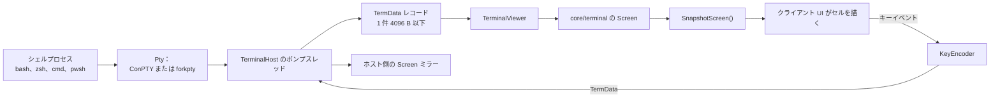
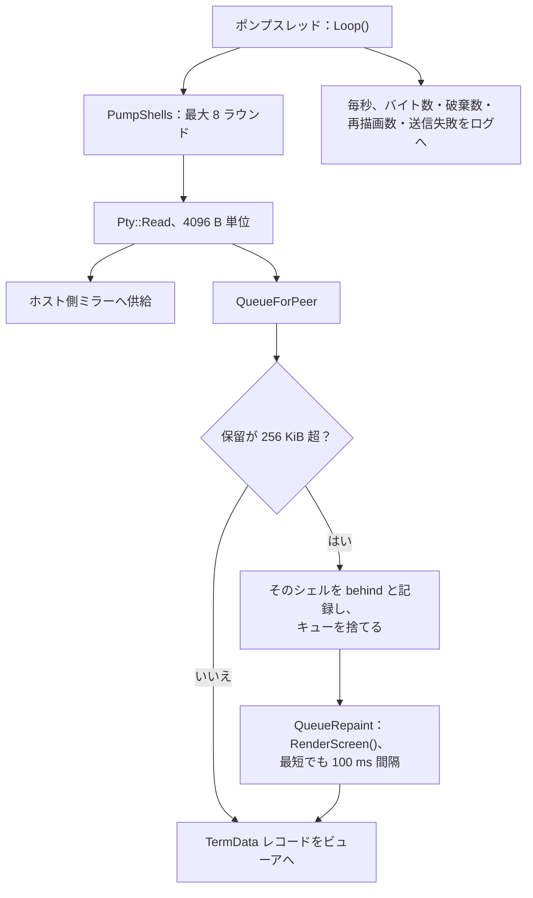
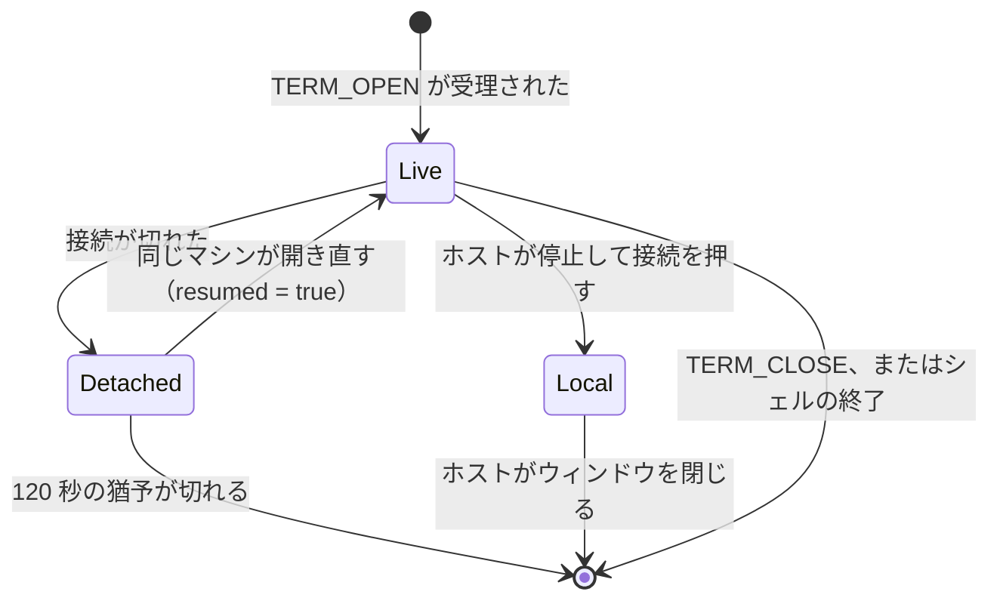
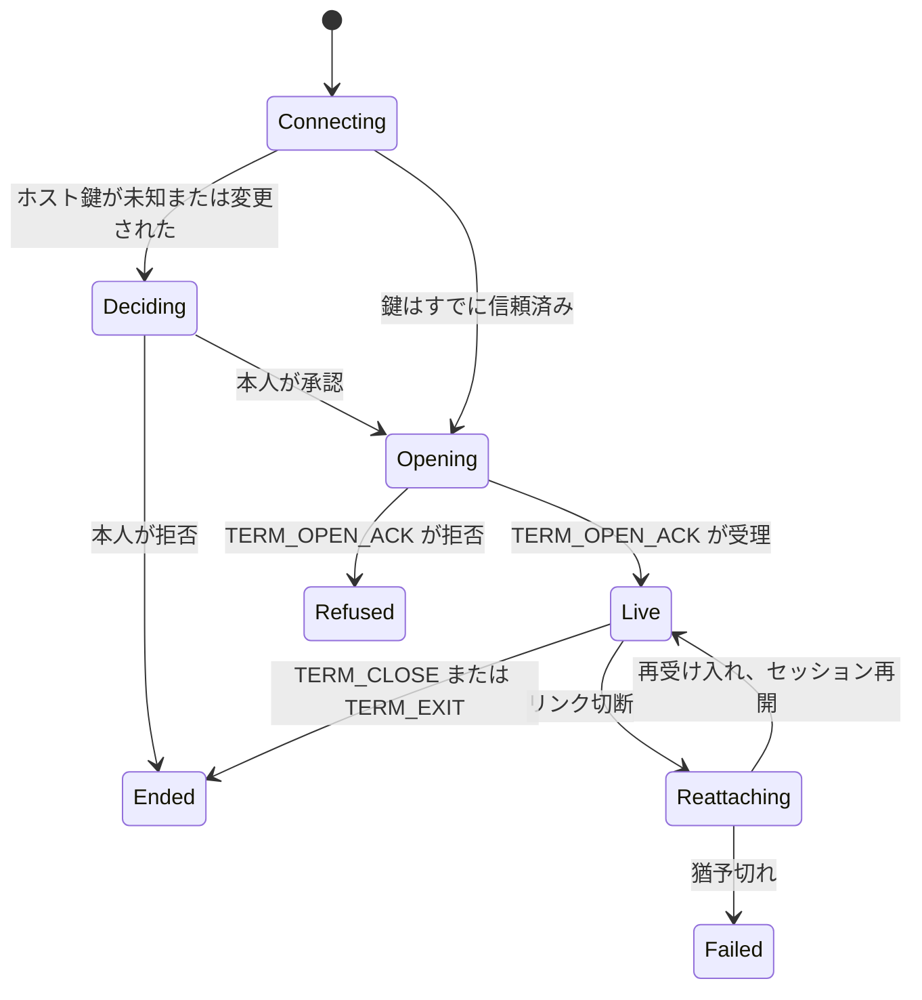

[English](TERMINAL.md) · [Tiếng Việt](TERMINAL.vi.md) · [中文](TERMINAL.zh.md) · **日本語**

# Deskhub — ターミナル共有

Deskhub は自前の VT エミュレータを持っている。本書はそれを記述する。シェルからのバイト
がどうやってセルの格子になるか、キーがどうやって戻りのバイトになるか、シェルが切断をどう
生き延びるか、そしてホストが何を自分の手に取り戻せるかである。

より大きな配置は [`ARCHITECTURE.ja.md`](ARCHITECTURE.ja.md) に、ユーザーから何が見えるか
は [`SPECIFICATION.ja.md`](SPECIFICATION.ja.md) にある。

本書は [`TERMINAL.md`](TERMINAL.md) の翻訳である。相違がある場合は英語版が正典となる。

- **状態：** 現在のコードを記述している。
- **読者：** `core/terminal`、`TerminalHost`、`TerminalViewer` を変更するすべての人。

---

## 1. エミュレータは 1 つ、クライアントは 5 つ

エミュレータは純粋な `core/` のコードである。OS ヘッダも curses も terminfo もない。どの
クライアントもセルを描いてキーイベントを転送するだけで、エスケープシーケンスを解析する
ものは 1 つもない。

両端は同じ `Screen` を動かす。クライアント側は人が見るもの、ホスト側のミラーは*停止して
接続*が開くものだ。どちらが正本ということはない——同じバイト列を与えられている。

## 2. バイトからセルへ

`VtParser`（`core/src/terminal/VtParser.cpp`）は 1 バイトずつ進む状態機械で、`VtEvent` を
生成する。バイトごとの確保は行わず、あらゆる入力に上限を課す：

```mermaid
stateDiagram-v2
    [*] --> Ground
    Ground --> Escape: ESC
    Escape --> CsiEntry: "["
    Escape --> EscapeIntermediate: 中間バイト
    Escape --> OscString: "]"
    CsiEntry --> CsiParam: 数字または ";"
    CsiEntry --> CsiIntermediate: 中間バイト
    CsiParam --> CsiIntermediate: 中間バイト
    CsiEntry --> CsiIgnore: 不正なバイト
    CsiParam --> CsiIgnore: 不正なバイト
    CsiIgnore --> Ground: 終端バイト
    CsiEntry --> Ground: 終端バイト、Csi を発行
    CsiParam --> Ground: 終端バイト、Csi を発行
    CsiIntermediate --> Ground: 終端バイト、Csi を発行
    EscapeIntermediate --> Ground: 終端バイト、Esc を発行
    OscString --> Ground: BEL または ST、Osc を発行
    OscString --> StringIgnore: 4096 バイト超過
    StringIgnore --> Ground: BEL または ST
    Ground --> Ground: 印字可能文字、Print を発行
```

| 上限 | 値 | 超えたとき |
| --- | --- | --- |
| CSI パラメータ数 | 32 | 以降は捨てられ、シーケンス自体は実行される |
| パラメータ値 | 65535 | クランプされる |
| OSC ペイロード | 4096 B | その文字列の残りは無視（`StringIgnore`） |
| UTF-8 | 冗長形式と切れた形式を拒否 | 置換され、格子には決して入らない |

`Screen`（`core/src/terminal/Screen.cpp`、674 行）はそれらのイベントを `Cell`（コード
ポイント + `Pen`）の格子に適用する。本物のターミナルが持つものは持っている：代替画面
バッファ、スクロール領域、DEC 特殊図形、挿入・原点・自動折り返しの各モード、保存された
カーソルとペン、OSC からのタイトル、ベル回数、そして変化があったときだけ UI が描き直せる
ようにする `revision` カウンタである。

**スクロールバック**は行の `deque` で、既定 2000（`kDefaultScrollback`、上限
`kMaxScrollback` 100000）。コード中のすべての構築が既定値を使っている——この上限は今日の
ところ設定項目ではない。代替画面にスクロールバックはなく、代替画面が有効なあいだ
`SnapshotScreen` は 0 行と報告する。全画面エディタが履歴にゴミを残さないのはこれによる。

一部のシーケンスは応答を要する（デバイスステータス、デバイス属性）。`Screen` はソケット
へ書くことがない。応答をバッファに溜め、画面を所有する側が `TakeResponse()` を呼んで送
る——ビューアはホストへ、ホストのミラーは PTY へ書き戻す。

`RenderScreen`（`Repaint.cpp`）は逆をやる。`Screen` 全体をエスケープシーケンスの列に戻す
のだ。遅れたクライアントはこれで再同期され、接続し直したセッションも履歴の再生ではなく
1 通のメッセージで状態を取り戻す。

## 3. キーからバイトへ

`KeyEncoder` は `TermKeyEvent`（キー、コードポイント、shift/alt/ctrl）を、シェルが期待す
るバイト列へ変える。そのとき画面が置かれているモードを尊重する：

| モード | 効果 |
| --- | --- |
| `applicationCursor` | 矢印キーが `CSI A` ではなく `SS3 A` を送る |
| `applicationKeypad` | テンキーが application 形式に切り替わる |
| `bracketedPaste` | `EncodePaste` がテキストを `ESC[200~` / `ESC[201~` で包む |

`EncodeText` は打鍵されたテキスト用、`EncodePaste` はクリップボード内容用。両者を区別し
たいと申告したシェルに対して、貼り付けが打鍵と取り違えられないようにするための分割である。

## 4. ホスト側：全シェルに 1 本のポンプスレッド

`TerminalHost` は全シェルに対してスレッドを 1 本だけ動かす。`HandleMessage` のほうはネット
ループスレッドで走るので、両者は 1 つのミューテックスの下で `shells_` に触れる。

要点はバックプレッシャの規則である。追いつけないビューアがシェルを止めることはなく、
キューが無限に伸びることもない。256 KiB を超えると保留バイトは捨てられ、シェルは
`behind` と記録され、失われたストリームの代わりに現在の画面の**完全な再描画**が送られる
——毎秒 10 回まで。そのあいだシェルは全速で動き続ける。

PTY 自体は pimpl の裏に 2 実装を持つ 1 つのクラスである。Windows では ConPTY、それ以外で
は `forkpty`。`DefaultShell()` が OS ごとにシェルを選ぶ。

## 5. シェルの寿命

`TerminalSessions`（`core/src/session/TerminalSession.cpp`）が表を持つ。シェルは最大 8 本
（`kMaxTerminalSessions`）、それぞれ 3 つの状態のいずれかを取る：

- **Detached** は PTY を `kTerminalReattachGraceUs` = 120 秒だけ生かす。`Expire()` が誰も
  戻ってこなかったものを回収する。
- **Local** はホストがシェルを取り戻した状態である。リモートのクライアントは切断され、
  ホストのミラーが——スクロールバックそのままに——ホスト上のウィンドウで開く。ローカルの
  シェルは決して期限切れにならず、ホストが閉じたときにだけ終わる。
- 開く・閉じる・分離・再接続・追い出しのすべてが、相手のアドレス、名前、鍵フィンガープ
  リントとともに `TerminalAuditLine` で監査ログに残る。

受け入れは接続単位だけでなくシェル単位でもある。`TermOpen` はパスコードを運べ、3 回間違え
るとターミナル経路がロックされる（`LockedOut`）。拒否は必ず理由を名指しする：

| `TermReason` | 意味 |
| --- | --- |
| `Accepted` | シェルを開いた、または分離後に再開した |
| `WrongPasscode` | パスコード不一致、または経路がロック中 |
| `TooManySessions` | すでにシェルが 8 本 |
| `NotShared` | ホストがターミナルを共有していない |
| `NoSuchSession` | 再開しようとしたシェルがもう無い |

## 6. クライアント側

`TerminalViewer` は `HostLink` のチャネル上でサービススレッドを 1 本動かし、小さな状態機械
をたどる：

UI がサービススレッドを塞ぐことはない。キーとリサイズをキューに積み、格子は `Snapshot()`
をポーリングして取る。人がスクロールバックを見ているあいだに新しい行が届いたときは、
`AnchorScroll`（`ScrollAnchor.h`）が増えたスクロールバック行数ぶんだけオフセットをずらす
ので、表示は流れていかず同じ文字の上に留まる。

## 7. ワイヤ上のメッセージ

| メッセージ | 向き | 備考 |
| --- | --- | --- |
| `TermOpen` | クライアント → ホスト | サイズ、任意のパスコード、再開用 id |
| `TermOpenAck` | ホスト → クライアント | ターミナル id、`TermReason`、`resumed` フラグ |
| `TermData` | 双方向 | 1 レコード 4096 B 以下（`kMaxTermDataBytes`） |
| `TermResize` | クライアント → ホスト | PTY と両側の画面に適用 |
| `TermClose` | クライアント → ホスト | シェルを終了させる |
| `TermExit` | ホスト → クライアント | シェルの終了コードを運ぶ |

いずれも信頼性のある `Chan::Terminal` ストリームを通り、トランスポートの 1 パス 64 KiB の
予算の下で吸い出される。巨大なファイルの `cat` が接続自身の ACK やキープアライブを飢えさ
せられないのはこのためだ。サイズは 1〜1000 の列と行にクランプされ、既定は 80×24。

## 8. 読み進める地図

| 理解したいこと | 読むもの |
| --- | --- |
| パーサ | `core/src/terminal/VtParser.cpp` |
| 格子と、解釈するすべてのシーケンス | `core/src/terminal/Screen.cpp` |
| 遅れたあとの完全再描画 | `core/src/terminal/Repaint.cpp` |
| キーと貼り付け | `core/src/terminal/KeyEncoder.cpp` |
| シェル表、状態、監査 | `core/src/session/TerminalSession.cpp` |
| ポンプスレッドとバックプレッシャ | `platform/src/host/TerminalHost.cpp` |
| ビューアの状態機械 | `platform/src/client/TerminalViewer.cpp` |

## 9. 既知の隙間

- **マウス報告は解析されるが生成されない。** プライベートモード 1000、1002、1003、1006、
  1015 はどれも同じ `mouseReporting` フラグを立て、`RenderScreen` はそれを忠実に再生する
  ——が、マウスイベントをシェルへ送るクライアントは存在しない。マウスモードを有効にした
  プログラムには何も返らない。
- **スクロールバックは 2000 行に固定。** `Screen` は上限を受け取り 100000 まで扱えるが、
  すべての構築が既定値を使い、それを露出する設定もない。
- **ミラーはエミュレーション費用を倍にする。** シェルはホストとクライアントで 2 回エミュ
  レートされる。*停止して接続*と安価な再描画を可能にしているのはそれであり、おしゃべりな
  シェルが両方のマシンで CPU を食う理由でもある。
