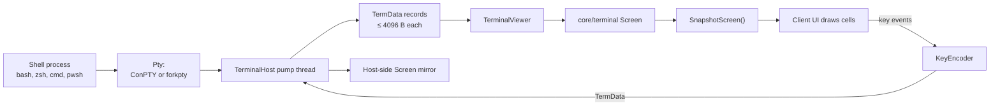
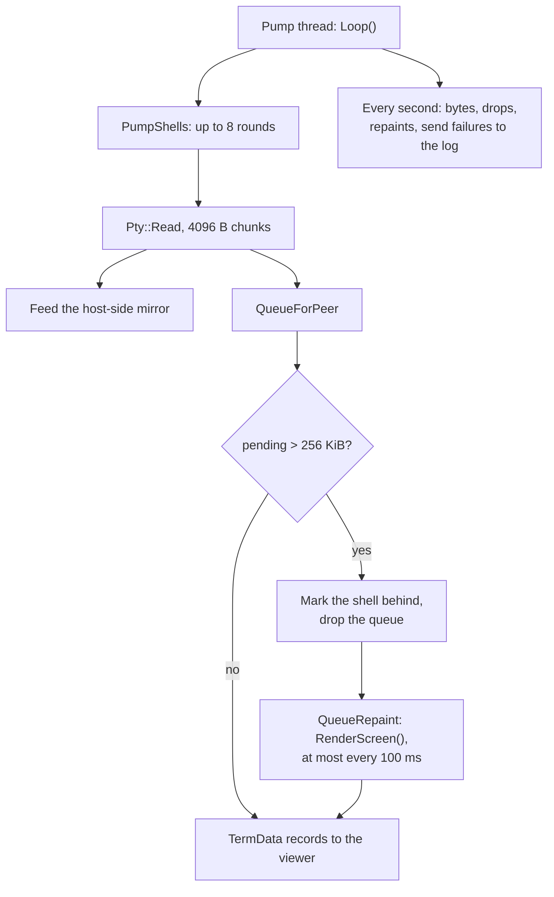
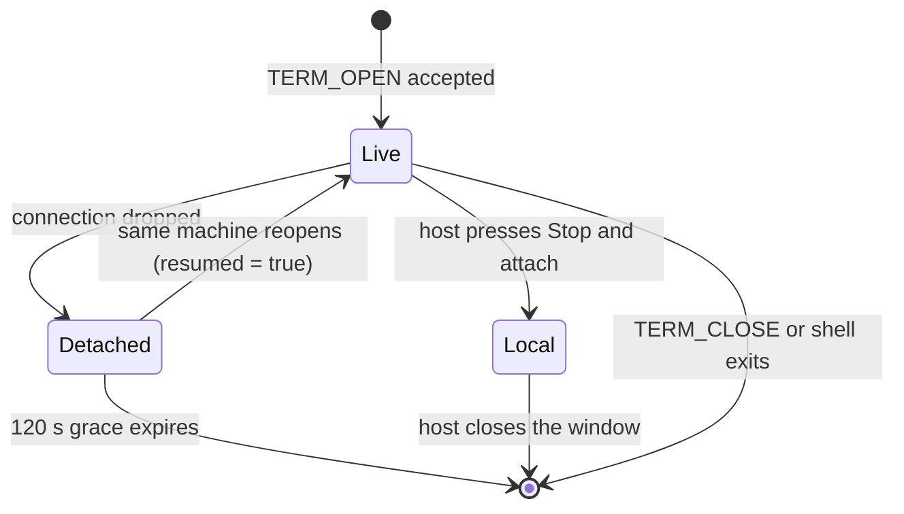
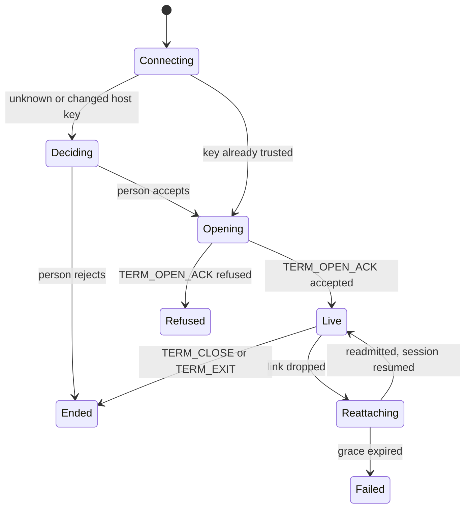

**English** · [Tiếng Việt](TERMINAL.vi.md) · [中文](TERMINAL.zh.md) · [日本語](TERMINAL.ja.md)

# Deskhub — Terminal sharing

Deskhub ships its own VT emulator. This document describes it: how bytes from a shell
become a grid of cells, how keys become bytes going back, how a shell survives a
dropped connection, and what the host can take back for itself.

The wider layout is in [`ARCHITECTURE.md`](ARCHITECTURE.md); what a user sees is in
[`SPECIFICATION.md`](SPECIFICATION.md).

- **Status:** describes the current code.
- **Audience:** anyone changing `core/terminal`, `TerminalHost` or `TerminalViewer`.

---

## 1. One emulator, five clients

The emulator is pure `core/` code: no OS headers, no curses, no terminfo. Every client
draws cells and forwards key events; none of them parses an escape sequence.

Both ends run the same `Screen`: the client's is what the person sees, the host's
mirror is what *Stop & attach* opens. Neither is authoritative over the other — they
are fed the same bytes.

## 2. Bytes to cells

`VtParser` (`core/src/terminal/VtParser.cpp`) is a byte-at-a-time state machine that
emits `VtEvent`s. It never allocates per byte, and it bounds every input:

```mermaid
stateDiagram-v2
    [*] --> Ground
    Ground --> Escape: ESC
    Escape --> CsiEntry: "["
    Escape --> EscapeIntermediate: intermediate byte
    Escape --> OscString: "]"
    CsiEntry --> CsiParam: digit or ";"
    CsiEntry --> CsiIntermediate: intermediate byte
    CsiParam --> CsiIntermediate: intermediate byte
    CsiEntry --> CsiIgnore: bad byte
    CsiParam --> CsiIgnore: bad byte
    CsiIgnore --> Ground: final byte
    CsiEntry --> Ground: final byte, emits Csi
    CsiParam --> Ground: final byte, emits Csi
    CsiIntermediate --> Ground: final byte, emits Csi
    EscapeIntermediate --> Ground: final byte, emits Esc
    OscString --> Ground: BEL or ST, emits Osc
    OscString --> StringIgnore: over 4096 bytes
    StringIgnore --> Ground: BEL or ST
    Ground --> Ground: printable, emits Print
```

| Limit | Value | What happens past it |
| --- | --- | --- |
| CSI parameters | 32 | further parameters are dropped, the sequence still runs |
| Parameter value | 65535 | clamped |
| OSC payload | 4096 B | the rest of the string is ignored (`StringIgnore`) |
| UTF-8 | overlong and truncated forms rejected | replaced, never trusted into the grid |

`Screen` (`core/src/terminal/Screen.cpp`, 674 lines) applies those events to a grid of
`Cell` (codepoint + `Pen`). It carries what a real terminal carries: an alternate
screen buffer, a scroll region, DEC special graphics, insert/origin/auto-wrap modes,
saved cursor and pen, a title from OSC, a bell count, and a `revision` counter that
lets a UI redraw only when something changed.

**Scrollback** is a `deque` of rows, default 2000 (`kDefaultScrollback`, cap
`kMaxScrollback` 100000). Every construction in the codebase uses the default — the
limit is not a setting today. The alternate screen has no scrollback, and
`SnapshotScreen` reports zero rows while it is active, which is what stops a full-screen
editor from leaving junk in the history.

Some sequences need an answer (device status, device attributes). `Screen` never writes
to a socket: it accumulates into a response buffer, and whoever owns the screen calls
`TakeResponse()` and sends it — the viewer to the host, the host mirror back into the
PTY.

`RenderScreen` (`Repaint.cpp`) does the reverse: it turns a whole `Screen` back into an
escape-sequence stream. That is how a client that fell behind is resynchronised, and
how a reattached session gets its state back in one message instead of a replay.

## 3. Keys to bytes

`KeyEncoder` turns a `TermKeyEvent` (key, codepoint, shift/alt/ctrl) into the bytes a
shell expects, honouring the modes the screen is in:

| Mode | Effect |
| --- | --- |
| `applicationCursor` | arrows send `SS3 A` instead of `CSI A` |
| `applicationKeypad` | keypad keys switch to application form |
| `bracketedPaste` | `EncodePaste` wraps the text in `ESC[200~` / `ESC[201~` |

`EncodeText` is for typed text, `EncodePaste` for clipboard content — the split exists
so a paste can never be mistaken for keystrokes by a shell that asked to tell them
apart.

## 4. On the host: one pump thread for every shell

`TerminalHost` runs a single thread for all shells. `HandleMessage` runs on the
net-loop thread instead, so both touch `shells_` under one mutex.

The backpressure rule is the important part. A viewer that cannot keep up does not
stall the shell and does not grow an unbounded queue: past 256 KiB the pending bytes
are thrown away, the shell is marked `behind`, and instead of the lost stream the
viewer is sent a **full repaint** of the current screen — at most ten a second. The
shell keeps running at full speed throughout.

The PTY itself is one class with two implementations behind a pimpl: ConPTY on
Windows, `forkpty` everywhere else. `DefaultShell()` picks the shell per OS.

## 5. Shell lifetime

`TerminalSessions` (`core/src/session/TerminalSession.cpp`) owns the table — at most 8
shells (`kMaxTerminalSessions`), each in one of three states:

- **Detached** keeps the PTY alive for `kTerminalReattachGraceUs` = 120 s. `Expire()`
  reaps what nobody came back for.
- **Local** is the host taking a shell back: the remote client is disconnected, the
  host's mirror — scrollback intact — opens in a window on the host. A local shell
  never expires and ends only when the host closes it.
- Every open, close, detach, reattach and kick is audit-logged through
  `TerminalAuditLine` with the peer's address, name and key fingerprint.

Admission is per shell as well as per connection: `TermOpen` may carry a passcode, and
three wrong ones lock the terminal path (`LockedOut`). A refusal names its reason:

| `TermReason` | Meaning |
| --- | --- |
| `Accepted` | shell opened, or resumed after a detach |
| `WrongPasscode` | passcode did not match, or the path is locked out |
| `TooManySessions` | 8 shells already |
| `NotShared` | the host is not sharing a terminal |
| `NoSuchSession` | resume asked for a shell that is gone |

## 6. On the client

`TerminalViewer` runs one service thread on a `HostLink` channel and walks a small
state machine:

The UI never blocks the service thread: it posts keys and resizes into a queue and
polls `Snapshot()` for the grid. When new rows arrive while the person is scrolled
back, `AnchorScroll` (`ScrollAnchor.h`) shifts the offset by exactly the number of new
scrollback rows, so the view stays on the same text instead of drifting.

## 7. The wire

| Message | Direction | Notes |
| --- | --- | --- |
| `TermOpen` | client → host | size, optional passcode, resume id |
| `TermOpenAck` | host → client | term id, `TermReason`, `resumed` flag |
| `TermData` | both ways | ≤ 4096 B per record (`kMaxTermDataBytes`) |
| `TermResize` | client → host | applied to the PTY and both screens |
| `TermClose` | client → host | ends the shell |
| `TermExit` | host → client | carries the shell's exit code |

All of it rides the reliable `Chan::Terminal` stream, drained under the transport's
64 KiB-per-pass budget so a `cat` of a huge file cannot starve the connection's own
ACKs and keepalives. Sizes are clamped to 1–1000 columns and rows, default 80×24.

## 8. Reading map

| To understand | Read |
| --- | --- |
| The parser | `core/src/terminal/VtParser.cpp` |
| The grid and every sequence it honours | `core/src/terminal/Screen.cpp` |
| Full repaint after falling behind | `core/src/terminal/Repaint.cpp` |
| Keys and paste | `core/src/terminal/KeyEncoder.cpp` |
| Shell table, states, audit | `core/src/session/TerminalSession.cpp` |
| Pump thread and backpressure | `platform/src/host/TerminalHost.cpp` |
| Viewer state machine | `platform/src/client/TerminalViewer.cpp` |

## 9. Known gaps

- **Mouse reporting is parsed but never produced.** Private modes 1000, 1002, 1003,
  1006 and 1015 all set one `mouseReporting` flag, which `RenderScreen` faithfully
  replays — but no client sends mouse events to a shell, so a program that turns
  mouse mode on gets nothing back.
- **Scrollback is fixed at 2000 rows.** `Screen` takes a limit and honours up to
  100000, but every construction uses the default and no setting exposes it.
- **The mirror doubles the emulation cost.** Every shell is emulated twice, once on the
  host and once on the client. It is what makes *Stop & attach* and cheap repaints
  possible, and it is also why a chatty shell costs CPU on both machines.
