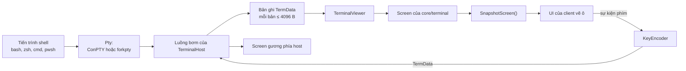
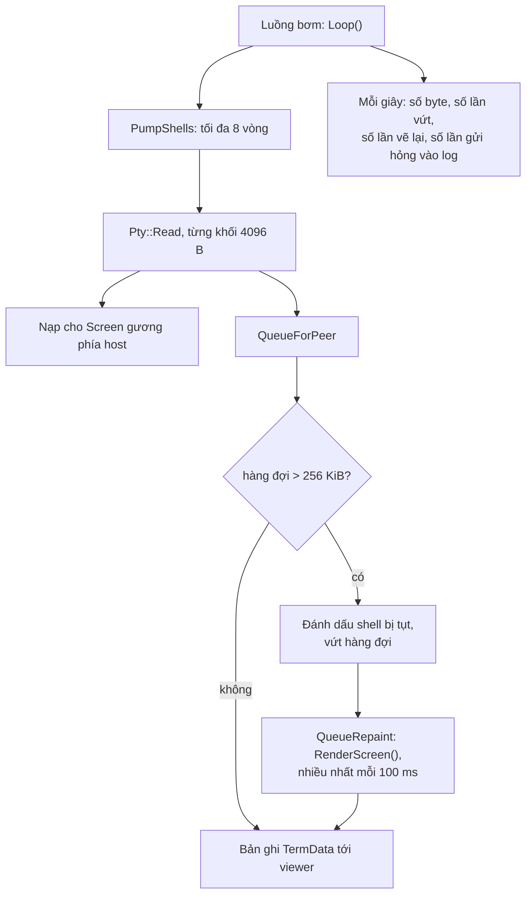
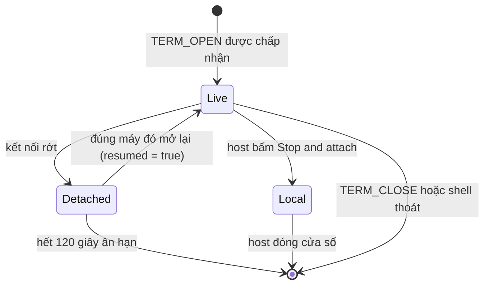
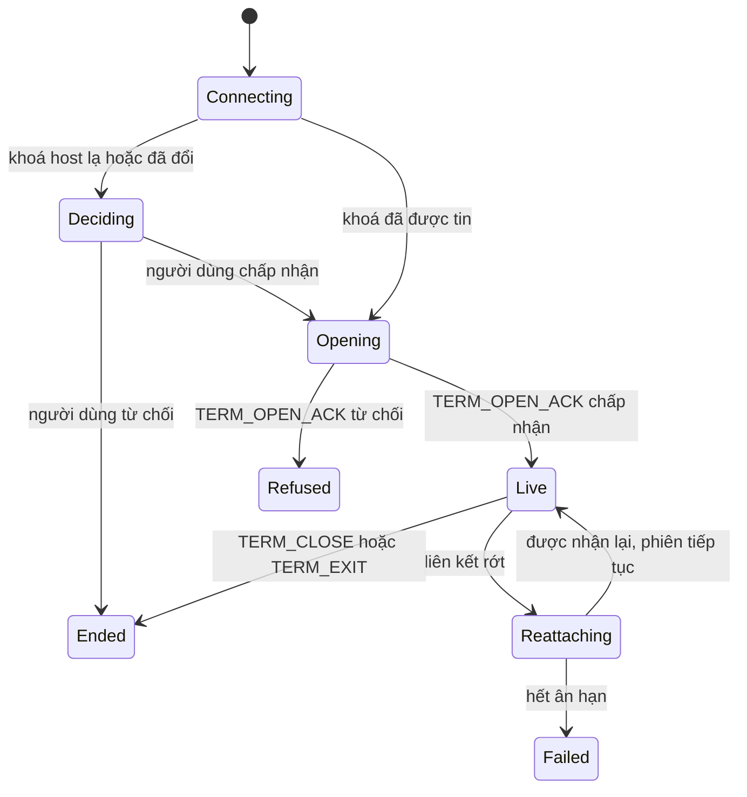

[English](TERMINAL.md) · **Tiếng Việt** · [中文](TERMINAL.zh.md) · [日本語](TERMINAL.ja.md)

# Deskhub — Chia sẻ terminal

Deskhub tự mang theo bộ giả lập VT của riêng nó. Tài liệu này mô tả nó: byte từ shell
trở thành lưới ô như thế nào, phím trở thành byte đi ngược lại ra sao, một shell sống
sót qua đứt kết nối bằng cách nào, và host có thể lấy lại cái gì cho chính mình.

Bố cục tổng thể nằm ở [`ARCHITECTURE.vi.md`](ARCHITECTURE.vi.md); thứ người dùng thấy
nằm ở [`SPECIFICATION.vi.md`](SPECIFICATION.vi.md).

Đây là bản dịch của [`TERMINAL.md`](TERMINAL.md); khi hai bản khác nhau, bản tiếng Anh
là bản chuẩn.

- **Trạng thái:** mô tả mã nguồn hiện tại.
- **Đối tượng đọc:** bất kỳ ai sửa `core/terminal`, `TerminalHost` hay `TerminalViewer`.

---

## 1. Một bộ giả lập, năm client

Bộ giả lập là mã `core/` thuần: không header OS, không curses, không terminfo. Mọi
client chỉ vẽ ô và chuyển tiếp sự kiện phím; không client nào phân tích chuỗi escape.

Hai đầu chạy cùng một `Screen`: bản của client là thứ người ta nhìn thấy, bản gương của
host là thứ *Stop & attach* mở ra. Không bản nào có thẩm quyền hơn bản nào — chúng được
nạp cùng một dòng byte.

## 2. Từ byte tới ô lưới

`VtParser` (`core/src/terminal/VtParser.cpp`) là một máy trạng thái xử lý từng byte và
phát ra `VtEvent`. Nó không cấp phát theo từng byte, và chặn mọi đầu vào:

```mermaid
stateDiagram-v2
    [*] --> Ground
    Ground --> Escape: ESC
    Escape --> CsiEntry: "["
    Escape --> EscapeIntermediate: byte trung gian
    Escape --> OscString: "]"
    CsiEntry --> CsiParam: chữ số hoặc ";"
    CsiEntry --> CsiIntermediate: byte trung gian
    CsiParam --> CsiIntermediate: byte trung gian
    CsiEntry --> CsiIgnore: byte sai
    CsiParam --> CsiIgnore: byte sai
    CsiIgnore --> Ground: byte kết thúc
    CsiEntry --> Ground: byte kết thúc, phát Csi
    CsiParam --> Ground: byte kết thúc, phát Csi
    CsiIntermediate --> Ground: byte kết thúc, phát Csi
    EscapeIntermediate --> Ground: byte kết thúc, phát Esc
    OscString --> Ground: BEL hoặc ST, phát Osc
    OscString --> StringIgnore: quá 4096 byte
    StringIgnore --> Ground: BEL hoặc ST
    Ground --> Ground: ký tự in được, phát Print
```

| Giới hạn | Giá trị | Vượt qua thì sao |
| --- | --- | --- |
| Tham số CSI | 32 | các tham số sau bị bỏ, chuỗi vẫn chạy |
| Giá trị tham số | 65535 | bị kẹp lại |
| Tải OSC | 4096 B | phần còn lại của chuỗi bị bỏ qua (`StringIgnore`) |
| UTF-8 | dạng overlong và cụt bị loại | được thay thế, không bao giờ tin vào lưới |

`Screen` (`core/src/terminal/Screen.cpp`, 674 dòng) áp các sự kiện đó lên lưới `Cell`
(điểm mã + `Pen`). Nó mang đủ thứ một terminal thật mang: bộ đệm màn hình thay thế,
vùng cuộn, DEC special graphics, các chế độ insert/origin/auto-wrap, con trỏ và pen đã
lưu, tiêu đề từ OSC, số lần chuông, và một bộ đếm `revision` để UI chỉ vẽ lại khi có
thay đổi.

**Scrollback** là một `deque` các hàng, mặc định 2000 (`kDefaultScrollback`, trần
`kMaxScrollback` 100000). Mọi chỗ khởi tạo trong mã đều dùng mặc định — hôm nay giới hạn
này không phải một tuỳ chọn. Màn hình thay thế không có scrollback, và `SnapshotScreen`
báo số hàng bằng không khi nó đang bật; đó là thứ ngăn một trình soạn thảo toàn màn hình
để lại rác trong lịch sử.

Một số chuỗi cần được trả lời (trạng thái thiết bị, thuộc tính thiết bị). `Screen` không
bao giờ ghi ra socket: nó dồn vào một bộ đệm phản hồi, và ai sở hữu màn hình sẽ gọi
`TakeResponse()` rồi gửi đi — viewer gửi tới host, còn gương của host ghi ngược vào PTY.

`RenderScreen` (`Repaint.cpp`) làm điều ngược lại: biến cả một `Screen` trở lại thành
dòng chuỗi escape. Đó là cách đồng bộ lại một client bị tụt, và cách một phiên vừa nối
lại lấy về trạng thái trong một bản tin thay vì phát lại toàn bộ.

## 3. Từ phím tới byte

`KeyEncoder` biến một `TermKeyEvent` (phím, điểm mã, shift/alt/ctrl) thành các byte mà
shell chờ đợi, tôn trọng chế độ mà màn hình đang ở trong:

| Chế độ | Ảnh hưởng |
| --- | --- |
| `applicationCursor` | phím mũi tên gửi `SS3 A` thay vì `CSI A` |
| `applicationKeypad` | phím keypad chuyển sang dạng application |
| `bracketedPaste` | `EncodePaste` bọc văn bản trong `ESC[200~` / `ESC[201~` |

`EncodeText` dành cho văn bản gõ vào, `EncodePaste` dành cho nội dung clipboard — tách
đôi để một lần dán không bao giờ bị shell nhầm thành gõ phím, khi shell đã yêu cầu phân
biệt hai thứ đó.

## 4. Phía host: một luồng bơm cho mọi shell

`TerminalHost` chạy đúng một luồng cho tất cả shell. Còn `HandleMessage` chạy trên luồng
net-loop, nên cả hai chạm vào `shells_` dưới cùng một mutex.

Quy tắc chống ứ là phần quan trọng. Một viewer không theo kịp sẽ không làm shell đứng
lại và không làm hàng đợi phình vô hạn: vượt 256 KiB thì số byte đang chờ bị vứt, shell
bị đánh dấu `behind`, và thay cho dòng dữ liệu đã mất, viewer nhận **một bản vẽ lại đầy
đủ** của màn hình hiện tại — nhiều nhất mười lần mỗi giây. Suốt lúc đó shell vẫn chạy hết
tốc độ.

Bản thân PTY là một lớp với hai hiện thực sau pimpl: ConPTY trên Windows, `forkpty` ở
mọi nơi khác. `DefaultShell()` chọn shell theo từng OS.

## 5. Vòng đời shell

`TerminalSessions` (`core/src/session/TerminalSession.cpp`) sở hữu bảng phiên — tối đa 8
shell (`kMaxTerminalSessions`), mỗi shell ở một trong ba trạng thái:

- **Detached** giữ PTY sống trong `kTerminalReattachGraceUs` = 120 giây. `Expire()` thu
  dọn những gì không ai quay lại nhận.
- **Local** là lúc host lấy lại một shell: client từ xa bị ngắt, gương của host — nguyên
  vẹn scrollback — mở ra trong một cửa sổ trên máy host. Shell cục bộ không bao giờ hết
  hạn và chỉ kết thúc khi host đóng nó.
- Mọi lần mở, đóng, tách, nối lại và đá ra đều được ghi log kiểm toán qua
  `TerminalAuditLine` kèm địa chỉ, tên và vân tay khoá của phía bên kia.

Việc cho vào áp dụng cho từng shell chứ không chỉ từng kết nối: `TermOpen` có thể mang
mật mã, và ba lần sai sẽ khoá đường terminal (`LockedOut`). Một lần từ chối luôn nêu lý
do:

| `TermReason` | Nghĩa |
| --- | --- |
| `Accepted` | shell đã mở, hoặc nối lại sau khi tách |
| `WrongPasscode` | mật mã sai, hoặc đường này đang bị khoá |
| `TooManySessions` | đã đủ 8 shell |
| `NotShared` | host không chia sẻ terminal |
| `NoSuchSession` | yêu cầu nối lại một shell đã biến mất |

## 6. Phía client

`TerminalViewer` chạy một luồng dịch vụ trên kênh của `HostLink` và đi qua một máy trạng
thái nhỏ:

UI không bao giờ chặn luồng dịch vụ: nó đẩy phím và lệnh đổi kích thước vào hàng đợi, rồi
hỏi `Snapshot()` để lấy lưới. Khi có hàng mới về trong lúc người dùng đang cuộn lên,
`AnchorScroll` (`ScrollAnchor.h`) dịch độ lệch đúng bằng số hàng scrollback vừa thêm, nên
khung nhìn ở nguyên trên đoạn văn bản đó thay vì trôi đi.

## 7. Trên đường truyền

| Bản tin | Chiều | Ghi chú |
| --- | --- | --- |
| `TermOpen` | client → host | kích thước, mật mã tuỳ chọn, id phiên để nối lại |
| `TermOpenAck` | host → client | id terminal, `TermReason`, cờ `resumed` |
| `TermData` | hai chiều | ≤ 4096 B mỗi bản ghi (`kMaxTermDataBytes`) |
| `TermResize` | client → host | áp cho PTY và cả hai màn hình |
| `TermClose` | client → host | kết thúc shell |
| `TermExit` | host → client | mang mã thoát của shell |

Tất cả đi trên luồng tin cậy `Chan::Terminal`, được rút dưới ngân sách 64 KiB mỗi lượt
phục vụ của transport, để một cú `cat` file khổng lồ không thể bỏ đói chính ACK và
keepalive của kết nối. Kích thước bị kẹp trong 1–1000 cột và hàng, mặc định 80×24.

## 8. Bản đồ đọc code

| Muốn hiểu | Đọc |
| --- | --- |
| Bộ phân tích | `core/src/terminal/VtParser.cpp` |
| Lưới ô và mọi chuỗi nó hiểu | `core/src/terminal/Screen.cpp` |
| Vẽ lại đầy đủ sau khi bị tụt | `core/src/terminal/Repaint.cpp` |
| Phím và dán | `core/src/terminal/KeyEncoder.cpp` |
| Bảng shell, trạng thái, kiểm toán | `core/src/session/TerminalSession.cpp` |
| Luồng bơm và chống ứ | `platform/src/host/TerminalHost.cpp` |
| Máy trạng thái của viewer | `platform/src/client/TerminalViewer.cpp` |

## 9. Những khoảng trống đã biết

- **Báo cáo chuột được phân tích nhưng không bao giờ được sinh ra.** Các chế độ riêng
  1000, 1002, 1003, 1006 và 1015 đều đặt cùng một cờ `mouseReporting`, và `RenderScreen`
  phát lại nó trung thực — nhưng không client nào gửi sự kiện chuột tới shell, nên một
  chương trình bật chế độ chuột sẽ không nhận được gì.
- **Scrollback cố định 2000 hàng.** `Screen` nhận vào một giới hạn và chấp nhận tới
  100000, nhưng mọi chỗ khởi tạo đều dùng mặc định và không có cài đặt nào lộ nó ra.
- **Bản gương nhân đôi chi phí giả lập.** Mỗi shell được giả lập hai lần, một trên host
  và một trên client. Đó là thứ làm cho *Stop & attach* và việc vẽ lại rẻ trở nên khả
  thi, và cũng là lý do một shell nói nhiều tốn CPU trên cả hai máy.
