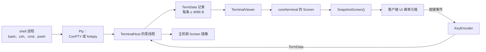
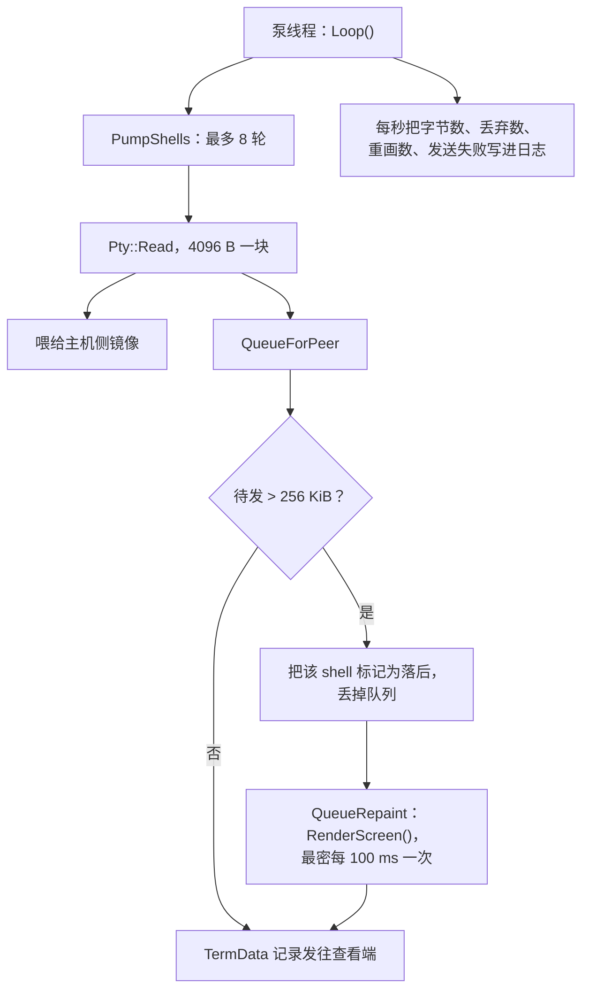
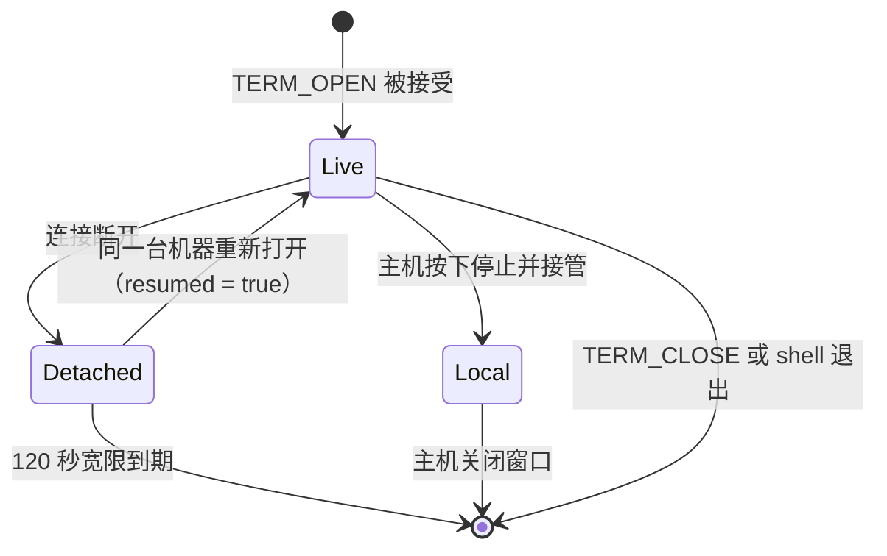
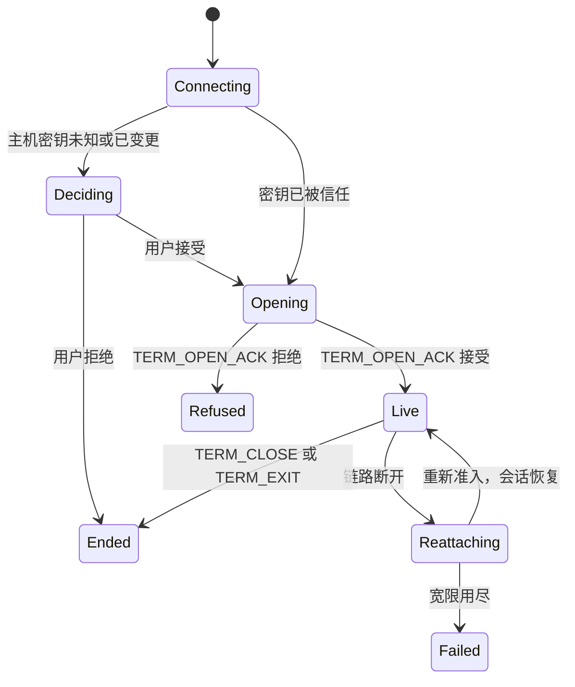

[English](TERMINAL.md) · [Tiếng Việt](TERMINAL.vi.md) · **中文** · [日本語](TERMINAL.ja.md)

# Deskhub —— 终端共享

Deskhub 自带一个 VT 模拟器。本文档描述它：shell 的字节如何变成单元格网格，按键如何变成
回程的字节，一个 shell 如何熬过掉线，以及主机能把什么收回给自己。

更大的布局在 [`ARCHITECTURE.zh.md`](ARCHITECTURE.zh.md)；用户看到什么在
[`SPECIFICATION.zh.md`](SPECIFICATION.zh.md)。

本文件是 [`TERMINAL.md`](TERMINAL.md) 的译本；若两者有出入，以英文版为准。

- **状态：** 描述的是当前代码。
- **读者：** 任何要改 `core/terminal`、`TerminalHost` 或 `TerminalViewer` 的人。

---

## 1. 一个模拟器，五个客户端

模拟器是纯 `core/` 代码：没有 OS 头文件，没有 curses，没有 terminfo。每个客户端只画单元
格并转发按键事件；没有一个客户端解析转义序列。

两端跑的是同一个 `Screen`：客户端那份是人看到的，主机那份镜像是*停止并接管*打开的。谁
都不比谁更权威——它们被喂的是同一串字节。

## 2. 从字节到单元格

`VtParser`（`core/src/terminal/VtParser.cpp`）是一个逐字节的状态机，产出 `VtEvent`。它
不按字节分配内存，并给每一路输入都设了上界：

```mermaid
stateDiagram-v2
    [*] --> Ground
    Ground --> Escape: ESC
    Escape --> CsiEntry: "["
    Escape --> EscapeIntermediate: 中间字节
    Escape --> OscString: "]"
    CsiEntry --> CsiParam: 数字或 ";"
    CsiEntry --> CsiIntermediate: 中间字节
    CsiParam --> CsiIntermediate: 中间字节
    CsiEntry --> CsiIgnore: 非法字节
    CsiParam --> CsiIgnore: 非法字节
    CsiIgnore --> Ground: 终结字节
    CsiEntry --> Ground: 终结字节，产出 Csi
    CsiParam --> Ground: 终结字节，产出 Csi
    CsiIntermediate --> Ground: 终结字节，产出 Csi
    EscapeIntermediate --> Ground: 终结字节，产出 Esc
    OscString --> Ground: BEL 或 ST，产出 Osc
    OscString --> StringIgnore: 超过 4096 字节
    StringIgnore --> Ground: BEL 或 ST
    Ground --> Ground: 可打印字符，产出 Print
```

| 上界 | 取值 | 越界后 |
| --- | --- | --- |
| CSI 参数个数 | 32 | 多余参数被丢弃，序列照常执行 |
| 参数取值 | 65535 | 截断到上界 |
| OSC 负载 | 4096 B | 该字符串余下部分被忽略（`StringIgnore`） |
| UTF-8 | 拒绝过长编码与截断序列 | 被替换，绝不带进网格 |

`Screen`（`core/src/terminal/Screen.cpp`，674 行）把这些事件施加到 `Cell`（码点 +
`Pen`）网格上。真终端有的它都有：备用屏缓冲、滚动区域、DEC 特殊图形字符、插入/原点/自动
换行模式、保存的光标与画笔、来自 OSC 的标题、响铃计数，以及一个 `revision` 计数器，让 UI
只在有变化时重画。

**回滚缓冲**是一个行的 `deque`，默认 2000（`kDefaultScrollback`，上限
`kMaxScrollback` 100000）。代码里每一处构造都用默认值——今天这个限制不是设置项。备用屏
没有回滚，`SnapshotScreen` 在备用屏生效时报告 0 行，正是这一点让全屏编辑器不会往历史里留
下垃圾。

有些序列需要回答（设备状态、设备属性）。`Screen` 从不往套接字里写：它把回答攒进一个缓冲
区，由持有屏幕的一方调用 `TakeResponse()` 并发出去——查看端发给主机，主机镜像写回 PTY。

`RenderScreen`（`Repaint.cpp`）做相反的事：把整个 `Screen` 变回一串转义序列。落后的客户
端就是这样被重新同步的，重新接上的会话也是这样用一条消息拿回状态，而不是重放全部历史。

## 3. 从按键到字节

`KeyEncoder` 把 `TermKeyEvent`（键、码点、shift/alt/ctrl）变成 shell 期待的字节，并尊重
屏幕当前所处的模式：

| 模式 | 效果 |
| --- | --- |
| `applicationCursor` | 方向键发 `SS3 A` 而不是 `CSI A` |
| `applicationKeypad` | 小键盘切到 application 形式 |
| `bracketedPaste` | `EncodePaste` 把文本包在 `ESC[200~` / `ESC[201~` 里 |

`EncodeText` 用于键入的文本，`EncodePaste` 用于剪贴板内容——分成两个，是为了让一次粘贴永
远不会被要求区分二者的 shell 当成敲键。

## 4. 主机侧：所有 shell 共用一条泵线程

`TerminalHost` 为全部 shell 只跑一条线程。而 `HandleMessage` 跑在网络循环线程上，所以两
者都在同一把互斥锁下碰 `shells_`。

背压规则是这里的要点。跟不上的查看端既不会拖住 shell，也不会让队列无限增长：超过
256 KiB，待发字节被丢掉，shell 被标记为 `behind`，取代丢失的数据流的是当前屏幕的**一次
完整重画**——每秒最多十次。整个过程中 shell 一直全速运行。

PTY 本身是一个类、pimpl 后面两套实现：Windows 上是 ConPTY，其他地方是 `forkpty`。
`DefaultShell()` 按 OS 选 shell。

## 5. shell 的生命周期

`TerminalSessions`（`core/src/session/TerminalSession.cpp`）持有会话表——最多 8 个 shell
（`kMaxTerminalSessions`），每个处于三种状态之一：

- **Detached** 让 PTY 存活 `kTerminalReattachGraceUs` = 120 秒。`Expire()` 回收无人认领
  的部分。
- **Local** 是主机把一个 shell 收回：远程客户端被断开，主机的镜像——回滚完好——在主机上
  的一个窗口里打开。本地 shell 永不过期，只有主机关掉它才结束。
- 每一次打开、关闭、分离、重新接上和踢出，都通过 `TerminalAuditLine` 带着对端地址、名字
  和密钥指纹写进审计日志。

准入既按连接也按 shell：`TermOpen` 可以带通行码，三次错误会锁住终端这条路
（`LockedOut`）。拒绝一定说明原因：

| `TermReason` | 含义 |
| --- | --- |
| `Accepted` | shell 已打开，或分离后恢复 |
| `WrongPasscode` | 通行码不对，或该路径已锁定 |
| `TooManySessions` | 已经有 8 个 shell |
| `NotShared` | 主机没有共享终端 |
| `NoSuchSession` | 想恢复的 shell 已经不在了 |

## 6. 客户端侧

`TerminalViewer` 在 `HostLink` 的一个通道上跑一条服务线程，并走一个小状态机：

UI 从不阻塞服务线程：它把按键和改尺寸塞进队列，并轮询 `Snapshot()` 拿网格。当用户正在往
上滚而新行到来时，`AnchorScroll`（`ScrollAnchor.h`）把偏移量精确地推进新增回滚行数，于是
视图停在同一段文字上，而不是漂走。

## 7. 线上消息

| 消息 | 方向 | 说明 |
| --- | --- | --- |
| `TermOpen` | 客户端 → 主机 | 尺寸、可选通行码、恢复用的会话 id |
| `TermOpenAck` | 主机 → 客户端 | 终端 id、`TermReason`、`resumed` 标志 |
| `TermData` | 双向 | 每条 ≤ 4096 B（`kMaxTermDataBytes`） |
| `TermResize` | 客户端 → 主机 | 施加到 PTY 和两侧屏幕 |
| `TermClose` | 客户端 → 主机 | 结束该 shell |
| `TermExit` | 主机 → 客户端 | 携带 shell 的退出码 |

这些都走可靠的 `Chan::Terminal` 流，并在传输层每轮 64 KiB 的预算下被排空，所以 `cat` 一个
巨大文件不会把连接自己的 ACK 与保活饿死。尺寸被夹在 1–1000 列与行之间，默认 80×24。

## 8. 阅读地图

| 想弄懂 | 就读 |
| --- | --- |
| 解析器 | `core/src/terminal/VtParser.cpp` |
| 网格和它认识的每条序列 | `core/src/terminal/Screen.cpp` |
| 落后之后的完整重画 | `core/src/terminal/Repaint.cpp` |
| 按键与粘贴 | `core/src/terminal/KeyEncoder.cpp` |
| shell 表、状态、审计 | `core/src/session/TerminalSession.cpp` |
| 泵线程与背压 | `platform/src/host/TerminalHost.cpp` |
| 查看端状态机 | `platform/src/client/TerminalViewer.cpp` |

## 9. 已知的缺口

- **鼠标上报只解析，从不产生。** 私有模式 1000、1002、1003、1006 和 1015 都设置同一个
  `mouseReporting` 标志，`RenderScreen` 也忠实地把它重放出去——但没有任何客户端把鼠标事件
  发给 shell，所以打开鼠标模式的程序什么也收不到。
- **回滚固定在 2000 行。** `Screen` 接受一个上限并支持到 100000，但每一处构造都用默认值，
  也没有任何设置把它暴露出来。
- **镜像让模拟成本翻倍。** 每个 shell 被模拟两次，主机一次、客户端一次。正是它让*停止并
  接管*和廉价重画成为可能，也正是它让一个话痨 shell 在两台机器上都吃 CPU。
