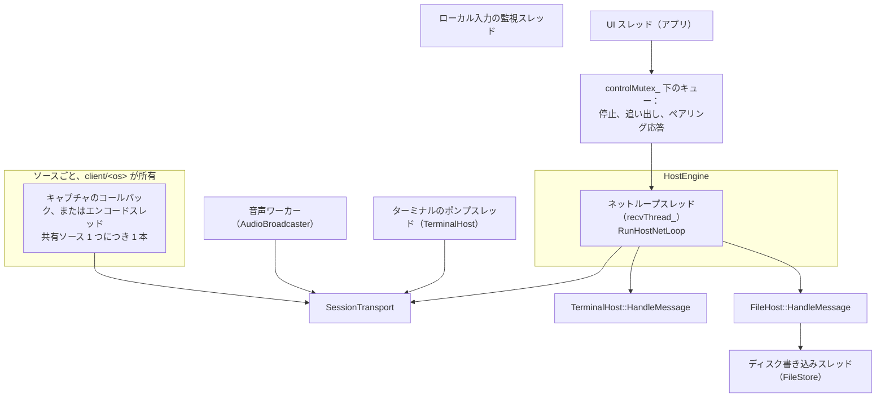
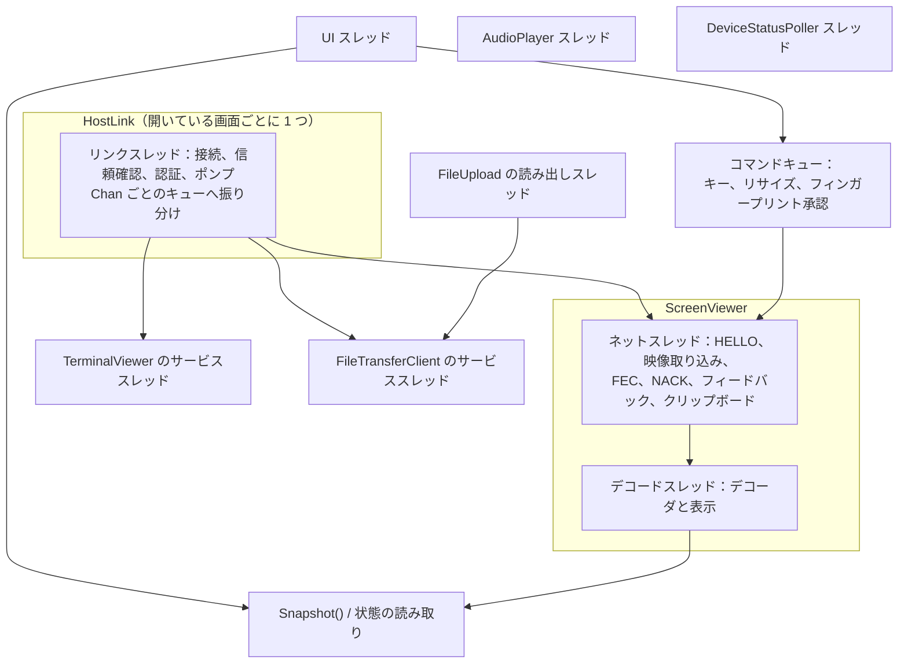
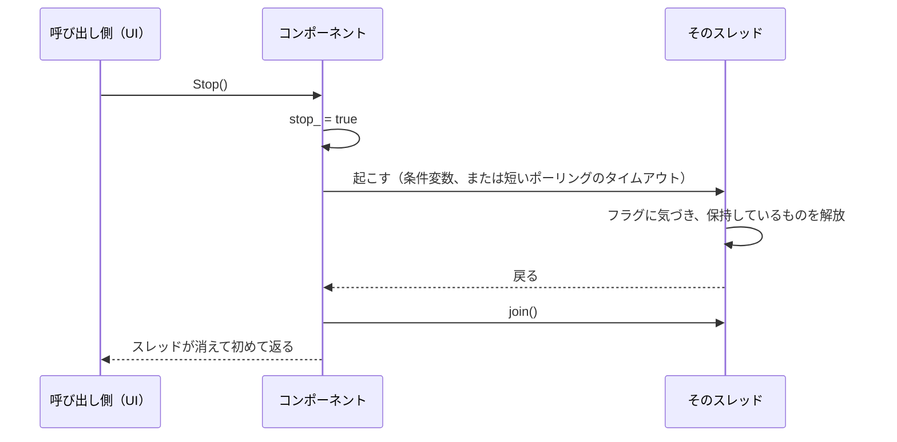

[English](THREADING.md) · [Tiếng Việt](THREADING.vi.md) · [中文](THREADING.zh.md) · **日本語**

# Deskhub — スレッド、ロック、所有権

どのスレッドが何に、どのロックの下で触れるか。そして破ってはならない規則は何か。セッション
が生きているあいだ動くものに手を入れる前に読むべき地図である。

レイヤそのものは [`ARCHITECTURE.ja.md`](ARCHITECTURE.ja.md) に、メディアのループは
[`MEDIA-PIPELINE.ja.md`](MEDIA-PIPELINE.ja.md) にある。

本書は [`THREADING.md`](THREADING.md) の翻訳である。相違がある場合は英語版が正典となる。

- **状態：** 現在のコードを記述している。
- **読者：** スレッドやロックを追加する人、既存のループに仕事を足す人すべて。

---

## 1. 共有する側のマシンのスレッド

ネットループが背骨である。受信し、データグラムを各ソースへ振り分け、各セッションを tick し、
クリップボードを吐き出し、再構成を送り、ターミナルとファイルのメッセージを**自分のスレッド
の上で**それぞれの持ち主へ渡す。ここから呼ばれるものはすべて素早く返らなければならない。
以下の設計判断のほとんどは、この制約で説明がつく。

## 2. 破ってはならない規則

| 規則 | 理由 | どこに現れるか |
| --- | --- | --- |
| quiche のコネクションはシングルスレッド | quiche 自身の契約 | `endpoint_` に触れるたび `sendMutex_` の下 |
| ブロッキング待ちを跨いで `sendMutex_` を保持しない | すべての送信側が飢える | `WaitReadable(...)` はロックせず、その後に短くロックして `Poll` |
| ネットループを決してブロックしない | ターミナル・ファイル・映像・ACK が共有している | キューと `try_lock`。待つロックは使わない |
| サブシステム自身のロックの下で送信しない | ロック順序が反転する | `FileHost` は `outbox_` に積み、解放後に送る |
| エンコーダへのアクセスは `lock` ではなく `try_lock` | 忙しいエンコーダがフィードバックを止めてはならない | `TryHoldEncoder` |

`try_lock` の規則が最も微妙だ。エンコーダがフレーム処理中にフィードバックがビットレート変更
を求めた場合、その変更は待たれるのではなく**飛ばされる**。ループは「変更なし」と報告し、制御
器はそれを確定させない。調整を 1 回落とす代償は 1 秒。ネットループを塞ぐ代償は接続そのもの
である。

## 3. ホスト側のロック

| ロック | 守るもの | 保持する側 |
| --- | --- | --- |
| `SessionTransport::sendMutex_` | quiche エンドポイント全体 | 送信するすべてのスレッド |
| `HostSourceBase::encMutex` | 1 ソースのエンコーダ | キャプチャスレッド（保持）、ネットループ（`try_lock` のみ） |
| `SourcePipelineState::retxMutex` | 再送キャッシュ | キャプチャスレッド（詰める）、ネットループ（NACK に答える） |
| `HostEngine::statusMutex_` | UI 向けのステータス行 | ネットループが書き、UI が読む |
| `HostEngine::controlMutex_` | UI の意図：停止、追い出し、ペアリング応答 | UI が書き、ネットループが取り出す |
| `HostEngine::clipMutex_` | 双方向のクリップボード | UI とネットループ |
| `HostEngine::errMutex_` | 直近のエラー、バインド警告 | 任意のスレッド |
| `TerminalHost::mutex_` | `shells_`、セッション表 | ポンプスレッドとネットループ |
| `TerminalHost::goneMutex_` | 去った相手 | ネットループが書き、ポンプが取り出す |
| `FileHost::mutex_` | 相手ごとの受信器 | ネットループ |
| `FileHost::outboxMutex_` | キューされた返信 | ネットループ |
| `FileStore::mutex_` | 書き込みキュー | ネットループが積み、書き込みスレッドが捌く |
| `SharingHost::pairingMutex_` | 保留中のペアリング要求 | UI とネットループ |
| `AudioBroadcaster::encoderMutex_` | Opus エンコーダ | 音声ワーカー |

`SourcePipelineState` の中でスレッド境界を越えるその他のものは、ロックではなく**アトミック**
である。サイズ、fps、ビットレート、各種フラグ、各種カウンタ。ステータスの読み取りがネット
ループを決してブロックしないのはこのためであり、この構造体にアトミックが 35 個ほどある理由
でもある。

## 4. 視聴する側のマシンのスレッド

最も忙しいのは `ScreenViewer` である。ネットスレッドとデコードスレッドがキュー
（`decMutex_` + `decCv_`）とサーフェスの受け渡し（`surfaceMutex_` と 2 つの条件変数
`surfaceCv_`、`surfaceAckCv_`）で結ばれている。

サーフェスの受け渡しがあるのは、デコーダが描き込む先のサーフェスを UI が所有しているから
だ。UI が新しいサーフェスを渡すとき——ウィンドウのリサイズ、端末の回転——デコードスレッドが
確認するまで古いサーフェスは破棄できない。`surfaceGen_` / `surfaceAckGen_` が数えているのは
それである。

| ロック | 守るもの |
| --- | --- |
| `textMutex_` | ステータス行、終了理由——UI が絶えず読む |
| `surfaceMutex_` | 描画サーフェスと世代カウンタ |
| `decMutex_` | デコードキュー |
| `clipMutex_` | 双方向のクリップボード |
| `HostLink::routeMutex_` | チャネルごとの購読者リスト |
| `HostLink::mutex_` | リンク状態、メッセージ、フィンガープリント |

## 5. UI が邪魔をしない仕組み

UI スレッドがネットワークへ直接呼び込むことはない。境界を越える仕事は 3 つのパターンが全部
引き受ける：

1. **意図のキュー。** キー、リサイズ、フィンガープリント承認、停止、追い出し——UI が積み、
   所有するスレッドが自分の都合で取り出す（`ClientInputQueue`、`controlMutex_`、
   `commandMutex_`）。
2. **スナップショット。** UI はポーリングする。ターミナルの格子は `Snapshot()`、ホスト画面は
   ステータス行、転送は `Progress()`。いずれも短いロックを取り、コピーし、返す。
3. **スカラーはアトミック。** 状態の列挙、カウンタ、サイズ、フラグはアトミックなので、「まだ
   動いているか、fps はいくつか」というよくある読み取りはほぼ無料である。

結果として、ユーザーのどの操作もセッションを塞げず、詰まったセッションも UI を凍らせない。

## 6. 停止

長命なコンポーネントはすべて同じ形をしている。アトミックな `stop_` か `quit_` のフラグ、
起こす操作、そして `join()` である。

知っておくべき帰結が 2 つ。コンポーネントのデストラクタは、そのスレッドがデストラクタの解放
対象への参照を握っているあいだに走ってはならない——だからメンバを壊す前に `join()` する。
そして条件変数で待っているスレッドは明示的に起こさねばならない。`stop_` を立てるだけでは
起きないからだ。

## 7. 読み進める地図

| 理解したいこと | 読むもの |
| --- | --- |
| ホストの背骨 | `platform/src/host/HostNetLoop.cpp` |
| エンジンが所有する状態とロック | `platform/include/deskhubp/host/HostEngine.h` |
| トランスポートのロック規律 | `platform/src/net/SessionTransport.cpp` |
| ビューアの 2 スレッド | `platform/include/deskhubp/client/ScreenViewer.h` |
| リンクスレッドとチャネル振り分け | `platform/include/deskhubp/client/HostLink.h` |
| ポンプスレッドとそのミューテックス | `platform/src/host/TerminalHost.cpp` |
| スレッドをまたぐソース状態 | `core/include/deskhub/session/host/SourcePipelineState.h` |

## 8. 既知の隙間

- **`SourcePipelineState` に所有権の境界がない。** 1 つの構造体にアトミック約 35 個とサブ
  システム 7 つが同居し、ネットループ、キャプチャスレッド、UI が触れる。どのフィールドがどの
  スレッドのものかを型は何も語らない。その知識は読む人の頭の中にしかなく、ここでの並行性
  バグが見えにくい理由はまさにそれである。
- **文書化されたロック順序がない。** 実際にはどれも葉ロックで入れ子にはならないが、それを
  強制するものはなく、順序もどこにも書かれていない。将来入れ子が生じても、照らし合わせる
  基準が存在しない。
- **Windows での断続的なスタック破壊が未解決のまま。** CI が Windows で統合スイートを追加で
  3 回走らせているのはこのためで、およそ 3 回に 1 回再現する。見つかるまでは、Windows の
  ホスト経路に新しいスレッドやロックを入れるときは疑わしいものとして扱い、コミットにその旨
  を書くこと。
- **`try_lock` の失敗は意図的に無言である。** 飛ばされたビットレート変更は「起こらなかった
  変更」としてしか現れない。負荷が高いときに調整が鈍く見えるなら、まず見るべきはここだ。
