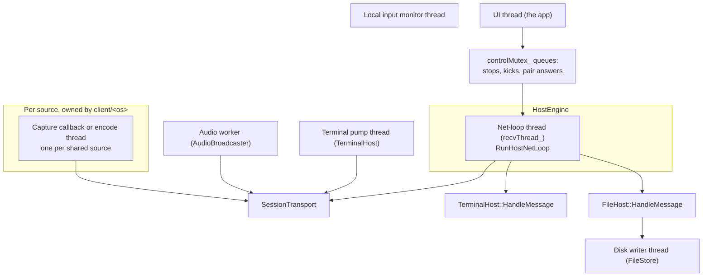
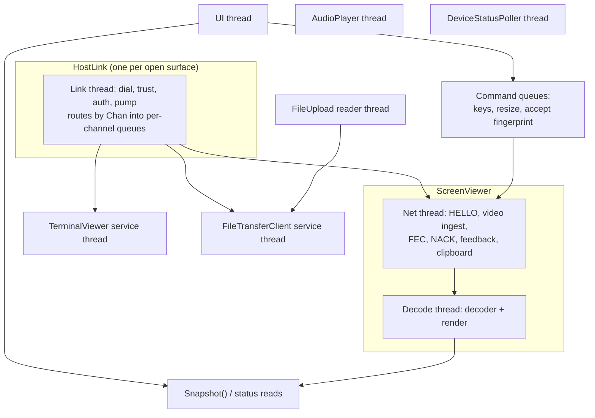
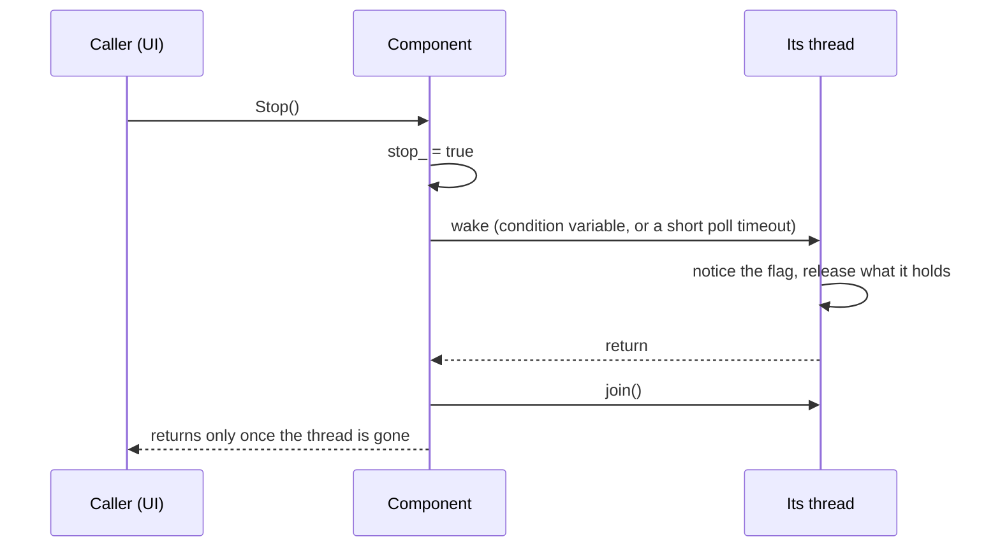

**English** · [Tiếng Việt](THREADING.vi.md) · [中文](THREADING.zh.md) · [日本語](THREADING.ja.md)

# Deskhub — Threads, locks and ownership

Which thread touches what, under which lock, and which rules must not be broken. This
is the map to read before changing anything that runs while a session is live.

The layers themselves are in [`ARCHITECTURE.md`](ARCHITECTURE.md); the media loops are
in [`MEDIA-PIPELINE.md`](MEDIA-PIPELINE.md).

- **Status:** describes the current code.
- **Audience:** anyone adding a thread, a lock, or work inside an existing loop.

---

## 1. Threads on a hosting machine

The net loop is the spine. It receives, routes datagrams to sources, ticks each session,
flushes clipboard, sends reconfigurations, and hands terminal and file messages to their
owners **on its own thread**. Everything it calls must return quickly; that constraint
explains most of the design decisions below.

## 2. The rules that must not be broken

| Rule | Why | Where it shows |
| --- | --- | --- |
| A quiche connection is single-threaded | quiche's own contract | every touch of `endpoint_` is under `sendMutex_` |
| Never hold `sendMutex_` across a blocking wait | it starves every sender | `WaitReadable(...)` unlocked, then a brief locked `Poll` |
| Never block the net loop | terminal, file, video and ACKs share it | queues + `try_lock`, never a waiting lock |
| Never send under a subsystem's own lock | inverted lock order | `FileHost` fills `outbox_`, sends after unlocking |
| Encoder access is `try_lock`, not `lock` | a busy encoder must not stall feedback | `TryHoldEncoder` |

The `try_lock` rule is the subtle one. When feedback asks for a bitrate change while the
encoder is mid-frame, the change is **skipped**, not waited for — the loop reports no
change and the controller does not commit it. A dropped adjustment costs one second; a
blocked net loop costs the connection.

## 3. Locks on the host

| Lock | Guards | Held by |
| --- | --- | --- |
| `SessionTransport::sendMutex_` | the whole quiche endpoint | every thread that sends |
| `HostSourceBase::encMutex` | one source's encoder | capture thread (holds), net loop (`try_lock` only) |
| `SourcePipelineState::retxMutex` | the retransmit cache | capture thread (fills), net loop (answers NACKs) |
| `HostEngine::statusMutex_` | status rows for the UI | net loop writes, UI reads |
| `HostEngine::controlMutex_` | UI intents: stops, kicks, pair answers | UI writes, net loop drains |
| `HostEngine::clipMutex_` | clipboard both ways | UI and net loop |
| `HostEngine::errMutex_` | last error, bind warning | any thread |
| `TerminalHost::mutex_` | `shells_`, the session table | pump thread and net loop |
| `TerminalHost::goneMutex_` | peers that went away | net loop writes, pump drains |
| `FileHost::mutex_` | per-peer receivers | net loop |
| `FileHost::outboxMutex_` | queued replies | net loop |
| `FileStore::mutex_` | the write queue | net loop enqueues, writer thread drains |
| `SharingHost::pairingMutex_` | pending pair prompts | UI and net loop |
| `AudioBroadcaster::encoderMutex_` | the Opus encoder | audio worker |

Everything else that crosses a thread boundary in `SourcePipelineState` is an
**atomic**, not a lock: sizes, fps, bitrate, flags, counters. That is why a status read
never blocks the net loop, and why the struct has around 35 atomics in it.

## 4. Threads on a viewing machine

`ScreenViewer` is the busiest: a net thread and a decode thread, joined by a queue
(`decMutex_` + `decCv_`) and a surface handshake (`surfaceMutex_` + two condition
variables, `surfaceCv_` and `surfaceAckCv_`).

The surface handshake exists because the decoder renders into a surface the UI owns.
When the UI hands over a new surface — a resized window, a rotated phone — the decode
thread must acknowledge before the old one can be destroyed, which is what
`surfaceGen_` / `surfaceAckGen_` count.

| Lock | Guards |
| --- | --- |
| `textMutex_` | status line, end reason — read constantly by the UI |
| `surfaceMutex_` | the render surface and its generation counters |
| `decMutex_` | the decode queue |
| `clipMutex_` | clipboard both ways |
| `HostLink::routeMutex_` | per-channel subscriber lists |
| `HostLink::mutex_` | link state, message, fingerprint |

## 5. How the UI stays out of the way

No UI thread ever calls into the network. Three patterns do all the crossing:

1. **Intent queues.** A key, a resize, an accept-fingerprint, a stop, a kick — the UI
   pushes, the owning thread drains on its own schedule (`ClientInputQueue`,
   `controlMutex_`, `commandMutex_`).
2. **Snapshots.** The UI polls: `Snapshot()` for a terminal grid, status rows for the
   host page, `Progress()` for a transfer. Each takes a short lock, copies, returns.
3. **Atomics for scalars.** State enums, counters, sizes and flags are atomic, so the
   common "is it still running, what is the fps" read costs nothing.

The result is that no user action can block a session, and no stalled session can freeze
the UI.

## 6. Shutdown

Every long-lived component follows the same shape: an atomic `stop_` or `quit_` flag, a
wake, then `join()`.

Two consequences worth knowing: a component's destructor must not run while its thread
still holds a reference to something the destructor frees — hence `join()` before any
member is torn down — and a thread that waits on a condition variable must be woken
explicitly, since `stop_` alone will not wake it.

## 7. Reading map

| To understand | Read |
| --- | --- |
| The host spine | `platform/src/host/HostNetLoop.cpp` |
| Engine-owned state and locks | `platform/include/deskhubp/host/HostEngine.h` |
| Transport locking discipline | `platform/src/net/SessionTransport.cpp` |
| Viewer's two threads | `platform/include/deskhubp/client/ScreenViewer.h` |
| Link thread and channel routing | `platform/include/deskhubp/client/HostLink.h` |
| Pump thread and its mutex | `platform/src/host/TerminalHost.cpp` |
| Cross-thread source state | `core/include/deskhub/session/host/SourcePipelineState.h` |

## 8. Known gaps

- **`SourcePipelineState` has no ownership boundary.** Around 35 atomics and seven
  subsystems in one struct, touched by the net loop, the capture thread and the UI.
  Nothing in the type says which fields belong to which thread — the knowledge lives in
  the reader's head, which is exactly why concurrency bugs here are hard to see.
- **There is no documented lock order.** In practice the locks are leaf locks and are
  not nested, but nothing enforces it and no order is written down; a future nesting
  would have nothing to check itself against.
- **An intermittent stack corruption on Windows is still open.** CI runs the whole
  integration suite three extra times on Windows for this reason: it reproduces in
  roughly one run in three. Until it is found, treat any new thread or lock in the
  Windows host path as suspect and say so in the commit.
- **`try_lock` failures are silent by design.** A skipped bitrate change is invisible
  except as a change that did not happen; if adjustments ever look sluggish under load,
  this is the first place to look.
