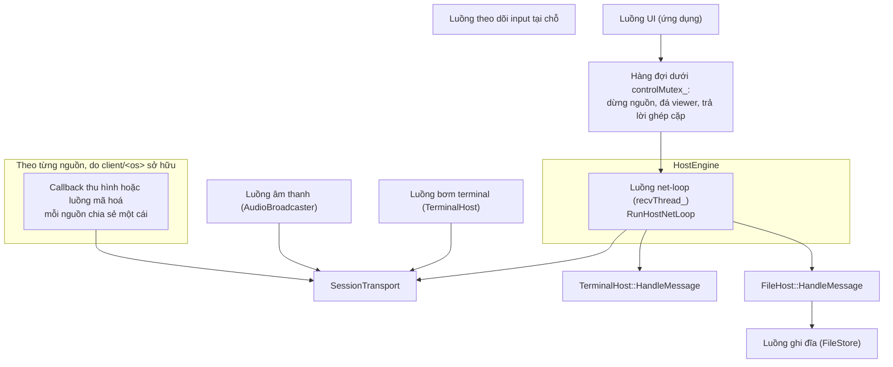
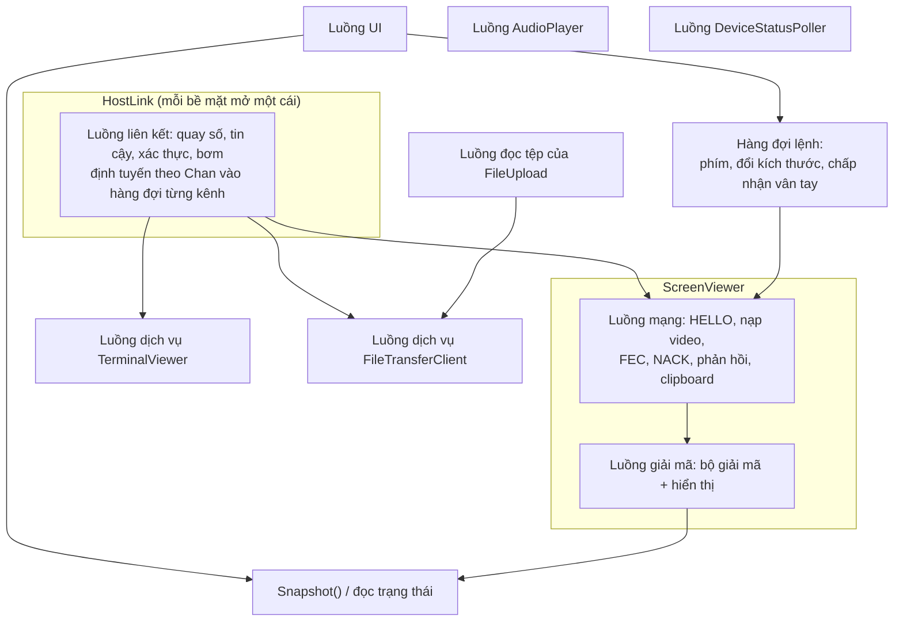
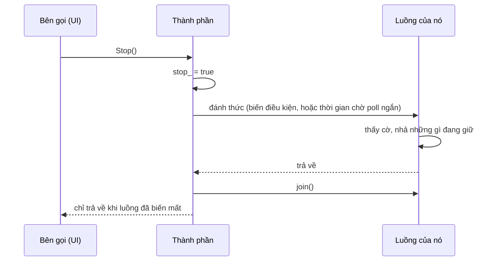

[English](THREADING.md) · **Tiếng Việt** · [中文](THREADING.zh.md) · [日本語](THREADING.ja.md)

# Deskhub — Luồng, khoá và quyền sở hữu

Luồng nào chạm vào cái gì, dưới khoá nào, và những quy tắc nào không được phá. Đây là bản
đồ cần đọc trước khi sửa bất cứ thứ gì chạy trong lúc một phiên đang sống.

Bản thân các tầng nằm ở [`ARCHITECTURE.vi.md`](ARCHITECTURE.vi.md); các vòng lặp media nằm
ở [`MEDIA-PIPELINE.vi.md`](MEDIA-PIPELINE.vi.md).

Đây là bản dịch của [`THREADING.md`](THREADING.md); khi hai bản khác nhau, bản tiếng Anh là
bản chuẩn.

- **Trạng thái:** mô tả mã nguồn hiện tại.
- **Đối tượng đọc:** bất kỳ ai thêm một luồng, một khoá, hay thêm việc vào một vòng lặp
  đang có.

---

## 1. Các luồng trên máy đang chia sẻ

Net loop là xương sống. Nó nhận, định tuyến datagram tới từng nguồn, tick từng phiên, xả
clipboard, gửi lệnh cấu hình lại, và trao bản tin terminal cùng tệp cho chủ của chúng
**ngay trên luồng của nó**. Mọi thứ nó gọi đều phải trả về nhanh; ràng buộc đó giải thích
gần hết các quyết định thiết kế bên dưới.

## 2. Những quy tắc không được phá

| Quy tắc | Vì sao | Thấy ở đâu |
| --- | --- | --- |
| Một kết nối quiche là đơn luồng | đó là hợp đồng của chính quiche | mọi lần chạm `endpoint_` đều dưới `sendMutex_` |
| Không bao giờ giữ `sendMutex_` qua một lần chờ chặn | nó bỏ đói mọi bên gửi | `WaitReadable(...)` không khoá, rồi một lần `Poll` ngắn có khoá |
| Không bao giờ chặn net loop | terminal, tệp, video và ACK dùng chung nó | hàng đợi + `try_lock`, không bao giờ khoá chờ |
| Không bao giờ gửi khi đang giữ khoá của một hệ con | đảo thứ tự khoá | `FileHost` đổ đầy `outbox_`, gửi sau khi mở khoá |
| Truy cập encoder bằng `try_lock`, không phải `lock` | một encoder đang bận không được làm đứng phản hồi | `TryHoldEncoder` |

Quy tắc `try_lock` là quy tắc tinh tế. Khi phản hồi đòi đổi bitrate trong lúc encoder đang
làm dở một khung hình, thay đổi đó bị **bỏ qua** chứ không chờ — vòng lặp báo là không có
thay đổi và bộ điều tiết không ghi nhận nó. Một lần chỉnh bị bỏ tốn một giây; một net loop
bị chặn tốn cả kết nối.

## 3. Các khoá phía host

| Khoá | Bảo vệ | Do ai giữ |
| --- | --- | --- |
| `SessionTransport::sendMutex_` | toàn bộ endpoint quiche | mọi luồng có gửi |
| `HostSourceBase::encMutex` | encoder của một nguồn | luồng thu hình (giữ), net loop (chỉ `try_lock`) |
| `SourcePipelineState::retxMutex` | bộ nhớ đệm truyền lại | luồng thu hình (đổ vào), net loop (trả lời NACK) |
| `HostEngine::statusMutex_` | các hàng trạng thái cho UI | net loop ghi, UI đọc |
| `HostEngine::controlMutex_` | ý định từ UI: dừng, đá, trả lời ghép cặp | UI ghi, net loop rút |
| `HostEngine::clipMutex_` | clipboard hai chiều | UI và net loop |
| `HostEngine::errMutex_` | lỗi gần nhất, cảnh báo bind | luồng bất kỳ |
| `TerminalHost::mutex_` | `shells_`, bảng phiên | luồng bơm và net loop |
| `TerminalHost::goneMutex_` | các máy đã rời đi | net loop ghi, luồng bơm rút |
| `FileHost::mutex_` | bộ nhận theo từng máy | net loop |
| `FileHost::outboxMutex_` | các bản tin trả lời đang xếp hàng | net loop |
| `FileStore::mutex_` | hàng đợi ghi | net loop đẩy vào, luồng ghi rút ra |
| `SharingHost::pairingMutex_` | các lời hỏi ghép cặp đang chờ | UI và net loop |
| `AudioBroadcaster::encoderMutex_` | bộ mã hoá Opus | luồng âm thanh |

Mọi thứ khác vượt ranh giới luồng trong `SourcePipelineState` đều là **atomic**, không phải
khoá: kích thước, fps, bitrate, các cờ, các bộ đếm. Đó là lý do một lần đọc trạng thái không
bao giờ chặn net loop, và cũng là lý do struct đó chứa khoảng 35 biến atomic.

## 4. Các luồng trên máy đang xem

`ScreenViewer` là chỗ bận rộn nhất: một luồng mạng và một luồng giải mã, nối với nhau bằng
một hàng đợi (`decMutex_` + `decCv_`) và một cái bắt tay về bề mặt (`surfaceMutex_` cùng hai
biến điều kiện, `surfaceCv_` và `surfaceAckCv_`).

Cái bắt tay về bề mặt tồn tại vì bộ giải mã vẽ vào một bề mặt do UI sở hữu. Khi UI trao một
bề mặt mới — cửa sổ đổi kích thước, điện thoại xoay ngang — luồng giải mã phải xác nhận
trước khi bề mặt cũ có thể bị huỷ, và đó là thứ mà `surfaceGen_` / `surfaceAckGen_` đếm.

| Khoá | Bảo vệ |
| --- | --- |
| `textMutex_` | dòng trạng thái, lý do kết thúc — UI đọc liên tục |
| `surfaceMutex_` | bề mặt hiển thị và các bộ đếm thế hệ của nó |
| `decMutex_` | hàng đợi giải mã |
| `clipMutex_` | clipboard hai chiều |
| `HostLink::routeMutex_` | danh sách người đăng ký theo từng kênh |
| `HostLink::mutex_` | trạng thái liên kết, thông điệp, vân tay |

## 5. UI đứng ngoài đường bằng cách nào

Không luồng UI nào gọi thẳng vào mạng. Ba khuôn mẫu lo hết phần vượt ranh giới:

1. **Hàng đợi ý định.** Một phím, một lần đổi kích thước, một lần chấp nhận vân tay, một lệnh
   dừng, một lệnh đá — UI đẩy vào, luồng chủ rút ra theo lịch của nó (`ClientInputQueue`,
   `controlMutex_`, `commandMutex_`).
2. **Ảnh chụp.** UI hỏi định kỳ: `Snapshot()` cho lưới terminal, các hàng trạng thái cho
   trang host, `Progress()` cho một lần truyền. Mỗi lần lấy một khoá ngắn, sao chép, trả về.
3. **Atomic cho các giá trị vô hướng.** Enum trạng thái, bộ đếm, kích thước và cờ đều là
   atomic, nên câu hỏi thường gặp "còn chạy không, fps bao nhiêu" gần như không tốn gì.

Kết quả là không hành động nào của người dùng chặn được một phiên, và không phiên nào bị
đứng làm đông cứng được UI.

## 6. Tắt máy

Mọi thành phần sống lâu đều theo cùng một hình dạng: một cờ atomic `stop_` hoặc `quit_`, một
cú đánh thức, rồi `join()`.

Hai hệ quả đáng biết: hàm huỷ của một thành phần không được chạy khi luồng của nó còn giữ
tham chiếu tới thứ mà hàm huỷ sẽ giải phóng — vì vậy phải `join()` trước khi bất kỳ thành
viên nào bị tháo dỡ — và một luồng đang chờ trên biến điều kiện phải được đánh thức tường
minh, vì riêng `stop_` sẽ không đánh thức nó.

## 7. Bản đồ đọc code

| Muốn hiểu | Đọc |
| --- | --- |
| Xương sống phía host | `platform/src/host/HostNetLoop.cpp` |
| Trạng thái và khoá do engine sở hữu | `platform/include/deskhubp/host/HostEngine.h` |
| Kỷ luật khoá của transport | `platform/src/net/SessionTransport.cpp` |
| Hai luồng của viewer | `platform/include/deskhubp/client/ScreenViewer.h` |
| Luồng liên kết và định tuyến kênh | `platform/include/deskhubp/client/HostLink.h` |
| Luồng bơm và mutex của nó | `platform/src/host/TerminalHost.cpp` |
| Trạng thái nguồn dùng chung giữa các luồng | `core/include/deskhub/session/host/SourcePipelineState.h` |

## 8. Những khoảng trống đã biết

- **`SourcePipelineState` không có ranh giới sở hữu.** Khoảng 35 biến atomic và bảy hệ con
  trong một struct, bị net loop, luồng thu hình và UI cùng chạm vào. Không gì trong kiểu dữ
  liệu nói trường nào thuộc luồng nào — kiến thức đó nằm trong đầu người đọc, và đó chính là
  lý do lỗi tương tranh ở đây rất khó thấy.
- **Không có thứ tự khoá được ghi lại.** Trên thực tế các khoá đều là khoá lá và không lồng
  nhau, nhưng không gì bắt buộc điều đó và không thứ tự nào được viết ra; một lần lồng khoá
  trong tương lai sẽ không có gì để tự đối chiếu.
- **Một lỗi hỏng ngăn xếp không thường xuyên trên Windows vẫn đang mở.** Đó là lý do CI chạy
  thêm ba lần toàn bộ bộ kiểm thử tích hợp trên Windows: nó tái hiện khoảng một lần trong ba
  lần chạy. Cho tới khi tìm ra, hãy coi mọi luồng hay khoá mới trên đường host của Windows là
  đáng ngờ và nói rõ điều đó trong commit.
- **Việc `try_lock` thất bại là im lặng có chủ đích.** Một lần đổi bitrate bị bỏ qua chỉ hiện
  ra dưới dạng một thay đổi đã không xảy ra; nếu việc điều chỉnh có vẻ ì ạch khi tải nặng,
  đây là chỗ cần nhìn đầu tiên.
