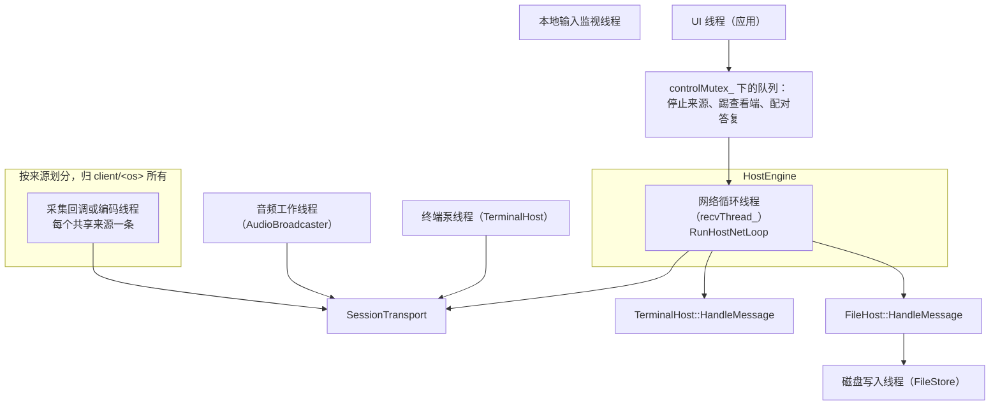
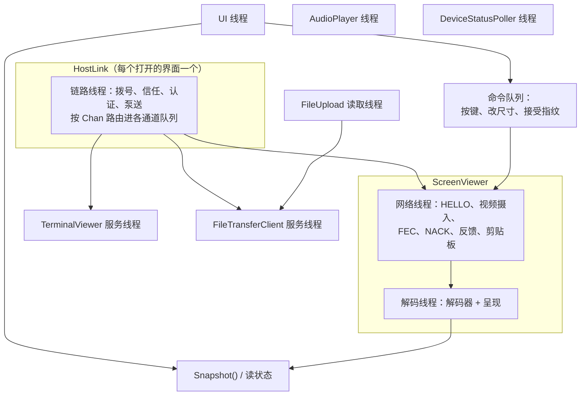
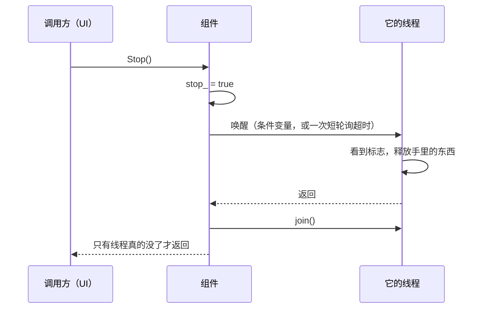

[English](THREADING.md) · [Tiếng Việt](THREADING.vi.md) · **中文** · [日本語](THREADING.ja.md)

# Deskhub —— 线程、锁与所有权

哪条线程碰什么、在哪把锁下面碰，以及哪些规则不能破。这是在改动任何"会话进行中还在跑"的东
西之前该先读的地图。

分层本身在 [`ARCHITECTURE.zh.md`](ARCHITECTURE.zh.md)；媒体环路在
[`MEDIA-PIPELINE.zh.md`](MEDIA-PIPELINE.zh.md)。

本文件是 [`THREADING.md`](THREADING.md) 的译本；若两者有出入，以英文版为准。

- **状态：** 描述的是当前代码。
- **读者：** 任何要新增线程、新增锁，或往已有循环里塞活儿的人。

---

## 1. 共享方机器上的线程

网络循环是脊梁。它接收、把数据报路由到各来源、给每个会话打点、冲刷剪贴板、发送重配置，并
**在自己这条线程上**把终端和文件消息交给各自的主人。它调用的一切都必须迅速返回；下面大多
数设计决定都由这条约束解释。

## 2. 不能破的规则

| 规则 | 为什么 | 体现在哪 |
| --- | --- | --- |
| 一条 quiche 连接是单线程的 | 这是 quiche 自己的契约 | 每次碰 `endpoint_` 都在 `sendMutex_` 下 |
| 绝不在阻塞等待期间持有 `sendMutex_` | 那会饿死所有发送方 | 先不加锁 `WaitReadable(...)`，再短暂加锁 `Poll` |
| 绝不阻塞网络循环 | 终端、文件、视频和 ACK 共用它 | 用队列 + `try_lock`，从不使用会等待的锁 |
| 绝不在某个子系统自己的锁下发送 | 会造成锁序颠倒 | `FileHost` 先填 `outbox_`，解锁之后再发 |
| 访问编码器用 `try_lock` 而不是 `lock` | 忙碌的编码器不该拖住反馈 | `TryHoldEncoder` |

`try_lock` 这条最微妙。当反馈要求改码率、而编码器正在处理一帧时，这次改动会被**跳过**而不是
等待——循环报告"没有变化"，控制器也就不会认下它。少调一次的代价是一秒；网络循环被堵住的代价
是整条连接。

## 3. 主机侧的锁

| 锁 | 保护什么 | 谁持有 |
| --- | --- | --- |
| `SessionTransport::sendMutex_` | 整个 quiche 端点 | 每条会发送的线程 |
| `HostSourceBase::encMutex` | 某个来源的编码器 | 采集线程（持有）、网络循环（只 `try_lock`） |
| `SourcePipelineState::retxMutex` | 重传缓存 | 采集线程（写入）、网络循环（应答 NACK） |
| `HostEngine::statusMutex_` | 给 UI 的状态行 | 网络循环写，UI 读 |
| `HostEngine::controlMutex_` | 来自 UI 的意图：停止、踢出、配对答复 | UI 写，网络循环取 |
| `HostEngine::clipMutex_` | 双向剪贴板 | UI 与网络循环 |
| `HostEngine::errMutex_` | 最后一次错误、绑定告警 | 任意线程 |
| `TerminalHost::mutex_` | `shells_`、会话表 | 泵线程与网络循环 |
| `TerminalHost::goneMutex_` | 已离开的对端 | 网络循环写，泵线程取 |
| `FileHost::mutex_` | 按对端划分的接收器 | 网络循环 |
| `FileHost::outboxMutex_` | 排队的回复 | 网络循环 |
| `FileStore::mutex_` | 写队列 | 网络循环入队，写线程出队 |
| `SharingHost::pairingMutex_` | 待处理的配对提示 | UI 与网络循环 |
| `AudioBroadcaster::encoderMutex_` | Opus 编码器 | 音频线程 |

`SourcePipelineState` 里其他跨线程的东西都是**原子量**而不是锁：尺寸、帧率、码率、各种标
志、各种计数。这就是为什么读一次状态从不阻塞网络循环，也是那个结构体里有大约 35 个原子量的
原因。

## 4. 观看方机器上的线程

`ScreenViewer` 最忙：一条网络线程和一条解码线程，由一个队列（`decMutex_` + `decCv_`）和一次
表面交接（`surfaceMutex_` 加两个条件变量 `surfaceCv_` 与 `surfaceAckCv_`）连起来。

表面交接之所以存在，是因为解码器渲染进的那块表面归 UI 所有。当 UI 交出一块新表面——窗口改了
大小、手机转了方向——解码线程必须先确认，旧的那块才能销毁，`surfaceGen_` / `surfaceAckGen_`
数的就是这个。

| 锁 | 保护什么 |
| --- | --- |
| `textMutex_` | 状态行、结束原因——UI 一直在读 |
| `surfaceMutex_` | 渲染表面及其世代计数 |
| `decMutex_` | 解码队列 |
| `clipMutex_` | 双向剪贴板 |
| `HostLink::routeMutex_` | 各通道的订阅者列表 |
| `HostLink::mutex_` | 链路状态、消息、指纹 |

## 5. UI 如何不挡道

没有任何 UI 线程会直接调进网络。跨界的活儿全靠三种套路：

1. **意图队列。** 一个按键、一次改尺寸、一次接受指纹、一次停止、一次踢出——UI 推进去，拥有
   它的线程按自己的节奏取走（`ClientInputQueue`、`controlMutex_`、`commandMutex_`）。
2. **快照。** UI 轮询：终端网格用 `Snapshot()`，主机页用状态行，传输用 `Progress()`。每次
   拿一把短锁、拷贝、返回。
3. **标量用原子量。** 状态枚举、计数、尺寸和标志都是原子的，所以"还在跑吗、帧率多少"这种最
   常见的读几乎不花钱。

结果就是：用户的任何操作都堵不住会话，卡住的会话也冻不住界面。

## 6. 关停

每个长生命周期的组件都是同一个形状：一个原子的 `stop_` 或 `quit_` 标志，一次唤醒，然后
`join()`。

两点值得知道的后果：组件的析构函数不能在它的线程还持有某个将被析构释放的引用时运行——所以要
在拆掉任何成员之前先 `join()`；而在条件变量上等待的线程必须被显式唤醒，光设 `stop_` 唤不醒
它。

## 7. 阅读地图

| 想弄懂 | 就读 |
| --- | --- |
| 主机的脊梁 | `platform/src/host/HostNetLoop.cpp` |
| 引擎持有的状态与锁 | `platform/include/deskhubp/host/HostEngine.h` |
| 传输层的加锁纪律 | `platform/src/net/SessionTransport.cpp` |
| 查看端的两条线程 | `platform/include/deskhubp/client/ScreenViewer.h` |
| 链路线程与通道路由 | `platform/include/deskhubp/client/HostLink.h` |
| 泵线程与它的互斥锁 | `platform/src/host/TerminalHost.cpp` |
| 跨线程的来源状态 | `core/include/deskhub/session/host/SourcePipelineState.h` |

## 8. 已知的缺口

- **`SourcePipelineState` 没有所有权边界。** 一个结构体里约 35 个原子量加七个子系统，被网络
  循环、采集线程和 UI 一起碰。类型本身没有说明哪个字段属于哪条线程——这份知识只存在于读者脑
  子里，而这正是这里的并发 bug 难以看见的原因。
- **没有写下来的锁序。** 实际上这些锁都是叶子锁、互不嵌套，但没有东西强制这一点，也没有任何
  顺序被记录下来；将来一旦出现嵌套，将没有任何依据可对照。
- **Windows 上一个偶发的栈损坏仍未解决。** CI 之所以在 Windows 上额外跑三遍整套集成测试就是
  为了它：大约每三次运行复现一次。在找到它之前，Windows 主机路径上任何新线程或新锁都应视为
  可疑，并在提交里写明。
- **`try_lock` 失败是刻意静默的。** 被跳过的一次码率调整只会表现为"一次没有发生的变化"；如果
  负载高时调整显得迟钝，这里是第一个该看的地方。
